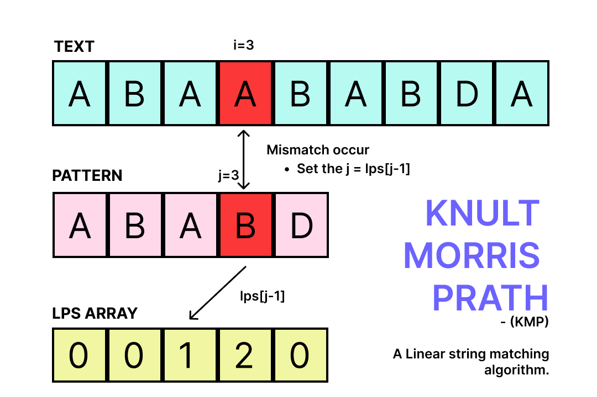

## Knuth Morris Prath
It is a string matching algorithm which is capable of finding sub string in a string with a linear time complexity. It uses the optimization which a pattern contains sub string more than once.

### Why KMP over Naive method?
Because it never backtracks, the already matched string by using prefix function(pi) which contains info about the longest proper prefix which is also a suffix(lps).

### What is a Prefix function
This function contains information about the pattern matches against the shift of itself. This info is used to avoid the unnecessary backtracking of the string.

### KMP Matcher or Main Search Function
It takes the text, pattern and the lps of pattern. It will search for the pattern in text by utilizing the already calculated lps array. IT helps to not backtrack.

Pseudo Steps:  
1. Store length of text and pattern in N and M variable, respectively.
2. Before moving ahead, let's calculate the lps array.  
   1. Two pointers needed on same pattern i, len. Start i from 1 and len from 0.
   2. Loop while i <= M.  
      1. If character matched, increment both i and j. Lps[i]=len+1
      2. If not, if i==0 then set lps[i] = 0 and increment i else len = lps[len-1]
   3. Return Lps array
3. Need two pointers i and j for text and pattern respectively.
4. Loop while i < N.
   1. If character matches, increment both i and j.
   2. Else, if j==0 then simply increment i else j = lps[j-1]
   3. If j==M (means pattern matches completely) then return i-j

**Reference**  
[Logic First](https://www.youtube.com/watch?v=4jY57Ehc14Y)