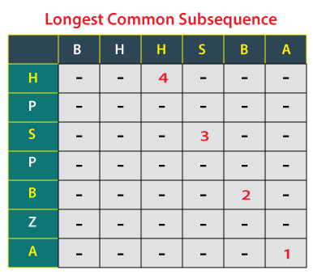

## Longest Common Subseqence
The longest common subsequence (LCS) problem is the problem of finding the longest subsequence common to all sequences in a set of sequences (often just two sequences). It differs from the longest common substring problem: unlike substrings, subsequences are not required to occupy consecutive positions within the original sequences. The longest common subsequence problem is a classic computer science problem, the basis of data comparison programs such as the diff utility, and has applications in computational linguistics and bioinformatics. It is also widely used by revision control systems such as Git for reconciling multiple changes made to a revision-controlled collection of files

  

##### Sample Input 0
```
secretary
bisect
```

##### Sample Output 0  
`4`

##### Sample Input 0
```
honey
sunny
```

##### Sample Output 0  
`2`