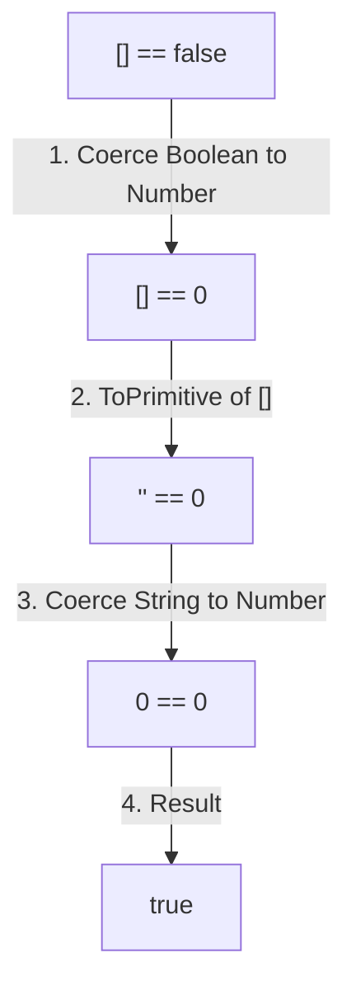

# 📝 [10. Equal](https://bigfrontend.dev/quiz/Equal-1)

## 📌 Problem Overview

What is printed to the console when running the following loose equality comparisons?

```javascript
console.log(0 == false)
console.log('' == false)
console.log([] == false)
console.log(undefined == false)
console.log(null == false)
console.log('1' == true)
console.log(1n == true)
console.log(' 1     ' == true)
```

---

## 🚀 Correct Answer
>
> [!TIP]
> **Output:**
>
> ```text
> true
> true
> true
> false
> false
> true
> true
> true
> ```

---

## 🔍 Detailed Explanation & Spec-Accurate Trace

This quiz is the ultimate test of the **Abstract Equality Comparison Algorithm (`==`)** defined in ECMAScript (ES2026/Section 7.2.14).

### ⚡ Key Spec Rules of Loose Equality (`==`)

1. **Rule 1 (Booleans First)**: If either operand is a **Boolean**, it is coerced to a **Number** (`true` becomes `1`, `false` becomes `0`), and the comparison is retried.
2. **Rule 2 (Object vs. Primitive)**: If one operand is an **Object** (including Arrays `[]`) and the other is a Primitive (String, Number, Symbol, BigInt), the Object is converted to a Primitive via `ToPrimitive(object)`. For default objects/arrays, this triggers `valueOf()`, which returns the object itself, and falls back to `toString()`.
3. **Rule 3 (String vs. Number)**: If comparing a **String** and a **Number**, the String is coerced to a Number via `ToNumber(string)`. This conversion trims whitespace and parses numbers (empty string `""` becomes `0`).
4. **Rule 4 (BigInt vs. Number/String)**: BigInt comparisons to Numbers use direct mathematical values (e.g. `1n == 1` is `true`).
5. **Rule 5 (Null / Undefined)**: `null` and `undefined` are loosely equal to each other, and equal to nothing else.

---

### Step-by-Step Execution

#### 1. `0 == false` -> `true`

- **Step A**: Right side is boolean `false`, coerce to number `0` (Rule 1).
- **Step B**: `0 == 0`. Since both types are numbers, they are mathematically equal.
- **Output**: `true`

#### 2. `'' == false` -> `true`

- **Step A**: Coerce boolean `false` to number `0` (Rule 1). The comparison is now `'' == 0`.
- **Step B**: Comparing string to number (Rule 3). Coerce empty string `''` to number -> `0`.
- **Step C**: `0 == 0` -> mathematically equal.
- **Output**: `true`

#### 3. `[] == false` -> `true`

- **Step A**: Coerce boolean `false` to number `0` (Rule 1). The comparison is now `[] == 0`.
- **Step B**: Object vs. Number (Rule 2). Coerce object `[]` to primitive via `ToPrimitive([])`:
  - `[].valueOf()` returns `[]` (not a primitive).
  - `[].toString()` returns `""` (empty string, which is primitive).
  - The comparison is now `"" == 0`.
- **Step C**: String vs. Number (Rule 3). Coerce string `""` to number -> `0`.
- **Step D**: `0 == 0` -> mathematically equal.
- **Output**: `true`

#### 4. `undefined == false` -> `false`

- **Step A**: Coerce boolean `false` to number `0` (Rule 1). The comparison is now `undefined == 0`.
- **Step B**: `undefined` only loosely equals `undefined` or `null` (Rule 5). Thus, `undefined == 0` is false.
- **Output**: `false`

#### 5. `null == false` -> `false`

- **Step A**: Coerce boolean `false` to number `0` (Rule 1). The comparison is now `null == 0`.
- **Step B**: `null` only loosely equals `null` or `undefined` (Rule 5). Thus, `null == 0` is false.
- **Output**: `false`

#### 6. `'1' == true` -> `true`

- **Step A**: Coerce boolean `true` to number `1` (Rule 1). Comparison is `'1' == 1`.
- **Step B**: Coerce string `'1'` to number `1` (Rule 3). Comparison is `1 == 1`.
- **Output**: `true`

#### 7. `1n == true` -> `true`

- **Step A**: Coerce boolean `true` to number `1` (Rule 1). Comparison is `1n == 1`.
- **Step B**: Compare BigInt `1n` with Number `1` (Rule 4). They are mathematically equal.
- **Output**: `true`

#### 8. `' 1     ' == true` -> `true`

- **Step A**: Coerce boolean `true` to number `1` (Rule 1). Comparison is `' 1     ' == 1`.
- **Step B**: Coerce string `' 1     '` to number. `ToNumber()` ignores leading/trailing whitespaces, parsing `"1"` as the number `1`. Comparison is `1 == 1`.
- **Output**: `true`

---

## 💡 Key Takeaway

* **Rule Priority**: Under loose equality (`==`), Booleans are always converted to Numbers first. Arrays/Objects undergo `ToPrimitive` (which converts them to strings like `""` or `"1,2"`), and Strings are then coerced to Numbers.

---

## 🛠️ Recommendations & Best Practices

* **Use Strict Equality (`===`)**: Never use loose equality (`==`) in production code. It has complex type conversion heuristics that lead to silent bugs (like `[] == false` being `true`!). Strict equality (`===`) checks both value and type without coercion, which is safer and faster.
- **Exceptions to the Rule**: The *only* widely accepted use of `==` is for combined nullish checks:

  ```javascript
  if (value == null) {
    // Matches BOTH null and undefined
  }
  ```

---

## 🧠 Revision Tips & Cheat Sheet

### Visual Coercion Path for `[] == false`



---

## 🔗 Helpful Resources

- [ECMA-262 Specification - Abstract Equality Comparison](https://tc39.es/ecma262/#sec-abstract-equality-comparison)
- [MDN Web Docs - Equality comparisons and sameness](https://developer.mozilla.org/en-US/docs/Web/JavaScript/Equality_comparisons_and_sameness)
- [BFE.dev - Quiz 10](https://bigfrontend.dev/quiz/Equal-1)

---

## 🏷️ Tags

`#AbstractEquality` `#LooseEquality` `#DoubleEquals` `#TypeCoercion` `#Google` `#Meta` `#LinkedIn` `#SpecDeepDive`
