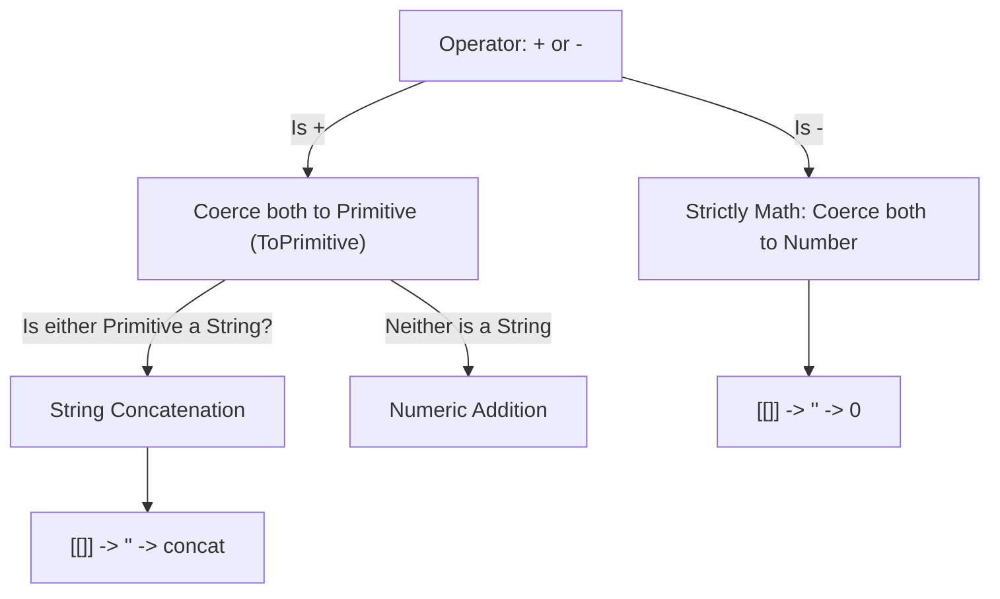

# 📝 [11. Implicit Coercion II](https://bigfrontend.dev/quiz/Implicit-Conversion-II)

## 📌 Problem Overview

What is printed to the console when evaluating the following implicit type coercion expressions involving arrays, objects, and operators (`+` and `-`)?

```javascript
console.log([] + [])
console.log([] + 1)
console.log([[]] + 1)
console.log([[1]] + 1)
console.log([[[[2]]]] + 1)
console.log([] - 1)
console.log([[]] - 1)
console.log([[1]] - 1)
console.log([[[[2]]]] - 1)
console.log([] + {})
console.log({} + {})
console.log({} - {})
```

---

## 🚀 Correct Answer
>
> [!TIP]
> **Output:**
>
> ```text
> ""
> "1"
> "1"
> "11"
> "21"
> -1
> -1
> 0
> 1
> "[object Object]"
> "[object Object][object Object]"
> NaN
> ```

---

## 🔍 Detailed Explanation & Spec-Accurate Trace

This quiz explores **Implicit Type Coercion** in JavaScript, governed by the ECMAScript specification for operators (`+`, `-`) and abstract operations (`ToPrimitive` and `ToNumber`).

### ⚡ Key Spec Rules of Coercion

1. **Rule 1 (The Binary `+` Operator)**:
   - When evaluating `LHS + RHS`, JavaScript converts both operands to primitives via `ToPrimitive(value, hint: "default")`.
   - If **either** primitive is a **String**, the operator acts as **String Concatenation**.
   - Otherwise, both primitives are converted to **Numbers** via `ToNumber`, and mathematical addition is performed.

2. **Rule 2 (The Binary `-` Operator)**:
   - The subtraction operator `-` is strictly mathematical. It always coerces both operands to **Numbers** via `ToNumber(value)` and performs subtraction.

3. **Rule 3 (Array & Object ToPrimitive Conversion)**:
   - To convert an Object (including Arrays) to a primitive, JavaScript calls `ToPrimitive()`.
   - For regular Arrays and Objects, this triggers `valueOf()`, which returns the object itself (non-primitive).
   - It then falls back to `toString()`:
     - **Empty Array `[]`**: `[].toString()` -> `""` (empty string)
     - **Nested Arrays**: `[[]].toString()` -> `""`, `[[1]].toString()` -> `"1"`, `[[[[2]]]].toString()` -> `"2"`.
     - **Plain Object `{}`**: `{}.toString()` -> `"[object Object]"` (string literal)

---

### Step-by-Step Execution

#### 1. `[] + []` -> `""`
- **Step A**: Both operands are Arrays. `ToPrimitive([])` triggers `[].toString()`, returning `""`.
- **Step B**: The expression becomes `"" + ""` (String concatenation).
- **Output**: `""`

#### 2. `[] + 1` -> `"1"`
- **Step A**: Convert `[]` to primitive: `ToPrimitive([])` -> `""`.
- **Step B**: Expression becomes `"" + 1`. Since the left operand is a string, `1` is coerced to `"1"`.
- **Output**: `"1"`

#### 3. `[[]] + 1` -> `"1"`
- **Step A**: `[[]]` is a nested array. `ToPrimitive([[]])` triggers `[[]].toString()`, which resolves to `""`.
- **Step B**: Expression becomes `"" + 1` -> `"1"`.
- **Output**: `"1"`

#### 4. `[[1]] + 1` -> `"11"`
- **Step A**: `[[1]]` is a nested array. `ToPrimitive([[1]])` triggers `[[1]].toString()`, which resolves to `"1"`.
- **Step B**: Expression becomes `"1" + 1`. Since the left operand is a string, string concatenation yields `"11"`.
- **Output**: `"11"`

#### 5. `[[[[2]]]] + 1` -> `"21"`
- **Step A**: `ToPrimitive([[[[2]]]])` recursively calls `toString()`, flattening the nested array to `"2"`.
- **Step B**: Expression becomes `"2" + 1` -> `"21"`.
- **Output**: `"21"`

#### 6. `[] - 1` -> `-1`
- **Step A**: The subtraction operator `-` coerces operands to numbers via `ToNumber`.
- **Step B**: `ToNumber([])` first calls `ToPrimitive([])` -> `""`.
- **Step C**: `ToNumber("")` converts an empty string to `0`.
- **Step D**: Expression becomes `0 - 1`.
- **Output**: `-1`

#### 7. `[[]] - 1` -> `-1`
- **Step A**: `ToNumber([[]])` converts nested array to primitive -> `""`.
- **Step B**: `ToNumber("")` converts to `0`.
- **Step C**: Expression becomes `0 - 1`.
- **Output**: `-1`

#### 8. `[[1]] - 1` -> `0`
- **Step A**: `ToNumber([[1]])` converts `[[1]]` to primitive -> `"1"`.
- **Step B**: `ToNumber("1")` converts string `"1"` to number `1`.
- **Step C**: Expression becomes `1 - 1`.
- **Output**: `0`

#### 9. `[[[[2]]]] - 1` -> `1`
- **Step A**: `ToNumber([[[[2]]]])` converts deeply nested array to primitive -> `"2"`.
- **Step B**: `ToNumber("2")` converts string `"2"` to number `2`.
- **Step C**: Expression becomes `2 - 1`.
- **Output**: `1`

#### 10. `[] + {}` -> `"[object Object]"`
- **Step A**: Convert both operands to primitives. `ToPrimitive([])` -> `""`, `ToPrimitive({})` -> `"[object Object]"`.
- **Step B**: Expression becomes `"" + "[object Object]"` (String concatenation).
- **Output**: `"[object Object]"`

#### 11. `{} + {}` -> `"[object Object][object Object]"`
- **Step A**: In an expression context (like inside `console.log`), both `{}` are treated as object literals.
- **Step B**: `ToPrimitive({})` -> `"[object Object]"`.
- **Step C**: Expression becomes `"[object Object]" + "[object Object]"` (String concatenation).
- **Output**: `"[object Object][object Object]"`
- > [!NOTE]
  > If typed directly in a browser dev console as a raw line: `{ } + { }`, the first `{}` is parsed as an empty code block. The statement evaluates as `+ { }`, yielding `NaN`.

#### 12. `{} - {}` -> `NaN`
- **Step A**: In an expression context, subtraction `-` forces numeric coercion via `ToNumber`.
- **Step B**: `ToNumber({})` calls `ToPrimitive({})` -> `"[object Object]"`.
- **Step C**: `ToNumber("[object Object]")` yields `NaN` because the string cannot be parsed as a number.
- **Step D**: Expression becomes `NaN - NaN`.
- **Output**: `NaN`

---

## 💡 Key Takeaways

* **Operator Behavior**: The `+` operator prefers **String Concatenation** if any operand resolves to a string. The `-` operator only performs **Numeric Subtraction** and strictly coerces all operands to Numbers.
* **Array Flattening via `toString()`**: Arrays coerced to primitive using `toString()` will flatten out any nested arrays (e.g. `[[[1]]].toString()` becomes `"1"`).

---

## 🛠️ Recommendations & Best Practices

* **Always Code Explicitly**: Avoid relying on implicit type coercion for complex objects or array math. It leads to highly confusing and error-prone code.
* **Convert Explicitly**: Use explicit conversion functions when handling different types:

  ```javascript
  // Good: Explicit and obvious
  const arraySum = Number(arr1.join('')) + Number(arr2.join(''));
  const templateString = `${JSON.stringify(obj1)}${JSON.stringify(obj2)}`;
  ```

---

## 🧠 Revision Tips & Cheat Sheet

### Coercion Decision Path



---

## 🔗 Helpful Resources

- [ECMA-262 Specification - ApplyStringOrNumericBinaryOperator](https://tc39.es/ecma262/#sec-applystringornumericbinaryoperator)
- [MDN Web Docs - Type Coercion](https://developer.mozilla.org/en-US/docs/Glossary/Type_coercion)
- [BFE.dev - Quiz 11](https://bigfrontend.dev/quiz/Implicit-Conversion-II)

---

## 🏷️ Tags

`#ImplicitCoercion` `#TypeCoercion` `#PlusOperator` `#MinusOperator` `#ArrayCoercion` `#ObjectCoercion` `#SpecDeepDive`
