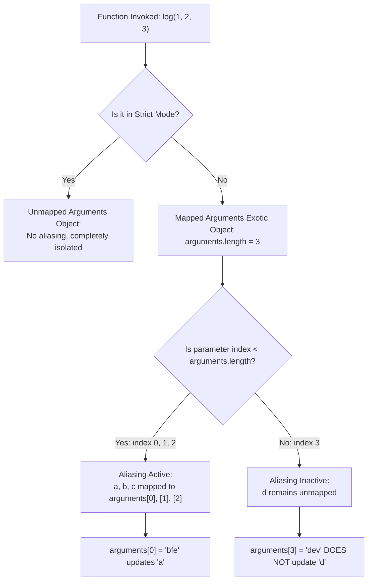

# 📝 [12. arguments](https://bigfrontend.dev/quiz/arguments)

## 📌 Problem Overview

What is printed to the console when evaluating the following JavaScript code involving the `arguments` object, parameter modification, and varying argument lengths?

```javascript
function log(a,b,c,d) {
  console.log(a,b,c,d)
  arguments[0] = 'bfe'
  arguments[3] = 'dev'
 
  console.log(a,b,c,d)
}

log(1,2,3)
```

---

## 🚀 Correct Answer
>
> [!TIP]
> **Output:**
>
> ```text
> 1 2 3 undefined
> "bfe" 2 3 undefined
> ```

---

## 🔍 Detailed Explanation & Spec-Accurate Trace

This quiz explores the behavior of the `arguments` object in JavaScript, specifically testing parameter-arguments aliasing (mapping) under sloppy (non-strict) mode, and how unpassed parameters are treated.

### ⚡ Key Spec Rules / Concepts

1. **Rule 1 (Mapped Arguments Exotic Object)**:
   In non-strict mode (sloppy mode), when a function is called and it does not use rest, default, or destructured parameters, JavaScript creates a **Mapped Arguments Exotic Object** (defined in **ECMA-262 Section 10.4.4**). This object establishes a two-way dynamic mapping (aliasing) between formal parameters and indices of the `arguments` object.
2. **Rule 2 (Aliasing Restricted to Passed Arguments)**:
   Crucially, this live connection is only initialized for parameters where arguments *were actually passed* at invocation time (i.e., for indexes `0` up to `arguments.length - 1`). If a parameter is declared but no corresponding argument is passed during call-time, no connection is established. Modifying the corresponding index in `arguments` will NOT update the variable, and vice versa.
3. **Rule 3 (Strict Mode Non-Aliasing)**:
   If strict mode is enabled (`"use strict"`), the `arguments` object is unmapped. Modifying `arguments[i]` never affects the formal parameter, even for passed arguments.

---

### Step-by-Step Execution

#### 1. `log(1, 2, 3)` -> `1 2 3 undefined`

- **Step A**: The function `log` is invoked with 3 arguments: `1`, `2`, and `3`. The formal parameters are mapped as follows:
  - `a` is bound to `1` (explicitly passed)
  - `b` is bound to `2` (explicitly passed)
  - `c` is bound to `3` (explicitly passed)
  - `d` is initialized to `undefined` (not passed)
- **Step B**: Because only 3 arguments were passed, the engine creates a Mapped Arguments Exotic Object with `arguments.length = 3`. Dynamic aliasing is established for indexes `0`, `1`, and `2` (corresponding to parameters `a`, `b`, and `c`).
- **Step C**: The variable `d` corresponds to index `3`. Since index `3` is greater than or equal to `arguments.length` (3), **no aliasing** is created for `d`.
- **Output**: `1 2 3 undefined`

#### 2. `arguments[0] = 'bfe'` -> updates `a` to `"bfe"`

- **Step A**: The engine modifies index `0` of the `arguments` object to `'bfe'`.
- **Step B**: Because index `0` is dynamically aliased to the formal parameter `a`, the value of `a` is automatically updated in the execution scope.
- **Output**: `a` is now `"bfe"`.

#### 3. `arguments[3] = 'dev'` -> does not update `d`

- **Step A**: The engine sets the property `'3'` on the `arguments` object to `'dev'`.
- **Step B**: Since index `3` has no dynamic aliasing with the formal parameter `d`, this assignment does not affect the variable `d`. `d` remains `undefined`.
- **Output**: `d` remains `undefined`.

#### 4. `console.log(a, b, c, d)` -> `"bfe" 2 3 undefined`

- **Step A**: The current values of parameters `a`, `b`, `c`, and `d` are read from the environment record:
  - `a` is `"bfe"`
  - `b` is `2`
  - `c` is `3`
  - `d` is `undefined`
- **Output**: `"bfe" 2 3 undefined`

---

## 💡 Key Takeaway

- **Invocation-Bound Aliasing**: Parameter-to-arguments aliasing only applies to arguments that are explicitly provided at the call-site. Unpassed parameters (whose index >= `arguments.length`) are never aliased.
- **Strict Mode Distinction**: This entire dynamic aliasing behavior is absent in strict mode, where parameters and the `arguments` object are completely independent.

---

## 🛠️ Recommendations & Best Practices

- **Do Not Modify `arguments`**: Mutating properties of the `arguments` object is confusing, hard to maintain, and severely degrades execution performance because it prevents JavaScript engines from optimizing variable scopes.
- **Use Rest Parameters**: Instead of the `arguments` object, use modern ES6 Rest Parameters (`...args`), which form a standard Array and do not alias.

```javascript
// Avoid (Legacy Sloppy Aliasing):
function legacyFunc(a) {
  arguments[0] = 'new value';
  console.log(a); // 'new value'
}

// Recommended (Strict Mode + Explicit Rest Parameters):
'use strict';

function modernFunc(a, ...rest) {
  // Safe, clean, and highly performant
  console.log(a, rest);
}
```

---

## 🧠 Revision Tips & Cheat Sheet

### Arguments Mapping Decision Flow



---

## 🔗 Helpful Resources

- [ECMA-262 Specification - Section 10.4.4 Arguments Exotic Objects](https://tc39.es/ecma262/#sec-arguments-exotic-objects)
- [MDN Web Docs - The arguments object](https://developer.mozilla.org/en-US/docs/Web/JavaScript/Reference/Functions/arguments)
- [BFE.dev - Quiz 12: arguments](https://bigfrontend.dev/quiz/arguments)

---

## 🏷️ Tags

`#arguments` `#ParameterAliasing` `#SloppyMode` `#StrictParameters` `#SpecDeepDive`
