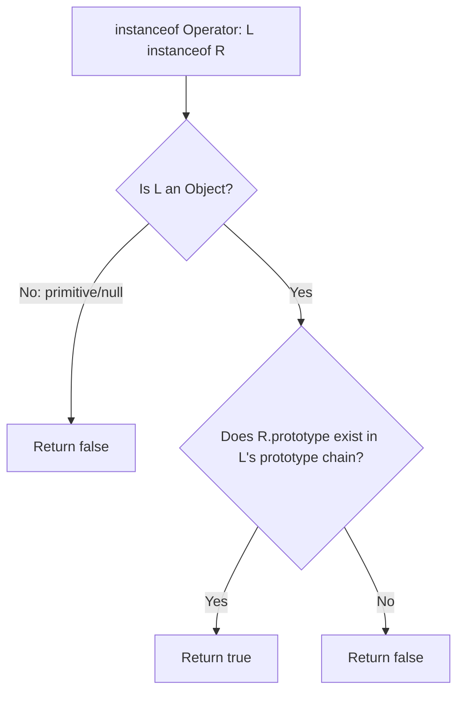

# 📝 [15. instanceOf](https://bigfrontend.dev/quiz/instanceOf)

## 📌 Problem Overview

This quiz tests your understanding of the `typeof` and `instanceof` operators in JavaScript, specifically how they behave when applied to `null`, primitive values (numbers, booleans), object wrappers (created via `new`), and complex objects like arrays and functions.

```javascript
console.log(typeof null)
console.log(null instanceof Object) 
console.log(typeof 1)
console.log(1 instanceof Number)
console.log(1 instanceof Object)
console.log(Number(1) instanceof Object)
console.log(new Number(1) instanceof Object)
console.log(typeof true)
console.log(true instanceof Boolean)
console.log(true instanceof Object)
console.log(Boolean(true) instanceof Object)
console.log(new Boolean(true) instanceof Object)
console.log([] instanceof Array)
console.log([] instanceof Object)
console.log((() => {}) instanceof Object)
```

---

## 🚀 Correct Answer
>
> [!TIP]
> **Output:**
>
> ```text
> object
> false
> number
> false
> false
> false
> true
> boolean
> false
> false
> false
> true
> true
> true
> true
> ```

---

## 🔍 Detailed Explanation & Spec-Accurate Trace

The quiz tests two primary concepts in JavaScript:

1. **The `typeof` Operator**: Returns a string indicating the type of the unevaluated operand. Its behavior is defined in the ECMAScript spec (under the `typeof` Operator evaluation), with a well-known legacy behavior returning `"object"` for `null`.
2. **The `instanceof` Operator**: Tests whether the `.prototype` property of a constructor function appears anywhere in the prototype chain of an object. The crucial spec rule is that `instanceof` only operates on actual objects. If the left-hand side is a primitive value, it immediately returns `false` without traversing any prototype chain.

### ⚡ Key Spec Rules / Concepts

1. **Rule 1 (`typeof` Operator)**: According to ECMA-262 (specifically `typeof` evaluation), the `typeof` operator returns a string depending on the type of the operand. For `null`, due to a historical bug dating back to the first version of JavaScript, it returns `"object"`. For primitive numbers and booleans, it returns `"number"` and `"boolean"`, respectively.
2. **Rule 2 (`instanceof` Operator / OrdinaryHasInstance)**: Under the hood, `instanceof` invokes the `[@@hasInstance]` method on the constructor (e.g., `Object[Symbol.hasInstance](V)`). If the left-hand side operand `V` is not an Object (i.e. it is a primitive), the specification dictates that the operator returns `false` immediately.
3. **Rule 3 (Primitive vs. Object Wrappers)**: Calling a constructor function like `Number(x)` or `Boolean(x)` as a normal function performs type conversion and returns a **primitive** value. Calling it with the `new` operator (e.g., `new Number(x)`) creates a **wrapper object** whose prototype is set to the constructor's `.prototype`.

---

### Step-by-Step Execution

For each expression/statement executed in the quiz, trace the evaluation step-by-step:

#### 1. `typeof null` -> `"object"`

- **Step A**: The engine evaluates the operand `null`.
- **Step B**: By historical implementation design (and codified in the ECMA-262 specification), `typeof null` evaluates to `"object"`.
- **Output**: `"object"`

#### 2. `null instanceof Object` -> `false`

- **Step A**: The engine checks the left-hand side operand `null`.
- **Step B**: Since `null` is a primitive value (not an object), the `instanceof` operator immediately returns `false` without checking the prototype chain.
- **Output**: `false`

#### 3. `typeof 1` -> `"number"`

- **Step A**: The operand `1` is a numeric literal representing a primitive Number.
- **Step B**: `typeof` on a primitive number returns `"number"`.
- **Output**: `"number"`

#### 4. `1 instanceof Number` -> `false`

- **Step A**: The left-hand side operand `1` is a primitive value.
- **Step B**: Because `1` is a primitive and not an object, the `instanceof` check returns `false` immediately.
- **Output**: `false`

#### 5. `1 instanceof Object` -> `false`

- **Step A**: The left-hand side operand `1` is a primitive value.
- **Step B**: Since `1` is not an object, `instanceof` returns `false` immediately.
- **Output**: `false`

#### 6. `Number(1) instanceof Object` -> `false`

- **Step A**: `Number(1)` is invoked as a function. This performs type conversion, returning the primitive number `1`.
- **Step B**: Since `1` is a primitive value, it is not an object, so `instanceof` returns `false`.
- **Output**: `false`

#### 7. `new Number(1) instanceof Object` -> `true`

- **Step A**: `new Number(1)` is invoked with the `new` operator, which constructs a new `Number` object wrapper instance.
- **Step B**: The engine traverses the prototype chain of this new object. Its internal prototype `[[Prototype]]` is `Number.prototype`, which in turn inherits from `Object.prototype`.
- **Output**: `true`

#### 8. `typeof true` -> `"boolean"`

- **Step A**: The operand `true` is a boolean literal representing a primitive Boolean.
- **Step B**: `typeof` on a primitive boolean returns `"boolean"`.
- **Output**: `"boolean"`

#### 9. `true instanceof Boolean` -> `false`

- **Step A**: The left-hand side operand `true` is a primitive value.
- **Step B**: Since `true` is a primitive, `instanceof` returns `false`.
- **Output**: `false`

#### 10. `true instanceof Object` -> `false`

- **Step A**: The left-hand side operand `true` is a primitive value.
- **Step B**: Since `true` is not an object, `instanceof` returns `false`.
- **Output**: `false`

#### 11. `Boolean(true) instanceof Object` -> `false`

- **Step A**: `Boolean(true)` is invoked as a function, returning the primitive boolean `true`.
- **Step B**: Since the result is primitive, `instanceof` returns `false`.
- **Output**: `false`

#### 12. `new Boolean(true) instanceof Object` -> `true`

- **Step A**: `new Boolean(true)` is invoked with the `new` operator, constructing a `Boolean` object wrapper.
- **Step B**: The engine checks the prototype chain of this wrapper object. It has `Boolean.prototype` and `Object.prototype` in its chain, matching `Object.prototype`.
- **Output**: `true`

#### 13. `[] instanceof Array` -> `true`

- **Step A**: `[]` is an array literal, which constructs an Array object.
- **Step B**: The prototype chain of an array object has `Array.prototype` as its direct prototype. Since `Array.prototype` matches the constructor's `.prototype`, `instanceof` returns `true`.
- **Output**: `true`

#### 14. `[] instanceof Object` -> `true`

- **Step A**: `[]` evaluates to an array object.
- **Step B**: The engine traverses its prototype chain: `Array.prototype` -> `Object.prototype`. Since `Object.prototype` is found, `instanceof` returns `true`.
- **Output**: `true`

#### 15. `(() => {}) instanceof Object` -> `true`

- **Step A**: `(() => {})` evaluates to a function object.
- **Step B**: The internal prototype `[[Prototype]]` of a function is `Function.prototype`, which in turn inherits from `Object.prototype`. Since `Object.prototype` is present, it returns `true`.
- **Output**: `true`

---

## 💡 Key Takeaway

- **`instanceof` only works on Objects**: Any check where the left-hand operand is a primitive (including `null`, numbers, strings, symbols, booleans, and bigints) will automatically evaluate to `false`.
- **Functions vs Object Wrappers**: Avoid using constructors with the `new` keyword (like `new Number()`, `new Boolean()`) unless you explicitly want object wrapper instances, as they can lead to highly confusing behavior when checking types or executing truthiness checks.

---

## 🛠️ Recommendations & Best Practices

- **Use direct type checking or typeof for primitives**: When writing type assertions, use `typeof` for checking primitive types rather than `instanceof`.
- **Avoid Object Wrappers**: Always use literal initialization (`1`, `true`, `[]`) or pure type conversion (`Number()`, `Boolean()`) without the `new` keyword to keep values as primitive types.

```javascript
// Good practice: testing primitive types with typeof
const score = 100;
if (typeof score === 'number') {
  console.log("Valid number");
}

// Good practice: checking array types with Array.isArray
const list = [];
if (Array.isArray(list)) {
  console.log("Valid array");
}
```

---

## 🧠 Revision Tips & Cheat Sheet

### Visual Coercion Path / Logical Flow



---

## 🔗 Helpful Resources

- [ECMA-262 Specification - Relational Operators (instanceof)](https://tc39.es/ecma262/#sec-relational-operators)
- [MDN Web Docs - instanceof](https://developer.mozilla.org/en-US/docs/Web/JavaScript/Reference/Operators/instanceof)
- [BFE.dev - Quiz 15](https://bigfrontend.dev/quiz/instanceOf)

---

## 🏷️ Tags

`#typeof` `#instanceof` `#PrimitiveVsObject` `#SpecDeepDive`
