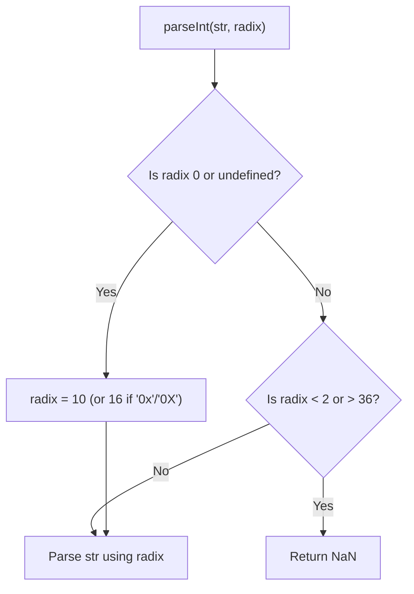

# 📝 [16. parseInt](https://bigfrontend.dev/quiz/parseInt)

## 📌 Problem Overview

This quiz tests your understanding of the interaction between `Array.prototype.map()` and `parseInt()`, specifically how `map()` passes multiple arguments (`value`, `index`, `array`) to its callback function, and how `parseInt()` interprets the second argument (`radix`).

```javascript
console.log(['0'].map(parseInt))
console.log(['0','1'].map(parseInt))
console.log(['0','1','1'].map(parseInt))
console.log(['0','1','1','1'].map(parseInt))
```

---

## 🚀 Correct Answer
>
> [!TIP]
> **Output:**
>
> ```text
> [0]
> [0, NaN]
> [0, NaN, 1]
> [0, NaN, 1, 1]
> ```

---

## 🔍 Detailed Explanation & Spec-Accurate Trace

The quiz explores a classic JavaScript gotcha where passing a built-in function with a multi-parameter signature directly into `Array.prototype.map()` produces unexpected results.

1. **`Array.prototype.map` Callback Signature**: Passes three arguments to its callback for every element: `(value, index, array)`.
2. **`parseInt(string, radix)` Signature**: Accepts up to two arguments: the `string` to parse and the `radix` (mathematical base).

When we do `.map(parseInt)`, the `parseInt` function receives the `index` as its second argument (`radix`), and the `array` itself as the third argument (which it ignores).

### ⚡ Key Spec Rules / Concepts

1. **Rule 1 (`Array.prototype.map` Callback Signature)**: According to the ECMAScript spec, the `map` callback is invoked with `(element, index, array)`.
2. **Rule 2 (`parseInt` Radix Handling)**: Under the ECMA-262 specification for `parseInt(string, radix)`:
   - If the `radix` argument is `undefined` or `0`, it defaults to `10` (unless the string begins with `0x` or `0X`, in which case it defaults to `16`).
   - If `radix` is not `0` and is either `< 2` or `> 36`, `parseInt` returns `NaN`.
   - Otherwise, the string is parsed using the specified mathematical base.

---

### Step-by-Step Execution

For each expression/statement executed in the quiz, trace the evaluation step-by-step:

#### 1. `['0'].map(parseInt)` -> `[0]`

- **Step A**: `map` evaluates the element `'0'` at index `0`. It calls `parseInt('0', 0, ['0'])`.
- **Step B**: `parseInt` ignores the third argument and evaluates `parseInt('0', 0)`.
- **Step C**: Since `radix` is `0`, it defaults to base `10`. `0` is a valid digit in base 10, so it parses to `0`.
- **Output**: `[0]`

#### 2. `['0','1'].map(parseInt)` -> `[0, NaN]`

- **Step A**: The element `'0'` at index `0` evaluates to `0`.
- **Step B**: The element `'1'` at index `1` is processed. `map` calls `parseInt('1', 1, ['0','1'])`.
- **Step C**: `parseInt` evaluates `parseInt('1', 1)`. Since the radix `1` is less than `2` (and not `0`), the specification dictates that it returns `NaN`.
- **Output**: `[0, NaN]`

#### 3. `['0','1','1'].map(parseInt)` -> `[0, NaN, 1]`

- **Step A**: The first two elements evaluate to `0` and `NaN`.
- **Step B**: The third element `'1'` at index `2` is processed. `map` calls `parseInt('1', 2, ['0','1','1'])`.
- **Step C**: `parseInt` evaluates `parseInt('1', 2)`. Radix `2` (binary) is valid. The character `'1'` is a valid digit in base 2, so it parses to `1`.
- **Output**: `[0, NaN, 1]`

#### 4. `['0','1','1','1'].map(parseInt)` -> `[0, NaN, 1, 1]`

- **Step A**: The first three elements evaluate to `0`, `NaN`, and `1`.
- **Step B**: The fourth element `'1'` at index `3` is processed. `map` calls `parseInt('1', 3, ['0','1','1','1'])`.
- **Step C**: `parseInt` evaluates `parseInt('1', 3)`. Radix `3` (ternary) is valid. The character `'1'` is a valid digit in base 3, so it parses to `1`.
- **Output**: `[0, NaN, 1, 1]`

---

## 💡 Key Takeaway

* **Avoid passing multi-argument functions directly to `map()`**: High-order functions like `map`, `forEach`, and `filter` pass extra arguments (index, array) that can be inadvertently ingested by callbacks expecting multiple parameters.
* **Radix boundaries**: A radix of `0` in `parseInt` defaults to base `10`, whereas a radix of `1` is outside the valid range of `[2, 36]` and always returns `NaN`.

---

## 🛠️ Recommendations & Best Practices

* **Use explicit arrow function wrappers**: Always wrap callback functions in an arrow function to ensure only the intended arguments are passed.
* **Use `Number` for simple conversions**: If you just need standard base-10 conversion, use `Number` or the unary plus operator, which ignore extra arguments.

```javascript
// Good practice: explicitly pass value to parseInt with a defined radix
const items = ['0', '1', '1', '1'];
const parsedInts = items.map(value => parseInt(value, 10));
console.log(parsedInts); // [0, 1, 1, 1]

// Good practice: use Number constructor for simple numeric conversion
const numbers = items.map(Number);
console.log(numbers); // [0, 1, 1, 1]
```

---

## 🧠 Revision Tips & Cheat Sheet

### Visual Coercion Path / Logical Flow



---

## 🔗 Helpful Resources

- [ECMA-262 Specification - parseInt (string, radix)](https://tc39.es/ecma262/#sec-parseint-string-radix)
- [MDN Web Docs - parseInt](https://developer.mozilla.org/en-US/docs/Web/JavaScript/Reference/Global_Objects/parseInt)
- [BFE.dev - Quiz 16](https://bigfrontend.dev/quiz/parseInt)

---

## 🏷️ Tags

`#map` `#parseInt` `#radix` `#TypeCoercion` `#SpecDeepDive`