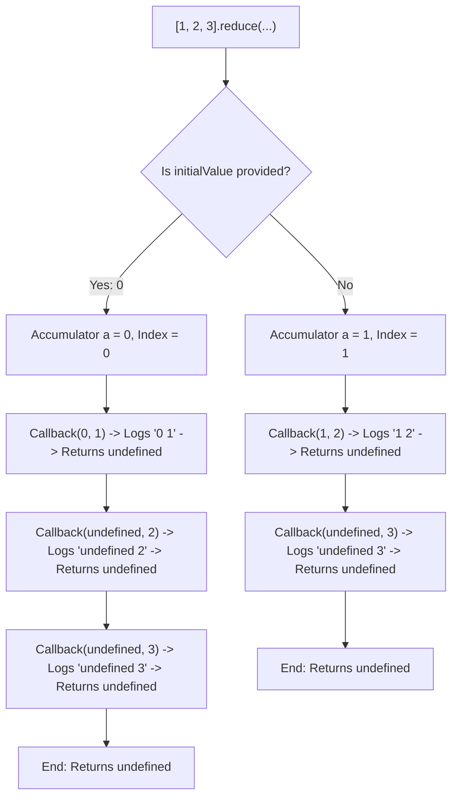

# 📝 [17. reduce](https://bigfrontend.dev/quiz/reduce)

## 📌 Problem Overview

This quiz tests your understanding of the `Array.prototype.reduce()` method's behavior under different initialization conditions: specifically, how the accumulator (`a`) and current value (`b`) are initialized depending on whether an `initialValue` argument is provided, and the consequences of omitting a `return` statement in the reducer callback.

```javascript
[1,2,3].reduce((a,b) => {
  console.log(a,b)
});

[1,2,3].reduce((a,b) => {
  console.log(a,b)
}, 0)
```

---

## 🚀 Correct Answer
>
> [!TIP]
> **Output:**
>
> ```text
> 1 2
> undefined 3
> 0 1
> undefined 2
> undefined 3
> ```

---

## 🔍 Detailed Explanation & Spec-Accurate Trace

The `Array.prototype.reduce()` method executes a reducer function on each element of the array in ascending index order, passing the return value of the callback from the previous iteration into the next iteration.

### ⚡ Key Spec Rules / Concepts

1. **Rule 1 (Accumulator Initialization with `initialValue` - ECMAScript §23.1.3.24)**: If `initialValue` is provided, the `accumulator` (`a`) is initialized to `initialValue`, and the traversal begins at index `0` with `currentValue` (`b`) equal to the first element in the array.
2. **Rule 2 (Accumulator Initialization without `initialValue` - ECMAScript §23.1.3.24)**: If `initialValue` is not provided, the `accumulator` (`a`) is initialized to the first element in the array (index `0`), and the traversal begins at index `1` with `currentValue` (`b`) equal to the second element in the array.
3. **Rule 3 (Implicit Return Value)**: The value returned by the callback becomes the `accumulator` (`a`) for the next iteration. In JavaScript, arrow functions with a block body `{ ... }` do not implicitly return any value unless the `return` keyword is used. Without `return`, the function implicitly returns `undefined`.

---

### Step-by-Step Execution

#### 1. `[1,2,3].reduce((a,b) => { console.log(a,b) })` -> `undefined`

- **Step A (Initialization)**: Since no `initialValue` is supplied, the engine sets the accumulator `a` to `1` (value at index `0`) and starts the loop at index `1`.
- **Step B (Iteration 1 at index 1)**:
  - The callback is invoked with `a = 1` and `b = 2`.
  - `console.log(1, 2)` prints `1 2` to the console.
  - The callback executes to completion without a `return` statement, implicitly returning `undefined`.
- **Step C (Iteration 2 at index 2)**:
  - The accumulator `a` takes the previous return value `undefined`.
  - The current value `b` is `3` (value at index `2`).
  - The callback is invoked with `a = undefined` and `b = 3`.
  - `console.log(undefined, 3)` prints `undefined 3` to the console.
  - The callback implicitly returns `undefined`.
- **Output**: Logs `1 2` and `undefined 3`. The final result of the `reduce` expression is `undefined`.

---

#### 2. `[1,2,3].reduce((a,b) => { console.log(a,b) }, 0)` -> `undefined`

- **Step A (Initialization)**: Since `initialValue` is explicitly provided as `0`, the engine sets the accumulator `a` to `0` and starts the loop at index `0`.
- **Step B (Iteration 1 at index 0)**:
  - The callback is invoked with `a = 0` and `b = 1`.
  - `console.log(0, 1)` prints `0 1`.
  - The callback implicitly returns `undefined`.
- **Step C (Iteration 2 at index 1)**:
  - The accumulator `a` takes the value `undefined`.
  - The current value `b` is `2`.
  - The callback is invoked with `a = undefined` and `b = 2`.
  - `console.log(undefined, 2)` prints `undefined 2`.
  - The callback implicitly returns `undefined`.
- **Step D (Iteration 3 at index 2)**:
  - The accumulator `a` takes the value `undefined`.
  - The current value `b` is `3`.
  - The callback is invoked with `a = undefined` and `b = 3`.
  - `console.log(undefined, 3)` prints `undefined 3`.
  - The callback implicitly returns `undefined`.
- **Output**: Logs `0 1`, `undefined 2`, and `undefined 3`. The final result of the `reduce` expression is `undefined`.

---

## 💡 Key Takeaway

* **Explicit Returns are Essential**: A block-body callback function in `.reduce()` must explicitly return the accumulator. Forgetting the `return` statement causes the accumulator to become `undefined` in subsequent iterations.
* **Initial Value Controls Loop Iterations**: Providing an `initialValue` means the callback runs $N$ times (for an array of length $N$), starting at index `0`. Omitting it means the callback runs $N-1$ times, starting at index `1` with the index `0` element as the starting accumulator.

---

## 🛠️ Recommendations & Best Practices

* **Always Specify an Initial Value**: Explicitly providing an initial value ensures type consistency and prevents `TypeError` when dealing with empty arrays.
* **Use Concise Arrow Syntax for Simplicity**: When the callback body contains only a simple computation, use concise-body arrow functions `(a, b) => a + b` to leverage implicit returns cleanly.

```javascript
// Good Practice: Supply initialValue and return accumulator explicitly
const totalSum = [1, 2, 3].reduce((acc, val) => {
  return acc + val;
}, 0);

// Good Practice: Concise body arrow syntax with implicit return
const product = [1, 2, 3].reduce((acc, val) => acc * val, 1);
```

---

## 🧠 Revision Tips & Cheat Sheet

### Visual Coercion Path / Logical Flow



---

## 🔗 Helpful Resources

- [ECMA-262 Specification - Array.prototype.reduce](https://tc39.es/ecma262/#sec-array.prototype.reduce)
- [MDN Web Docs - Array.prototype.reduce()](https://developer.mozilla.org/en-US/docs/Web/JavaScript/Reference/Global_Objects/Array/reduce)
- [BFE.dev - Quiz 17](https://bigfrontend.dev/quiz/reduce)

---

## 🏷️ Tags

`#JavaScript` `#ArrayPrototypeReduce` `#FunctionalProgramming` `#Accumulator` `#SpecDeepDive`