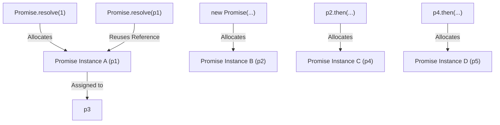

# 📝 [18. Promise executor II](https://bigfrontend.dev/quiz/Promise-executor-II)

## 📌 Problem Overview

This quiz tests your understanding of Promise instantiation, chaining with `.then()`, optimization behaviors in `Promise.resolve()`, and JavaScript's object reference comparison rules.

```javascript
const p1 = Promise.resolve(1)
const p2 = new Promise((resolve) => resolve(p1))
const p3 = Promise.resolve(p1)
const p4 = p2.then(() => new Promise((resolve) => resolve(p3)))
const p5 = p4.then(() => p4)

console.log(p1 == p2)
console.log(p1 == p3)
console.log(p3 == p4)
console.log(p4 == p5)
```

---

## 🚀 Correct Answer
>
> [!TIP]
> **Output:**
>
> ```text
> false
> true
> false
> false
> ```

---

## 🔍 Detailed Explanation & Spec-Accurate Trace

The core concepts being evaluated here are **Reference Equality** for JavaScript objects and how the Promise API manages instance allocation across different initialization pathways.

### ⚡ Key Spec Rules / Concepts

1. **`Promise.resolve(x)` Optimization (ECMA-262 27.2.4.6)**:
   If `IsPromise(x)` is true, `Promise.resolve` checks if the constructor of `x` is the standard `Promise` constructor. If it matches, the specification requires returning `x` directly. No new Promise wrapper is allocated.
2. **`new Promise(executor)` Instantiation (ECMA-262 27.2.3.1)**:
   Invoking the `Promise` constructor with `new` always creates and returns a brand-new Promise object instance in memory. Even when resolved with another Promise, it asynchronously adopts its state but remains a distinct object.
3. **`Promise.prototype.then()` Chain Resolution (ECMA-262 27.2.5.4)**:
   The `.then()` method always allocates and returns a new Promise instance (often called a "then-promise"). This ensures chaining operates independently, even if a callback returns an existing promise.
4. **Reference Comparison (`==` / `===`)**:
   In JavaScript, two objects compared using equality operators only return `true` if they reference the exact same memory address (referential identity).

---

### Step-by-Step Execution

#### 1. `const p1 = Promise.resolve(1)` -> `Promise_A`

- **Step A**: Since `1` is a primitive value, a brand new Promise instance (`Promise_A`) is created and fulfilled with `1`.
- **Output**: `p1` holds the reference to `Promise_A`.

#### 2. `const p2 = new Promise((resolve) => resolve(p1))` -> `Promise_B`

- **Step A**: Invoking `new Promise(...)` creates a brand new Promise instance (`Promise_B`).
- **Step B**: `resolve(p1)` is called within the executor. This hooks up `Promise_B` to resolve after `p1` resolves, but they remain distinct objects.
- **Output**: `p2` holds the reference to `Promise_B` (`p1 !== p2`).

#### 3. `const p3 = Promise.resolve(p1)` -> `Promise_A`

- **Step A**: `Promise.resolve()` is called with `p1`, which is already a Promise instance.
- **Step B**: According to the ECMA specification, the engine bypasses wrapping and returns `p1` (`Promise_A`) directly.
- **Output**: `p3` holds the reference to `Promise_A` (`p3 === p1`).

#### 4. `const p4 = p2.then(() => new Promise((resolve) => resolve(p3)))` -> `Promise_C`

- **Step A**: Invoking `.then()` on `p2` always creates and returns a brand new Promise instance (`Promise_C`).
- **Output**: `p4` holds the reference to `Promise_C`.

#### 5. `const p5 = p4.then(() => p4)` -> `Promise_D`

- **Step A**: Calling `.then()` on `p4` once again creates and returns a new Promise instance (`Promise_D`), even though the callback returns `p4` itself.
- **Output**: `p5` holds the reference to `Promise_D`.

#### 6. `console.log(p1 == p2)` -> `false`

- **Step A**: Evaluates the equality of two different object references, `Promise_A` and `Promise_B`.
- **Output**: `false`

#### 7. `console.log(p1 == p3)` -> `true`

- **Step A**: Evaluates the equality of the same object reference, `Promise_A` and `Promise_A`.
- **Output**: `true`

#### 8. `console.log(p3 == p4)` -> `false`

- **Step A**: Evaluates the equality of two different object references, `Promise_A` and `Promise_C`.
- **Output**: `false`

#### 9. `console.log(p4 == p5)` -> `false`

- **Step A**: Evaluates the equality of two different object references, `Promise_C` and `Promise_D`.
- **Output**: `false`

---

## 💡 Key Takeaway

- **`Promise.resolve` is Idempotent**: Calling `Promise.resolve()` on a standard Promise simply returns the input Promise directly, retaining the same reference.
- **Allocation is Guaranteed on `new` and `.then()`**: Every invocation of `new Promise()` or `.then()` allocates a brand-new Promise instance, meaning their references will never equal any existing Promise instance.

---

## 🛠️ Recommendations & Best Practices

- **Do Not Perform Reference Comparisons on Promises**: Avoid comparing Promise references with `==` or `===` to check equivalence, as they are objects and evaluate reference identity. Compare their resolved values instead.
- **Leverage `Promise.resolve` for Safe Wrapping**: Use `Promise.resolve(value)` to wrap unknown values. It safely bypasses double-wrapping if the value is already a Promise.

```javascript
// Good Practice: Safely waiting for values without checking reference identity
const valOrPromise1 = Promise.resolve(42);
const valOrPromise2 = 42;

async function compareValues(a, b) {
  // Resolve both values if they are promises (or pass through if primitive)
  const resolvedA = await a;
  const resolvedB = await b;
  console.log(resolvedA === resolvedB); // true
}

compareValues(valOrPromise1, valOrPromise2);
```

---

## 🧠 Revision Tips & Cheat Sheet

### Visual Coercion Path / Logical Flow



---

## 🔗 Helpful Resources

- [ECMA-262 Specification - Promise.resolve](https://tc39.es/ecma262/#sec-promise.resolve)
- [MDN Web Docs - Promise.resolve()](https://developer.mozilla.org/en-US/docs/Web/JavaScript/Reference/Global_Objects/Promise/resolve)
- [BFE.dev - Quiz 18: Promise executor II](https://bigfrontend.dev/quiz/Promise-executor-II)

---

## 🏷️ Tags

`#Promise` `#PromiseResolve` `#ReferenceEquality` `#SpecDeepDive`
