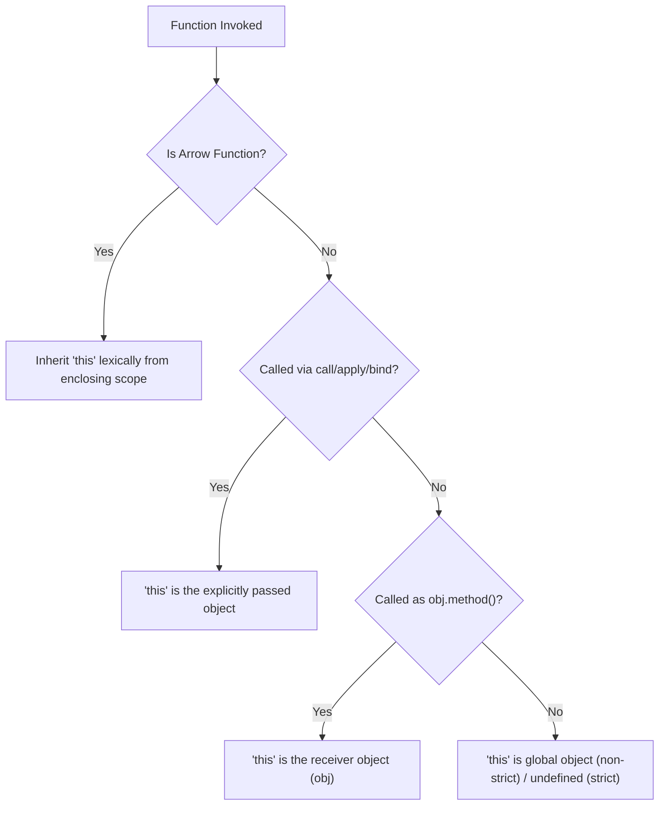

# 📝 [19. this](https://bigfrontend.dev/quiz/this)

## 📌 Problem Overview

This quiz explores how the `this` keyword is resolved in JavaScript across different contexts, including object methods, plain function calls, arrow functions, and immediately invoked function expressions (IIFE). It also demonstrates how explicit binding methods (`call` and `apply`) affect standard functions versus arrow functions.

```javascript
const obj = {
  a: 1,
  b: function() {
    console.log(this.a)
  },
  c() {
    console.log(this.a)
  },
  d: () => {
    console.log(this.a)
  },
  e: (function() {
    return () => {
      console.log(this.a);
    }
  })(),
  f: function() {
    return () => {
      console.log(this.a);
    }
  }
}

console.log(obj.a)
obj.b()
;(obj.b)()
const b = obj.b
b()
obj.b.apply({a: 2})
obj.c()
obj.d()
;(obj.d)()
obj.d.apply({a:2})
obj.e()
;(obj.e)()
obj.e.call({a:2})
obj.f()()
;(obj.f())()
obj.f().call({a:2})
```

---

## 🚀 Correct Answer
>
> [!TIP]
> **Output:**
>
> ```text
> 1
> 1
> 1
> undefined
> 2
> 1
> undefined
> undefined
> undefined
> undefined
> undefined
> undefined
> 1
> 1
> 1
> ```

---

## 🔍 Detailed Explanation & Spec-Accurate Trace

The behavior of `this` in JavaScript depends primarily on how a function is invoked rather than where it is declared. Specifically, standard functions use dynamic binding (determined at runtime based on the call site), whereas arrow functions use lexical binding (determined at definition time based on the enclosing scope).

### ⚡ Key Spec Rules / Concepts

1. **Rule 1 (Dynamic / Implicit Binding)**: When a standard function or shorthand method is executed as a method of an object (e.g., `receiver.method()`), the `this` value inside the function is bound to the receiver object (the object before the dot).
2. **Rule 2 (Default / Plain Function Invocation)**: When a standard function is executed as a plain function call without a receiver object (e.g., `func()`), the `this` value falls back to the global object (in non-strict mode) or `undefined` (in strict mode).
3. **Rule 3 (Lexical Arrow Function Binding)**: Arrow functions do not define their own `this` binding. Instead, they capture the `this` value of their enclosing execution context at the time they are created. Once bound, an arrow function's `this` context is immutable and cannot be changed by methods like `.call()`, `.apply()`, or `.bind()`.

---

### Step-by-Step Execution

For each expression/statement executed in the quiz, trace the evaluation step-by-step:

#### 1. `console.log(obj.a)` -> `1`

- **Step A**: Access the property `a` directly on `obj`.
- **Step B**: `obj.a` evaluates to `1`.
- **Output**: `1`

#### 2. `obj.b()` -> `1`

- **Step A**: The function `obj.b` is called using method invocation syntax `obj.b()`.
- **Step B**: The dynamic `this` environment value inside `b` is bound to the receiver object `obj`.
- **Step C**: `this.a` resolves to `obj.a`, which is `1`.
- **Output**: `1`

#### 3. `(obj.b)()` -> `1`

- **Step A**: The grouping operator `()` wraps the property reference `obj.b`. According to ECMAScript spec, parenthesizing a Reference does not discard the base object (the reference remains `obj.b`).
- **Step B**: The invocation is still evaluated as a method call on `obj`, setting `this` to `obj`.
- **Output**: `1`

#### 4. `b()` -> `undefined`

- **Step A**: The reference to `obj.b` is extracted and assigned to `const b`. The function is then invoked as a plain function `b()`.
- **Step B**: The `this` environment value defaults to the global object (`window` or `global` in non-strict mode).
- **Step C**: Since `global.a` is not defined, `this.a` evaluates to `undefined`.
- **Output**: `undefined`

#### 5. `obj.b.apply({a: 2})` -> `2`

- **Step A**: The function `obj.b` is invoked using `.apply()` with the context object `{a: 2}`.
- **Step B**: This explicitly binds `this` inside the standard function to `{a: 2}`.
- **Output**: `2`

#### 6. `obj.c()` -> `1`

- **Step A**: Method `c` is defined using ES6 shorthand syntax (`c() {}`). It behaves identically to standard function properties regarding dynamic `this` binding.
- **Step B**: Since it is invoked as `obj.c()`, `this` is bound to `obj`.
- **Output**: `1`

#### 7. `obj.d()` -> `undefined`

- **Step A**: `obj.d` is an arrow function. It has no dynamic `this` and inherits it lexically.
- **Step B**: The parent lexical scope of the `obj` object literal declaration is the global/module scope.
- **Step C**: `this` resolves to the global object, and `global.a` is `undefined`.
- **Output**: `undefined`

#### 8. `(obj.d)()` -> `undefined`

- **Step A**: Evaluates similarly to `obj.d()`.
- **Step B**: The arrow function resolves its `this` context to the global scope.
- **Output**: `undefined`

#### 9. `obj.d.apply({a: 2})` -> `undefined`

- **Step A**: `.apply()` is invoked on the arrow function `obj.d`.
- **Step B**: The ECMAScript specification dictates that arrow functions ignore explicit bindings like `apply`, `call`, or `bind`.
- **Step C**: The `this` value remains the lexically inherited global object.
- **Output**: `undefined`

#### 10. `obj.e()` -> `undefined`

- **Step A**: `obj.e` is initialized via an IIFE: `(function() { return () => { ... } })()`.
- **Step B**: The IIFE is executed immediately as a plain function call when defining the object literal `obj`. Thus, `this` inside the IIFE is the global object.
- **Step C**: The IIFE returns an arrow function, which captures this enclosing lexical context (`this` as global).
- **Step D**: When calling `obj.e()`, the arrow function executes using the captured global `this`.
- **Output**: `undefined`

#### 11. `(obj.e)()` -> `undefined`

- **Step A**: Invokes the arrow function stored in `obj.e`.
- **Step B**: It uses the lexically captured global context.
- **Output**: `undefined`

#### 12. `obj.e.call({a:2})` -> `undefined`

- **Step A**: Invokes the arrow function with `.call()`.
- **Step B**: Arrow functions ignore dynamic context changes, using the lexically captured global `this`.
- **Output**: `undefined`

#### 13. `obj.f()()` -> `1`

- **Step A**: `obj.f()` is called. Since `f` is a standard function called as a method, its `this` context is bound to `obj`.
- **Step B**: `f` returns an arrow function. This arrow function captures the enclosing lexical scope's `this` context, which is `obj`.
- **Step C**: The returned arrow function is then immediately executed: `()`. It runs with `this` bound to `obj`.
- **Output**: `1`

#### 14. `(obj.f())()` -> `1`

- **Step A**: First evaluates `obj.f()`, which returns the arrow function bound to `obj`.
- **Step B**: Executes that arrow function, evaluating `this.a` (which is `obj.a`) to `1`.
- **Output**: `1`

#### 15. `obj.f().call({a:2})` -> `1`

- **Step A**: First evaluates `obj.f()`, which returns the arrow function bound to `obj`.
- **Step B**: Invokes this arrow function using `.call({a: 2})`.
- **Step C**: Since arrow functions ignore explicit context bindings, it retains its lexical binding to `obj`.
- **Output**: `1`

---

## 💡 Key Takeaway

- **Dynamic vs. Lexical Scope**: Standard functions/methods resolve `this` dynamically based on how they are invoked. Arrow functions resolve `this` lexically based on the scope in which they are defined.
- **Arrow Functions ignore explicitly set context**: The `this` of an arrow function is set permanently at creation time and cannot be overridden by `.call()`, `.apply()`, or `.bind()`.

---

## 🛠️ Recommendations & Best Practices

- **Do not use arrow functions for object methods**: Use shorthand method syntax (`c() {}`) when declaring object methods that need access to the object's properties via `this`.
- **Use arrow functions inside callbacks**: Use arrow functions when returning functions from methods or inside callbacks (e.g., `setTimeout`, array utilities) to automatically forward the parent's `this` context without needing workaround references like `const self = this`.

```javascript
const counter = {
  count: 0,
  // Good: Shorthand method declaration ensures `this` refers to `counter` when called as `counter.increment()`
  increment() {
    this.count++;
  },
  // Good: Arrow function inside method captures the `counter` context lexically
  incrementLater() {
    setTimeout(() => {
      this.count++;
    }, 100);
  }
};
```

---

## 🧠 Revision Tips & Cheat Sheet

### Visual Coercion Path / Logical Flow

Here is a visual decision flow for determining the value of `this` when invoking a function:

> [!WARNING]
> Always wrap node labels containing brackets, parentheses, or spaces in double quotes to avoid Mermaid parsing errors (e.g. use `A["[] == false"]` instead of `A[[] == false]`).



---

## 🔗 Helpful Resources

- [ECMA-262 Specification - Standard/Arrow Function Definitions](https://tc39.es/ecma262/#sec-arrow-function-definitions)
- [MDN Web Docs - this keyword in JavaScript](https://developer.mozilla.org/en-US/docs/Web/JavaScript/Reference/Operators/this)
- [MDN Web Docs - Arrow functions guide](https://developer.mozilla.org/en-US/docs/Web/JavaScript/Reference/Functions/Arrow_functions)
- [BFE.dev - Quiz 19: this](https://bigfrontend.dev/quiz/this)

---

## 🏷️ Tags

`#JavaScript` `#this` `#ArrowFunctions` `#Binding` `#SpecDeepDive`
