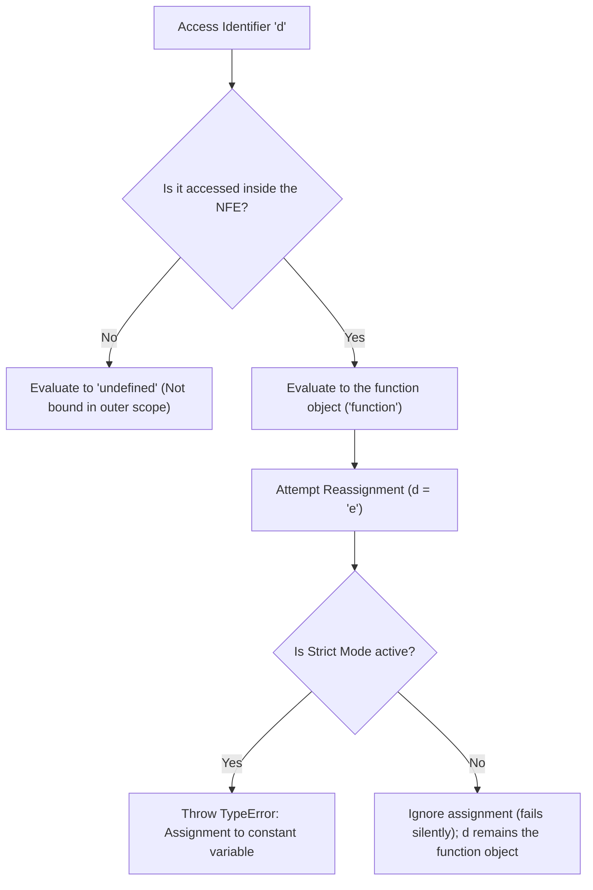

# 📝 [20. name for Function expression](https://bigfrontend.dev/quiz/name-for-Function-expression)

## 📌 Problem Overview

This quiz tests your understanding of JavaScript functions, specifically the differences in scoping and mutability between Function Declarations, Function Expressions, and Named Function Expressions (NFE). It explores where the function's name identifier is bound and whether it can be reassigned inside the function body.

```javascript
function a(){
}
const b = function() {
  
}

const c = function d() {
  console.log(typeof d)
  d = 'e'
  console.log(typeof d)
}

console.log(typeof a)
console.log(typeof b)
console.log(typeof c)
console.log(typeof d)
c()
```

---

## 🚀 Correct Answer
>
> [!TIP]
> **Output:**
>
> ```text
> "function"
> "function"
> "function"
> "undefined"
> "function"
> "function"
> ```

---

## 🔍 Detailed Explanation & Spec-Accurate Trace

The quiz highlights the distinct scoping behavior of function identifiers. A Function Declaration binds its name to its surrounding scope. A Named Function Expression, however, binds its name strictly to a new, local declarative environment created specifically for that function's execution. Furthermore, the name identifier inside a Named Function Expression is bound as an immutable (read-only) binding.

### ⚡ Key Spec Rules / Concepts

1. **Rule 1 (Function Declaration Scope)**: A Function Declaration (e.g., `function a(){}`) binds its identifier to the variable environment of the running execution context (making it available in the enclosing scope).
2. **Rule 2 (Named Function Expression Scoping)**: Under the ECMAScript Specification (ECMA-262, Section 15.2.5 on Named Function Expressions), evaluating a Named Function Expression creates a new local Declarative Environment Record. The function's internal name (`d` in `function d(){}`) is bound in this local environment. It is not bound in, nor accessible from, the enclosing/outer scope.
3. **Rule 3 (Immutability of NFE Name)**: Inside the Named Function Expression, the binding of the function name (`d`) is an immutable binding. Attempting to assign a new value to it (e.g., `d = 'e'`) fails silently in non-strict mode, leaving the binding referencing the original function. In strict mode, it throws a `TypeError: Assignment to constant variable`.

---

### Step-by-Step Execution

For each expression/statement executed in the quiz, trace the evaluation step-by-step:

#### 1. `console.log(typeof a)` -> `"function"`

- **Step A**: Look up the identifier `a` in the current scope.
- **Step B**: `a` is a Function Declaration, so it is resolved to the function object.
- **Output**: `"function"`

#### 2. `console.log(typeof b)` -> `"function"`

- **Step A**: Look up the identifier `b` in the current scope.
- **Step B**: `b` is a constant variable pointing to a Function Expression.
- **Output**: `"function"`

#### 3. `console.log(typeof c)` -> `"function"`

- **Step A**: Look up the identifier `c` in the current scope.
- **Step B**: `c` is a constant variable pointing to the Named Function Expression.
- **Output**: `"function"`

#### 4. `console.log(typeof d)` -> `"undefined"`

- **Step A**: Look up the identifier `d` in the current outer scope.
- **Step B**: `d` is the name of the Named Function Expression, which is only bound locally within the function's body. It is not present in the outer environment.
- **Output**: `"undefined"`

#### 5. `c()` -> Executes function body of `c` (internally named `d`)

- **Step A**: Invoke the function referenced by `c`.
- **Step B**: Inside the function, evaluate `console.log(typeof d)`. Since `d` is bound locally to the function itself, it resolves to the function object.
- **Output**: `"function"`
- **Step C**: Evaluate `d = 'e'`. Since `d` is bound as an immutable binding in the NFE scope, this assignment is ignored (fails silently) in non-strict mode.
- **Step D**: Evaluate `console.log(typeof d)`. The binding `d` still references the function object.
- **Output**: `"function"`

---

## 💡 Key Takeaway

- **NFE Scoping**: The name of a Named Function Expression is only visible within the function body itself and is completely isolated from the outer scope.
- **NFE Immutability**: The internal identifier of a Named Function Expression is read-only. Assigning to it does not change the reference in non-strict mode and throws a TypeError in strict mode.

---

## 🛠️ Recommendations & Best Practices

- **Do not reassign function names inside NFEs**: Never attempt to reassign the function name variable inside the body of a Named Function Expression.
- **Enable strict mode**: Always write code in strict mode (`"use strict"`) to catch silent failures, such as trying to reassign the immutable name of an NFE.

```javascript
"use strict";

const myFunc = function helper() {
  // Good: Referencing `helper` for recursion
  console.log(typeof helper); // "function"

  // Bad: Attempting to assign to helper will throw a TypeError in strict mode
  // helper = "something else"; 
};
```

---

## 🧠 Revision Tips & Cheat Sheet

### Visual Coercion Path / Logical Flow

Provide a Mermaid diagram to visualize the key decision path or type coercion flow.

> [!WARNING]
> Always wrap node labels containing brackets, parentheses, or spaces in double quotes to avoid Mermaid parsing errors (e.g. use `A["[] == false"]` instead of `A[[] == false]`).



---

## 🔗 Helpful Resources

- [ECMA-262 Specification - Function Definitions Runtime Semantics: Evaluation](https://tc39.es/ecma262/#sec-function-definitions-runtime-semantics-evaluation)
- [MDN Web Docs - Function expression](https://developer.mozilla.org/en-US/docs/Web/JavaScript/Reference/Operators/function)
- [BFE.dev - Quiz 20: name for Function expression](https://bigfrontend.dev/quiz/name-for-Function-expression)

---

## 🏷️ Tags

`#JavaScript` `#FunctionExpression` `#NamedFunctionExpression` `#Scope` `#SpecDeepDive`
