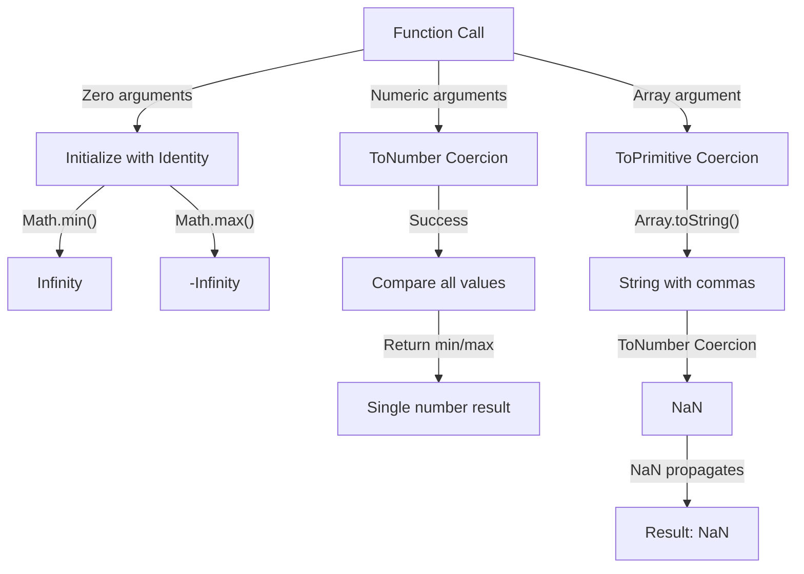

# 📝 [22. min max](https://bigfrontend.dev/quiz/min-max)

## 📌 Problem Overview

This quiz explores the behavior of `Math.min()` and `Math.max()` functions, particularly their identity elements when called with no arguments, their numeric coercion behavior, and how they handle array arguments.

```javascript
console.log(Math.min())
console.log(Math.max())
console.log(Math.min(1))
console.log(Math.max(1,2))
console.log(Math.min([1,2,3]))
```

---

## 🚀 Correct Answer

> [!TIP]
> **Output:**
>
> ```text
> Infinity
> -Infinity
> 1
> 2
> NaN
> ```

---

## 🔍 Detailed Explanation & Spec-Accurate Trace

`Math.min()` and `Math.max()` are built-in functions that compare numeric values. However, their behavior involves crucial edge cases: identity elements for empty argument lists, automatic numeric coercion for arguments, and special handling when receiving non-numeric types.

### ⚡ Key Spec Rules / Concepts

1. **Identity Elements for Aggregation**: `Math.min()` returns `Infinity` (the identity element for minimum) and `Math.max()` returns `-Infinity` (the identity element for maximum) when called with no arguments. This maintains mathematical properties of associativity and commutativity.
2. **Numeric Coercion via ToNumber**: All arguments are converted to numbers using the **ToNumber** abstract operation from the ECMAScript specification.
3. **NaN Propagation**: If any argument coerces to `NaN`, both `Math.min()` and `Math.max()` return `NaN` immediately (the "sticky" NaN behavior).
4. **Array as Single Argument**: When an array is passed as a single argument without spreading, it undergoes **ToPrimitive** coercion, resulting in a string (array's default primitive representation), which then fails numeric coercion and becomes `NaN`.

---

### Step-by-Step Execution

#### 1. `Math.min()` → `Infinity`

- **Context**: Function called with zero arguments.
- **Spec Behavior**: When no arguments are provided, `Math.min()` initializes with the identity element `Infinity`.
- **Reasoning**: This ensures that any numeric value compared will be smaller than the initial value, maintaining mathematical consistency.
- **Output**: `Infinity`

#### 2. `Math.max()` → `-Infinity`

- **Context**: Function called with zero arguments.
- **Spec Behavior**: When no arguments are provided, `Math.max()` initializes with the identity element `-Infinity`.
- **Reasoning**: This ensures that any numeric value compared will be larger than the initial value.
- **Output**: `-Infinity`

#### 3. `Math.min(1)` → `1`

- **Step A**: Single argument `1` is coerced to a number via **ToNumber** → `1`.
- **Step B**: Compare against the identity element `Infinity` → `min(Infinity, 1)` → `1`.
- **Output**: `1`

#### 4. `Math.max(1,2)` → `2`

- **Step A**: First argument `1` is coerced to a number → `1`.
- **Step B**: Second argument `2` is coerced to a number → `2`.
- **Step C**: Compare both values → `max(1, 2)` → `2`.
- **Output**: `2`

#### 5. `Math.min([1,2,3])` → `NaN`

- **Step A**: Array `[1,2,3]` is a single argument (not spread), so it undergoes **ToPrimitive** coercion.
- **Step B**: **ToPrimitive** for an array calls its `toString()` method → `"1,2,3"` (a string).
- **Step C**: **ToNumber** is applied to the string `"1,2,3"` → `NaN` (string with commas cannot parse as a valid number).
- **Step D**: **NaN propagates** through comparisons → `min(Infinity, NaN)` → `NaN`.
- **Output**: `NaN`

---

## 💡 Key Takeaway

* **Identity Elements Matter**: Understanding the mathematical identity elements (`Infinity` for min, `-Infinity` for max) is crucial for understanding aggregate functions and why empty inputs return these special values.
* **Coercion Pitfalls**: Arrays are not automatically flattened or destructured by `Math.min()` and `Math.max()`. Pass individual numbers or use the spread operator: `Math.min(...array)`.
* **NaN is Sticky**: Once `NaN` enters a comparison, it propagates through the entire result—a single invalid numeric coercion will invalidate the entire operation.

---

## 🛠️ Recommendations & Best Practices

* **Use Spread Operator for Arrays**: When finding min/max of an array, always use the spread operator to pass individual elements.
* **Validate Input Types**: Ensure arguments are numbers before passing to `Math.min()` or `Math.max()` to avoid unexpected `NaN` results.
* **Consider Empty Arrays**: Handle the case where an array might be empty—`Math.min(...[])` returns `Infinity`, which may not be your intended behavior.

```javascript
// ❌ Don't: Array as single argument
const arr = [5, 2, 8];
console.log(Math.min(arr));  // NaN

// ✅ Do: Spread the array
console.log(Math.min(...arr));  // 2
console.log(Math.max(...arr));  // 8

// ✅ Do: Use Array methods for safety
console.log(Math.min(...arr.filter(n => typeof n === 'number')));  // 2

// ❌ Be cautious: Empty arrays
console.log(Math.min(...[]));  // Infinity (might not be expected)
```

---

## 🧠 Revision Tips & Cheat Sheet

### Visual Coercion Path / Logical Flow



---

## 🔗 Helpful Resources

- [ECMA-262 Specification - Math Object](https://tc39.es/ecma262/#sec-math-object)
- [ECMA-262 - Math.min()](https://tc39.es/ecma262/#sec-math.min)
- [ECMA-262 - Math.max()](https://tc39.es/ecma262/#sec-math.max)
- [MDN Web Docs - Math.min()](https://developer.mozilla.org/en-US/docs/Web/JavaScript/Reference/Global_Objects/Math/min)
- [MDN Web Docs - Math.max()](https://developer.mozilla.org/en-US/docs/Web/JavaScript/Reference/Global_Objects/Math/max)
- [BFE.dev - Quiz 22](https://bigfrontend.dev/quiz/min-max)

---

## 🏷️ Tags

`#MathObject` `#NumericCoercion` `#ToPrimitive` `#ToNumber` `#IdentityElements` `#ArrayHandling` `#EdgeCases` `#SpecDeepDive`