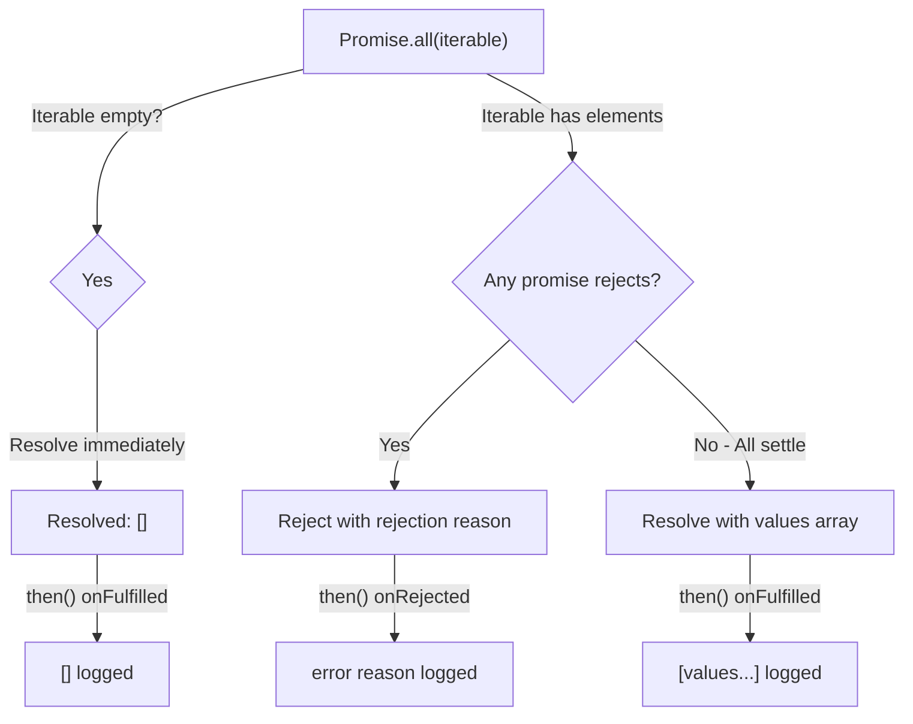

# 📝 [23. Promise.all()](https://bigfrontend.dev/quiz/Promise-all)

## 📌 Problem Overview

This quiz tests understanding of `Promise.all()` behavior, which aggregates multiple promises and resolves when all promises settle. Key behaviors: empty arrays resolve immediately, non-promise values are treated as resolved promises, and rejection of any single promise causes the entire `Promise.all()` to reject.

```javascript
(async () => {
  await Promise.all([]).then((value) => {
    console.log(value)
  }, (error) => {
    console.log(error)
  })
  
  await Promise.all([1,2,Promise.resolve(3), Promise.resolve(4)]).then((value) => {
    console.log(value)
  }, (error) => {
    console.log(error)
  })
  
  await Promise.all([1,2,Promise.resolve(3), Promise.reject('error')]).then((value) => {
    console.log(value)
  }, (error) => {
    console.log(error)
  })
})()
```

---

## 🚀 Correct Answer

> [!TIP]
> **Output:**
>
> ```text
> []
> [1, 2, 3, 4]
> error
> ```

---

## 🔍 Detailed Explanation & Spec-Accurate Trace

`Promise.all()` is a static method that takes an iterable of promise-like values and returns a single Promise. The semantics are governed by the ECMAScript Promise specification (ES2015+). Understanding its behavior requires knowledge of promise resolution, value coercion, and rejection propagation.

### ⚡ Key Spec Rules / Concepts

1. **Empty Iterable Resolution**: When `Promise.all()` receives an empty iterable, it immediately resolves with an empty array (no pending state).
2. **Non-Promise Values Conversion**: Non-promise values in the iterable are treated as already-resolved promises via `Promise.resolve()`.
3. **Rejection Short-Circuit**: If any element rejects, `Promise.all()` immediately rejects with that rejection reason; subsequent rejections are ignored.
4. **Index-Preserving Aggregation**: The resolved result maintains the order and index of the original iterable, not the order of settlement.

---

### Step-by-Step Execution

#### 1. `Promise.all([])` → `[]`

- **Step A**: The iterable is empty. Per spec, an empty iterable causes `Promise.all()` to immediately resolve.
- **Step B**: The resolved value is an empty array `[]`.
- **Step C**: The `then()` handler's first callback (onFulfilled) is invoked with `value = []`.
- **Output**: `[]`

#### 2. `Promise.all([1, 2, Promise.resolve(3), Promise.resolve(4)])` → `[1, 2, 3, 4]`

- **Step A**: The iterable contains 4 elements: two non-promise values (1, 2) and two already-resolved promises.
- **Step B**: All non-promise values are automatically wrapped via `Promise.resolve()`, making them behave as fulfilled promises.
- **Step C**: `Promise.resolve(3)` and `Promise.resolve(4)` are already fulfilled.
- **Step D**: Since all elements eventually resolve, `Promise.all()` waits for the last one to settle, then resolves with values in their original order: `[1, 2, 3, 4]`.
- **Step E**: The `then()` handler's first callback (onFulfilled) is invoked with the aggregated array.
- **Output**: `[1, 2, 3, 4]`

#### 3. `Promise.all([1, 2, Promise.resolve(3), Promise.reject('error')])` → `error`

- **Step A**: The iterable contains 4 elements, with the last being `Promise.reject('error')`.
- **Step B**: `Promise.all()` iterates through and wraps/processes each element.
- **Step C**: When `Promise.reject('error')` settles with rejection, `Promise.all()` immediately transitions to a rejected state.
- **Step D**: The rejection reason is `'error'` (a string primitive).
- **Step E**: The `then()` handler's second callback (onRejected) is invoked with the rejection reason.
- **Output**: `error`

---

## 💡 Key Takeaway

* **Empty arrays resolve immediately**: `Promise.all([])` does not create a pending promise; it resolves synchronously to an empty array.
* **Coercion via Promise.resolve()**: Non-promise values are automatically wrapped into resolved promises, preserving their position in the result array.
* **Fail-fast rejection**: Any rejection causes the entire `Promise.all()` to reject immediately with that specific rejection reason, ignoring subsequent elements.
* **Order preservation**: The output array maintains the original iterable's order, even if promises resolve out of order.

---

## 🛠️ Recommendations & Best Practices

* **Explicit error handling**: Always attach a `.catch()` or use the rejection handler in `.then()` to handle potential rejections from any promise in the iterable.
* **Fail-fast vs. fail-all semantics**: Use `Promise.allSettled()` if you need all results regardless of rejection; `Promise.all()` stops on first rejection.
* **Meaningful error messages**: When rejecting promises in a `Promise.all()` scenario, provide clear rejection reasons for easier debugging.

```javascript
// Good practice: explicit error handling
Promise.all([promise1, promise2, promise3])
  .then(
    (values) => {
      console.log('All resolved:', values)
    },
    (error) => {
      console.error('One or more rejected:', error)
    }
  )

// Better practice: using async/await with try-catch
;(async () => {
  try {
    const results = await Promise.all([promise1, promise2, promise3])
    console.log('All resolved:', results)
  } catch (error) {
    console.error('One or more rejected:', error)
  }
})()

// Alternative: Promise.allSettled for all results
Promise.allSettled([promise1, promise2, promise3])
  .then((results) => {
    // results contains {status, value/reason} for each promise
    results.forEach((result) => {
      if (result.status === 'fulfilled') {
        console.log('Resolved:', result.value)
      } else {
        console.log('Rejected:', result.reason)
      }
    })
  })
```

---

## 🧠 Revision Tips & Cheat Sheet

### Promise.all() Decision Tree



---

## 🔗 Helpful Resources

- [ECMAScript Promise.all Specification](https://tc39.es/ecma262/#sec-promise.all)
- [MDN Web Docs - Promise.all()](https://developer.mozilla.org/en-US/docs/Web/JavaScript/Reference/Global_Objects/Promise/all)
- [MDN Web Docs - Promise.allSettled()](https://developer.mozilla.org/en-US/docs/Web/JavaScript/Reference/Global_Objects/Promise/allSettled)
- [BFE.dev - Quiz 23](https://bigfrontend.dev/quiz/Promise-all)

---

## 🏷️ Tags

`#Promises` `#AsyncAwait` `#Aggregation` `#ErrorHandling` `#SpecDeepDive` `#Promise.all`