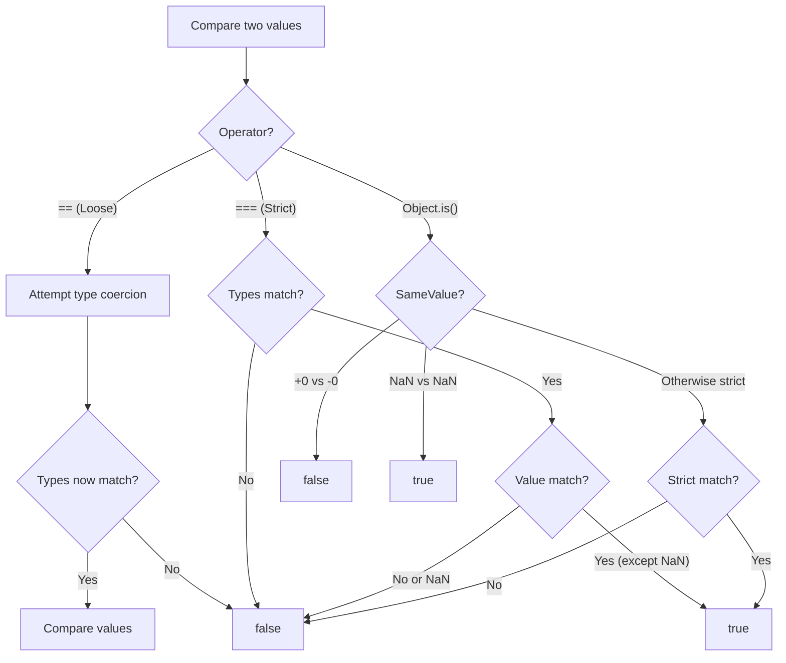

# 📝 [24. Equality & Sameness](https://bigfrontend.dev/quiz/Equality-Sameness)

## 📌 Problem Overview

This quiz examines the fundamental differences between three equality/sameness operators in JavaScript: loose equality (`==`), strict equality (`===`), and `Object.is()`. Understanding these distinctions is critical for writing predictable code and avoiding subtle bugs related to type coercion.

```javascript
console.log(0 == '0')
console.log(0 === '0')
console.log(Object.is(0, '0'))

console.log(0 == 0)
console.log(0 === 0)
console.log(Object.is(0, 0))

console.log(0 == -0)
console.log(0 === -0)
console.log(Object.is(0, -0))

console.log(NaN == NaN)
console.log(NaN === NaN)
console.log(Object.is(NaN, NaN))

console.log(0 == false)
console.log(0 === false)
console.log(Object.is(0, false))
```

---

## 🚀 Correct Answer

> [!TIP]
> **Output:**
>
> ```text
> true
> false
> false
> true
> true
> true
> true
> true
> false
> false
> false
> true
> true
> false
> false
> ```

---

## 🔍 Detailed Explanation & Spec-Accurate Trace

JavaScript provides three distinct mechanisms for comparing values, each with different semantics. The choice between them determines whether type coercion occurs and how special values like `NaN` and `-0` are handled.

### ⚡ Key Spec Rules / Concepts

1. **Loose Equality (`==`) — Abstract Equality Algorithm**: Performs type coercion if operands have different types. Converts one or both operands to a common type and then compares the values. Defined in ECMAScript Spec §7.2.14 (Abstract Equality Comparison).

2. **Strict Equality (`===`) — Strict Equality Algorithm**: No type coercion occurs. Values are only equal if they have the same type AND the same value. Treats `+0` and `-0` as equal, and treats `NaN` as not equal to itself. Defined in ECMAScript Spec §7.2.15 (Strict Equality Comparison).

3. **Object.is() — SameValue Algorithm**: Similar to strict equality but with two critical differences: `Object.is(NaN, NaN)` returns `true`, and `Object.is(0, -0)` returns `false`. Defined in ECMAScript Spec §7.2.9 (SameValue).

---

### Step-by-Step Execution

#### 1. `0 == '0'` → `true`

- **Step A**: Loose equality compares operands of different types (number and string).
- **Step B**: The Abstract Equality Algorithm coerces the string `'0'` to a number using ToNumber.
- **Step C**: `'0'` converts to `0` (numeric).
- **Step D**: Comparison becomes `0 == 0`, which is `true`.
- **Output**: `true`

#### 2. `0 === '0'` → `false`

- **Step A**: Strict equality does NOT perform type coercion.
- **Step B**: The operands have different types (number vs. string).
- **Step C**: Type mismatch means they are never strictly equal.
- **Output**: `false`

#### 3. `Object.is(0, '0')` → `false`

- **Step A**: `Object.is()` uses the SameValue algorithm.
- **Step B**: Like strict equality, no type coercion occurs.
- **Step C**: The operands have different types.
- **Output**: `false`

#### 4. `0 == 0` → `true`

- **Step A**: Same type and value.
- **Output**: `true`

#### 5. `0 === 0` → `true`

- **Step A**: Same type (number) and same value (0).
- **Output**: `true`

#### 6. `Object.is(0, 0)` → `true`

- **Step A**: Same value, SameValue comparison.
- **Output**: `true`

#### 7. `0 == -0` → `true`

- **Step A**: Loose equality compares the numeric values.
- **Step B**: In JavaScript, `+0` and `-0` are considered equal under `==`.
- **Output**: `true`

#### 8. `0 === -0` → `true`

- **Step A**: Strict equality also treats `+0` and `-0` as equal.
- **Step B**: This is a special case in the Strict Equality Algorithm (both are of type number and numerically equal).
- **Output**: `true`

#### 9. `Object.is(0, -0)` → `false`

- **Step A**: `Object.is()` uses the SameValue algorithm, which DISTINGUISHES between `+0` and `-0`.
- **Step B**: In IEEE 754 floating-point representation, these are technically different values (different signs).
- **Step C**: SameValue respects this distinction, unlike `==` and `===`.
- **Output**: `false`

#### 10. `NaN == NaN` → `false`

- **Step A**: Loose equality encounters `NaN` on both sides.
- **Step B**: Per the ECMAScript specification, `NaN` is not equal to anything, including itself.
- **Output**: `false`

#### 11. `NaN === NaN` → `false`

- **Step A**: Strict equality also returns `false` for `NaN` comparisons.
- **Step B**: The Strict Equality Algorithm explicitly states that if either operand is `NaN`, the result is `false`.
- **Output**: `false`

#### 12. `Object.is(NaN, NaN)` → `true`

- **Step A**: `Object.is()` uses the SameValue algorithm.
- **Step B**: Unlike `==` and `===`, SameValue treats `NaN` as equal to itself.
- **Step C**: This aligns with mathematical and practical reasoning (a value should be equal to itself).
- **Output**: `true`

#### 13. `0 == false` → `true`

- **Step A**: Loose equality with different types (number and boolean).
- **Step B**: The Abstract Equality Algorithm coerces `false` to a number using ToNumber.
- **Step C**: `false` converts to `0`.
- **Step D**: Comparison becomes `0 == 0`, which is `true`.
- **Output**: `true`

#### 14. `0 === false` → `false`

- **Step A**: Strict equality does not coerce types.
- **Step B**: `0` is a number; `false` is a boolean.
- **Step C**: Different types mean they are never strictly equal.
- **Output**: `false`

#### 15. `Object.is(0, false)` → `false`

- **Step A**: `Object.is()` uses SameValue, which does not coerce types.
- **Step B**: The operands have different types (number vs. boolean).
- **Output**: `false`

---

## 💡 Key Takeaway

* **Loose Equality (`==`) Performs Type Coercion**: Use `==` sparingly because implicit type conversion can lead to unexpected results. Common gotchas include `0 == false`, `'' == 0`, and `null == undefined` all returning `true`.

* **Strict Equality (`===`) is the Default Choice**: Always prefer `===` in production code to avoid type coercion surprises and to make comparisons explicit and predictable.

* **Object.is() Handles Edge Cases**: Use `Object.is()` when you need to distinguish between `+0` and `-0` or when you need `NaN === NaN` to be true (rare, but occasionally useful in specialized algorithms).

---

## 🛠️ Recommendations & Best Practices

* **Always Use Strict Equality**: Adopt `===` as your default comparison operator. It's explicit, predictable, and matches your intuition about what "equal" means.

* **Understand Type Coercion Before Using `==`**: If you must use `==`, be aware of the type coercion rules. Document why loose equality is necessary.

* **Use `Object.is()` for IEEE 754 Precision**: When working with floating-point edge cases (like distinguishing `0` from `-0`) or when `NaN` identity matters, reach for `Object.is()`.

```javascript
// Good practice: Use strict equality
if (status === 'active') {
  // ...
}

// Good practice: Explicit type conversion if needed
const num = parseInt(str, 10)
if (num === 0) {
  // ...
}

// Good practice: Use Object.is() for edge cases
if (Object.is(someValue, NaN)) {
  // Handle NaN-specific logic
}

// Avoid: Relying on loose equality coercion
if (user == 0) {
  // Unclear: is user supposed to be a number, string, or boolean?
}
```

---

## 🧠 Revision Tips & Cheat Sheet

### Visual Coercion & Comparison Path

This diagram shows how `==`, `===`, and `Object.is()` handle the same comparisons differently:



### Quick Reference Table

| Comparison | `==` | `===` | `Object.is()` |
|-----------|------|-------|---------------|
| `0 == '0'` | ✅ true | ❌ false | ❌ false |
| `0 == -0` | ✅ true | ✅ true | ❌ false |
| `NaN == NaN` | ❌ false | ❌ false | ✅ true |
| `0 == false` | ✅ true | ❌ false | ❌ false |

---

## 🔗 Helpful Resources

- [ECMA-262 Specification - 7.2.9 SameValue](https://tc39.es/ecma262/#sec-samevalue)
- [ECMA-262 Specification - 7.2.14 Abstract Equality Comparison](https://tc39.es/ecma262/#sec-abstract-equality)
- [ECMA-262 Specification - 7.2.15 Strict Equality Comparison](https://tc39.es/ecma262/#sec-strict-equality-comparison)
- [MDN Web Docs - Equality Comparisons and Sameness](https://developer.mozilla.org/en-US/docs/Web/JavaScript/Equality_comparisons_and_sameness)
- [MDN Web Docs - Object.is()](https://developer.mozilla.org/en-US/docs/Web/JavaScript/Reference/Global_Objects/Object/is)
- [BFE.dev - Quiz 24](https://bigfrontend.dev/quiz/Equality-Sameness)
- [Related: Quiz 8 - Implicit Coercion I](../8.%20Implicit%20Coercion%20I/readme.md)
- [Related: Quiz 11 - Implicit Coercion II](../11.%20Implicit%20Coercion%20II/readme.md)
- [Related: Quiz 10 - Equal](../10.%20Equal/readme.md)

---

## 🏷️ Tags

`#EqualityComparison` `#TypeCoercion` `#StrictEquality` `#LooseEquality` `#ObjectIs` `#ECMAScriptSpec` `#SpecDeepDive`