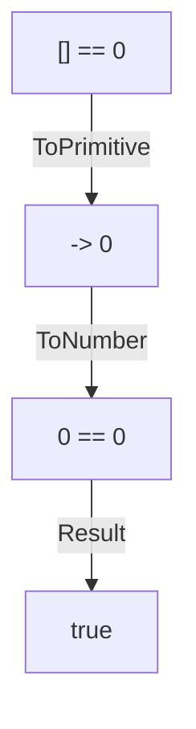

# 📝 [26. true or false](https://bigfrontend.dev/quiz/true-or-false)

## 📌 Problem Overview

This quiz tests how JavaScript performs implicit coercion in loose equality comparisons and boolean contexts. It is especially useful for understanding how arrays, booleans, and wrapper objects behave under `==`, `!!`, and `Boolean()`.

```javascript
console.log([] == 0)
console.log([] == false)
console.log(!![]) // logical coersion
console.log([1] == 1)
console.log(!![1])
console.log(Boolean([]))
console.log(Boolean(new Boolean([])))
console.log(Boolean(new Boolean(false)))
```

---

## 🚀 Correct Answer
>
> [!TIP]
> **Output:**
>
> ```text
> true
> true
> true
> true
> true
> true
> true
> true
> ```

---

## 🔍 Detailed Explanation & Spec-Accurate Trace

This quiz exercises several core ECMAScript coercion mechanisms: abstract equality with `==`, primitive conversion via `ToPrimitive`, numeric conversion via `ToNumber`, and boolean conversion via `ToBoolean`.

### ⚡ Key Spec Rules / Concepts

1. **Rule 1 (Abstract Equality)**: When `==` compares operands, JavaScript uses the abstract equality algorithm, which may coerce values before comparing them.
2. **Rule 2 (ToPrimitive)**: Objects, including arrays, are converted to primitives before comparison. Arrays typically convert via `toString()` and then possibly `ToNumber`.
3. **Rule 3 (ToBoolean)**: Values used in boolean contexts are converted using `ToBoolean`. Empty arrays and non-empty arrays are both truthy, while `Boolean` objects are always truthy regardless of their wrapped value.
4. **Rule 4 (Wrapper Objects)**: `new Boolean(false)` creates a `Boolean` object, and objects are truthy in JavaScript even when their internal value is `false`.

---

### Step-by-Step Execution

#### 1. `[] == 0` -> `true`

- **Step A**: The array `[]` is converted to a primitive. For arrays, the default conversion uses `toString()`, which yields `""`.
- **Step B**: The empty string `""` is then converted to a number through `ToNumber`, producing `0`.
- **Output**: `0 == 0`, so the result is `true`.

#### 2. `[] == false` -> `true`

- **Step A**: `false` is converted to a number via `ToNumber`, giving `0`.
- **Step B**: The array `[]` is again converted to `""`, then to `0`.
- **Output**: `0 == 0`, so the result is `true`.

#### 3. `!![]` -> `true`

- **Step A**: The unary `!` operator first applies boolean coercion to `[]`.
- **Step B**: Arrays are truthy, so `![]` becomes `false`.
- **Step C**: Applying the second `!` flips it back to `true`.
- **Output**: `true`.

#### 4. `[1] == 1` -> `true`

- **Step A**: The array `[1]` is converted to a primitive. Its string form is `"1"`.
- **Step B**: The string `"1"` is converted to the number `1`.
- **Output**: `1 == 1`, so the result is `true`.

#### 5. `!![1]` -> `true`

- **Step A**: The array `[1]` is coerced to a boolean.
- **Step B**: Non-empty arrays are truthy.
- **Output**: `!![1]` evaluates to `true`.

#### 6. `Boolean([])` -> `true`

- **Step A**: `Boolean()` uses `ToBoolean` for its argument.
- **Step B**: An empty array is truthy in JavaScript.
- **Output**: `true`.

#### 7. `Boolean(new Boolean([]))` -> `true`

- **Step A**: `new Boolean([])` creates a `Boolean` object wrapping the value `[]`.
- **Step B**: Objects are always truthy, regardless of the wrapped primitive value.
- **Output**: `true`.

#### 8. `Boolean(new Boolean(false))` -> `true`

- **Step A**: `new Boolean(false)` creates a wrapper object containing the primitive `false`.
- **Step B**: The object itself is truthy because objects are always truthy in JavaScript.
- **Output**: `true`.

---

## 💡 Key Takeaway

- **Loose equality can hide coercion**: `==` often performs implicit conversion, so values that look different can still compare as equal.
- **Truthiness is not the same as primitive value**: Arrays are truthy, and `Boolean` objects are always truthy even when their wrapped value is `false`.

---

## 🛠️ Recommendations & Best Practices

- **Prefer strict equality**: Use `===` instead of `==` when you want to avoid implicit coercion.
- **Be explicit with coercion**: If you need a number, string, or boolean, convert values explicitly with `Number()`, `String()`, or `Boolean()`.
- **Avoid relying on object wrapper semantics**: Prefer primitive booleans over `new Boolean(...)` in production code.

```javascript
const isTruthy = value => value === true;
console.log(isTruthy(Boolean([])));
```

---

## 🧠 Revision Tips & Cheat Sheet

### Visual Coercion Path / Logical Flow



---

## 🔗 Helpful Resources

- [ECMA-262 Specification - Abstract Equality Comparison](https://tc39.es/ecma262/#sec-abstract-equality-comparison)
- [MDN Web Docs - Equality comparisons and sameness](https://developer.mozilla.org/en-US/docs/Web/JavaScript/Reference/Operators/Equality)
- [MDN Web Docs - Boolean](https://developer.mozilla.org/en-US/docs/Web/JavaScript/Reference/Global_Objects/Boolean)
- [BFE.dev - Quiz 26](https://bigfrontend.dev/quiz/true-or-false)

---

## 🏷️ Tags

`#JavaScript` `#Coercion` `#LooseEquality` `#Boolean` `#SpecDeepDive`