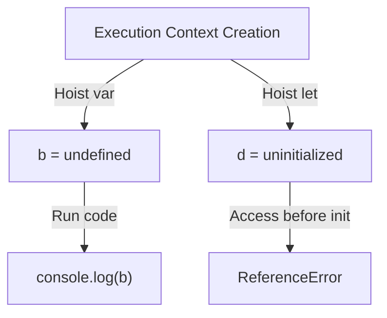

# 📝 [27. Hoisting I](https://bigfrontend.dev/quiz/Hoisting-I)

## 📌 Problem Overview

This quiz tests how JavaScript handles variable and function declarations during the creation and execution phases of the execution context. It highlights the difference between `var`, `let`, and function declarations in terms of hoisting and initialization.

```javascript
const a = 1
console.log(a)

var b
console.log(b)
b = 2

console.log(c)
var c = 3

console.log(d)
let d = 2
```

---

## 🚀 Correct Answer
>
> [!TIP]
> **Output:**
>
> ```text
> 1
> undefined
> undefined
> Error
> ```

---

## 🔍 Detailed Explanation & Spec-Accurate Trace

This quiz focuses on hoisting behavior in JavaScript, especially how declarations are registered in the environment record before execution begins. The key distinction is that `var` is initialized as `undefined` during the creation phase, while `let` remains in the Temporal Dead Zone until its declaration is executed.

### ⚡ Key Spec Rules / Concepts

1. **Rule 1 (Variable Environment Creation)**: During the creation phase, `var` declarations are hoisted and initialized to `undefined`, while `let` declarations are hoisted but remain uninitialized.
2. **Rule 2 (Function Declaration Hoisting)**: Function declarations are hoisted as full function objects and are available before execution reaches their declaration.
3. **Rule 3 (Temporal Dead Zone)**: Accessing a `let` variable before its declaration throws a `ReferenceError` because it is in the TDZ.

---

### Step-by-Step Execution

#### 1. `const a = 1` -> `1`

- **Step A**: The variable `a` is created in the lexical environment and initialized with the value `1`.
- **Step B**: The next statement logs the current value of `a`.
- **Output**: `1`.

#### 2. `console.log(b)` -> `undefined`

- **Step A**: The declaration `var b` is hoisted to the top of the scope and initialized as `undefined` during the creation phase.
- **Step B**: Since `b` has been declared but not assigned yet, logging it prints `undefined`.
- **Output**: `undefined`.

#### 3. `console.log(c)` -> `undefined`

- **Step A**: The declaration `var c` is also hoisted and initialized as `undefined`.
- **Step B**: Even though the assignment `c = 3` happens later, the variable already exists in the environment record.
- **Output**: `undefined`.

#### 4. `console.log(d)` -> `ReferenceError`

- **Step A**: The declaration `let d` is hoisted to the scope, but it is not initialized during the creation phase.
- **Step B**: Before the line `let d = 2` executes, the variable is still in the Temporal Dead Zone.
- **Output**: Accessing `d` throws a `ReferenceError`.

---

## 💡 Key Takeaway

- **Hoisting is not the same as initialization**: `var` is initialized as `undefined`, while `let` and `const` are not initialized until their declaration is executed.
- **`let` and `const` protect against early access**: They throw a `ReferenceError` when accessed before initialization due to the Temporal Dead Zone.

---

## 🛠️ Recommendations & Best Practices

- **Prefer `let` and `const`**: They provide clearer and safer scoping behavior than `var`.
- **Declare variables before use**: This avoids confusion around hoisting and TDZ.
- **Avoid relying on hoisting semantics**: Write code in a predictable order to improve readability.

```javascript
let value = 1;
console.log(value);
```

---

## 🧠 Revision Tips & Cheat Sheet

### Visual Hoisting Flow



---

## 🔗 Helpful Resources

- [ECMA-262 Specification - Variable Statements](https://tc39.es/ecma262/#sec-variable-statement)
- [MDN Web Docs - let](https://developer.mozilla.org/en-US/docs/Web/JavaScript/Reference/Statements/let)
- [MDN Web Docs - var](https://developer.mozilla.org/en-US/docs/Web/JavaScript/Reference/Statements/var)
- [BFE.dev - Quiz 27](https://bigfrontend.dev/quiz/Hoisting-I)

---

## 🏷️ Tags

`#JavaScript` `#Hoisting` `#let` `#var` `#TemporalDeadZone`