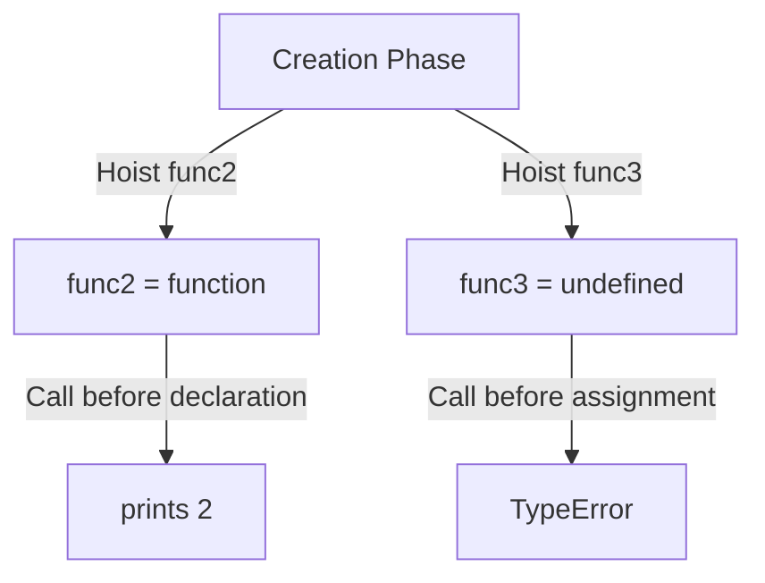

# 📝 [28. Hoisting II](https://bigfrontend.dev/quiz/Hoisting-II)

## 📌 Problem Overview

This quiz focuses on how function declarations and function expressions behave under hoisting. It shows that function declarations are hoisted as complete function objects, while variables assigned to function expressions are hoisted differently and remain uninitialized until execution reaches the assignment.

```javascript
const func1 = () => console.log(1)

func1()

func2()

function func2() {
  console.log(2)
}

func3()

var func3 = function func4() {
  console.log(3)
}
```

---

## 🚀 Correct Answer
>
> [!TIP]
> **Output:**
>
> ```text
> 1
> 2
> Error
> ```

---

## 🔍 Detailed Explanation & Spec-Accurate Trace

This quiz is about the difference between hoisting a function declaration and hoisting a variable that later receives a function expression. In JavaScript, function declarations are hoisted as callable functions during the creation phase, while `var func3` is hoisted and initialized to `undefined` and only becomes a function when the assignment expression runs.

### ⚡ Key Spec Rules / Concepts

1. **Rule 1 (Function Declaration Hoisting)**: Function declarations are hoisted to the top of their scope and initialized with a function object.
2. **Rule 2 (Variable Hoisting with `var`)**: A `var` variable is hoisted and initialized to `undefined` before execution begins.
3. **Rule 3 (Function Expression Timing)**: A function expression assigned to a variable is not available until the assignment statement executes.

---

### Step-by-Step Execution

#### 1. `func1()` -> `1`

- **Step A**: The arrow function assigned to `func1` is created during execution.
- **Step B**: The call executes successfully and prints `1`.
- **Output**: `1`.

#### 2. `func2()` -> `2`

- **Step A**: `func2` is declared using a function declaration, so it is hoisted as a function object.
- **Step B**: Calling it before its textual position in the code works because the declaration is already available.
- **Output**: `2`.

#### 3. `func3()` -> `Error`

- **Step A**: `func3` is declared with `var`, so it is hoisted and initialized to `undefined`.
- **Step B**: The function expression assignment has not executed yet when `func3()` is called.
- **Step C**: Since `func3` is still `undefined`, invoking it throws a `TypeError`.
- **Output**: `Error`.

---

## 💡 Key Takeaway

- **Function declarations are hoisted as functions**: They can be called before their declaration appears in source code.
- **Function expressions are not hoisted the same way**: A variable holding a function expression is only usable after the assignment runs.

---

## 🛠️ Recommendations & Best Practices

- **Use function declarations for hoisted utility functions**: They are convenient when you want to call them before they appear in the file.
- **Prefer `const` with function expressions**: If you do not need hoisting, use `const fn = () => {}` for clearer and safer code.
- **Avoid calling variables before initialization**: This prevents runtime errors from `undefined` function references.

```javascript
const greet = () => console.log('Hello');
greet();
```

---

## 🧠 Revision Tips & Cheat Sheet

### Visual Hoisting Flow



---

## 🔗 Helpful Resources

- [ECMA-262 Specification - Function Definitions](https://tc39.es/ecma262/#sec-function-definitions)
- [MDN Web Docs - Function declarations](https://developer.mozilla.org/en-US/docs/Web/JavaScript/Reference/Statements/function)
- [MDN Web Docs - Function expression](https://developer.mozilla.org/en-US/docs/Web/JavaScript/Reference/Operators/function)
- [BFE.dev - Quiz 28](https://bigfrontend.dev/quiz/Hoisting-II)

---

## 🏷️ Tags

`#JavaScript` `#Hoisting` `#FunctionDeclaration` `#FunctionExpression` `#SpecDeepDive`