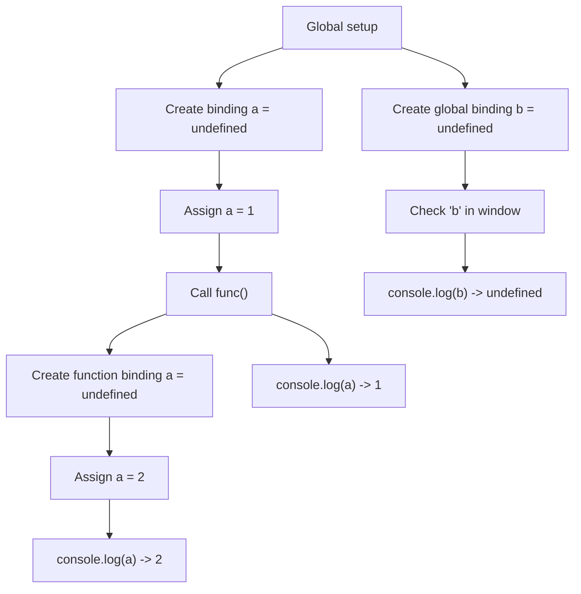

# 📝 [29. Hoisting III](https://bigfrontend.dev/quiz/Hoisting-III)

## 📌 Problem Overview

This quiz demonstrates that `var` is function-scoped and hoisted, even when declared later inside a function. It also shows that a global `var` declaration is created before the code runs, which affects the `in` operator test against `window`.

```javascript
var a = 1

function func() {
  a = 2
  console.log(a)
  var a
}

func()

console.log(a)

if (!('b' in window)) {
  var b = 1
}

console.log(b)
```

---

## 🚀 Correct Answer
>
> [!TIP]
> **Output:**
>
> ```text
> 2
> 1
> undefined
> ```

---

## 🔍 Detailed Explanation & Spec-Accurate Trace

This quiz tests three key behaviors of `var` in JavaScript:
- `var` declarations are hoisted to the top of their function scope.
- A `var` declared inside a function is scoped to that function, not the surrounding block.
- A global `var` declaration is created on the global object and initialized to `undefined` during environment setup.

### ⚡ Key Spec Rules / Concepts

1. **Rule 1 (Hoisting of `var`)**: `var` declarations are created in the relevant Environment Record during the binding creation phase and initialized to `undefined` before execution begins.
2. **Rule 2 (Function scope)**: `var` is scoped to the enclosing function, not to blocks, so an inner `var a` does not create a new variable outside the function.
3. **Rule 3 (Global `var` and `window`)**: A `var` declared at the top level becomes a property of the global object in browser environments, so it is visible to `'b' in window` before the assignment runs.

### Step-by-Step Execution

#### 1. `var a = 1` -> `1`

- **Step A**: The global binding `a` is created in the global environment and initialized to `undefined` during hoisting.
- **Step B**: The assignment `a = 1` runs, so the global `a` now holds `1`.
- **Output**: `1`

---

#### 2. `func()` -> `undefined` (call executes)

- **Step A**: The function body is entered and creates a function-local environment for `func`.
- **Step B**: The assignment `a = 2` updates the function-local `a` binding, because `var a` exists in the function scope.
- **Step C**: `console.log(a)` prints `2`.
- **Output**: `2`

---

#### 3. `console.log(a)` after `func()` -> `1`

- **Step A**: The outer global `a` is still in scope.
- **Step B**: The function-local `a` does not leak outside the function.
- **Output**: `1`

---

#### 4. `if (!('b' in window))` -> `false`

- **Step A**: The `var b` declaration was already created during global environment setup.
- **Step B**: Because `b` exists as a global binding, `'b' in window` evaluates to `true`.
- **Step C**: The `if` body is skipped.
- **Output**: `false` for the condition

---

#### 5. `console.log(b)` -> `undefined`

- **Step A**: `b` exists as a declared binding, but no assignment has executed.
- **Step B**: `var b` is initialized to `undefined` until the assignment would happen.
- **Output**: `undefined`

---

## 💡 Key Takeaway

- **`var` is hoisted and function-scoped**: declarations are available throughout the function, even before their line runs.
- **Block statements do not create a new scope for `var`**: the `if` block does not isolate `b` from the surrounding scope.

---

## 🛠️ Recommendations & Best Practices

- **Prefer `let` and `const`**: They are block-scoped and avoid confusing hoisting behavior.
- **Avoid relying on implicit global state**: Use explicit declarations and avoid tests like `'b' in window` for control flow.

```javascript
let a = 1;

function func() {
  a = 2;
  console.log(a);
}

func();
console.log(a);
```

---

## 🧠 Revision Tips & Cheat Sheet

### Visual Hoisting Flow



---

## 🔗 Helpful Resources

- [ECMA-262 Specification - Variable Environment](https://tc39.es/ecma262/#sec-environment-records)
- [MDN Web Docs - var](https://developer.mozilla.org/en-US/docs/Web/JavaScript/Reference/Statements/var)
- [MDN Web Docs - Hoisting](https://developer.mozilla.org/en-US/docs/Glossary/Hoisting)
- [BFE.dev - Quiz 29](https://bigfrontend.dev/quiz/Hoisting-III)

---

## 🏷️ Tags

`#Hoisting` `#Var` `#FunctionScope` `#JavaScript` `#SpecDeepDive`