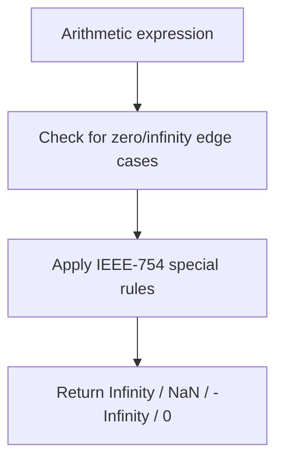

# 📝 [31. Math](https://bigfrontend.dev/quiz/Math)

## 📌 Problem Overview

This quiz tests how JavaScript handles arithmetic with `Infinity`, `NaN`, and zero under the ECMAScript numeric operation rules. It focuses on the special cases that arise from division and multiplication involving infinity and zero.

```javascript
console.log(1 / 0)
console.log(0 / 0)
console.log(-1 / 0)
console.log(1 / 0 * 0)
console.log(1 / 0 * 1)
console.log(1 / 0 * -1)
console.log(1 / 0 * 1 + 1 / 0 * 1)
console.log(1 / 0 * 1 - 1 / 0 * 1)
console.log(1 / 0 * 1 * (1 / 0 * 1))
console.log(1 / 0 * 1 / (1 / 0 * 1))
console.log(0 / Infinity)
console.log(0 * Infinity)
```

---

## 🚀 Correct Answer
>
> [!TIP]
> **Output:**
>
> ```text
> Infinity
> NaN
> -Infinity
> NaN
> Infinity
> -Infinity
> Infinity
> NaN
> Infinity
> NaN
> 0
> NaN
> ```

---

## 🔍 Detailed Explanation & Spec-Accurate Trace

This quiz exercises the IEEE-754-style behavior used by JavaScript numbers under the ECMAScript specification. Several expressions rely on the special rules for division and multiplication with `Infinity` and `0`.

### ⚡ Key Spec Rules / Concepts

1. **Rule 1 (Division by zero)**: Division of a non-zero finite number by `0` produces `Infinity` or `-Infinity` depending on the sign.
2. **Rule 2 (Zero divided by zero)**: `0 / 0` produces `NaN` because the operation is indeterminate.
3. **Rule 3 (Infinity × 0)**: Multiplying `Infinity` by `0` results in `NaN`.
4. **Rule 4 (Infinity arithmetic)**: Expressions involving `Infinity` and finite values follow the standard IEEE-754 rules, and `Infinity - Infinity` is `NaN`.

### Step-by-Step Execution

#### 1. `1 / 0` -> `Infinity`

- **Step A**: A positive finite number divided by zero results in positive infinity.
- **Step B**: JavaScript represents this special numeric result as `Infinity`.
- **Output**: `Infinity`

---

#### 2. `0 / 0` -> `NaN`

- **Step A**: Division of zero by zero is indeterminate.
- **Step B**: The result is `NaN` rather than `Infinity` or `0`.
- **Output**: `NaN`

---

#### 3. `-1 / 0` -> `-Infinity`

- **Step A**: A negative finite number divided by zero produces negative infinity.
- **Step B**: The sign is preserved in the result.
- **Output**: `-Infinity`

---

#### 4. `1 / 0 * 0` -> `NaN`

- **Step A**: `1 / 0` evaluates to `Infinity`.
- **Step B**: `Infinity * 0` follows the special rule and yields `NaN`.
- **Output**: `NaN`

---

#### 5. `1 / 0 * 1` -> `Infinity`

- **Step A**: `1 / 0` evaluates to `Infinity`.
- **Step B**: `Infinity * 1` remains `Infinity`.
- **Output**: `Infinity`

---

#### 6. `1 / 0 * -1` -> `-Infinity`

- **Step A**: `1 / 0` evaluates to `Infinity`.
- **Step B**: `Infinity * -1` becomes `-Infinity`.
- **Output**: `-Infinity`

---

#### 7. `1 / 0 * 1 + 1 / 0 * 1` -> `Infinity`

- **Step A**: Each term evaluates to `Infinity`.
- **Step B**: `Infinity + Infinity` is `Infinity`.
- **Output**: `Infinity`

---

#### 8. `1 / 0 * 1 - 1 / 0 * 1` -> `NaN`

- **Step A**: Each term evaluates to `Infinity`.
- **Step B**: `Infinity - Infinity` is `NaN`.
- **Output**: `NaN`

---

#### 9. `1 / 0 * 1 * (1 / 0 * 1)` -> `Infinity`

- **Step A**: The inner expression evaluates to `Infinity`.
- **Step B**: `Infinity * Infinity` is `Infinity`.
- **Output**: `Infinity`

---

#### 10. `1 / 0 * 1 / (1 / 0 * 1)` -> `NaN`

- **Step A**: The denominator evaluates to `Infinity`.
- **Step B**: `Infinity / Infinity` is `NaN`.
- **Output**: `NaN`

---

#### 11. `0 / Infinity` -> `0`

- **Step A**: Zero divided by a non-zero infinite value is `0`.
- **Step B**: The result is a finite zero value.
- **Output**: `0`

---

#### 12. `0 * Infinity` -> `NaN`

- **Step A**: Multiplication of zero and infinity is an indeterminate form.
- **Step B**: JavaScript returns `NaN` for this case.
- **Output**: `NaN`

---

## 💡 Key Takeaway

- **Special numeric values follow IEEE-754 rules**: `Infinity`, `-Infinity`, and `NaN` behave in predictable but non-intuitive ways.
- **Division and multiplication with zero and infinity require care**: expressions like `Infinity * 0` and `Infinity - Infinity` are not ordinary arithmetic results.

---

## 🛠️ Recommendations & Best Practices

- **Guard against invalid numeric operations**: Check for `Number.isFinite()` or `Number.isNaN()` when processing user input or calculations.
- **Avoid relying on implicit infinity behavior**: Normalize or validate values before performing arithmetic in production code.

```javascript
const result = Number.isFinite(value) ? value / divisor : NaN;
console.log(result);
```

---

## 🧠 Revision Tips & Cheat Sheet

### Visual Numeric Flow



---

## 🔗 Helpful Resources

- [ECMA-262 Specification - Number Operations](https://tc39.es/ecma262/#sec-abstract-operations)
- [MDN Web Docs - Number](https://developer.mozilla.org/en-US/docs/Web/JavaScript/Reference/Global_Objects/Number)
- [BFE.dev - Quiz 31](https://bigfrontend.dev/quiz/Math)

---

## 🏷️ Tags

`#Math` `#Infinity` `#NaN` `#JavaScript` `#SpecDeepDive`