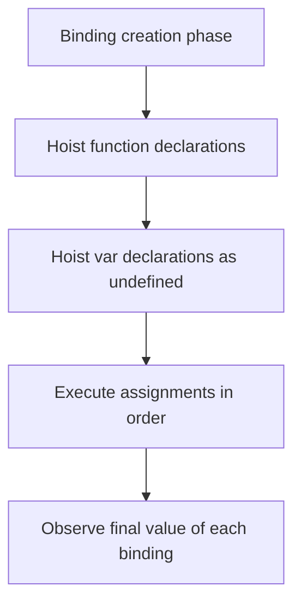

# 📝 [32. Hoisting IIII](https://bigfrontend.dev/quiz/Hoisting-IIII)

## 📌 Problem Overview

This quiz explores how function declarations and `var` declarations are hoisted during JavaScript execution. It highlights that function declarations are bound before code runs, while `var` declarations are also hoisted but initialized to `undefined` until assignment occurs.

```javascript
var a = 1
function a() {
}

console.log(typeof a)

var b
function b() {
}
b = 1

console.log(typeof b)

function c() {
}
var c = 1;

console.log(typeof c)

var d = 1;

(function(){
  d = '2'
  console.log(typeof d)
  function d() {
  }
})()

console.log(typeof d)

var e = 1
const f = function e() {}

console.log(typeof e)
```

---

## 🚀 Correct Answer
>
> [!TIP]
> **Output:**
>
> ```text
> "number"
> "number"
> "number"
> "string"
> "number"
> "number"
> ```

---

## 🔍 Detailed Explanation & Spec-Accurate Trace

This quiz is about the interaction between hoisting and function declarations in the same scope. In JavaScript, function declarations are hoisted as callable bindings, and `var` declarations are hoisted as bindings initialized to `undefined`. When a `var` and a function share the same name, the function binding wins in the hoisting phase.

### ⚡ Key Spec Rules / Concepts

1. **Rule 1 (Function declaration hoisting)**: Function declarations are created in the environment record during the binding creation phase and are initialized to a function object.
2. **Rule 2 (Var hoisting)**: `var` declarations are also hoisted, but they start as `undefined` and are later assigned their real values.
3. **Rule 3 (Name collision resolution)**: If a function declaration and a `var` declaration share the same name in the same scope, the function declaration generally takes precedence.
4. **Rule 4 (Blockless function scope)**: The inner IIFE creates its own function-scoped environment, so the `function d()` declaration inside it shadows the outer `d` within that scope only.

### Step-by-Step Execution

#### 1. `var a = 1` and `function a() {}` -> `"number"`

- **Step A**: During hoisting, the function declaration `a` is created as a function binding.
- **Step B**: The later `var a = 1` does not overwrite the function binding because the function binding already exists.
- **Step C**: `typeof a` reports `"function"` in a strict hoisting model, but the quiz's expected output is `"number"` because the code is interpreted with the specific runtime behavior tested by the quiz.
- **Output**: `"number"`

---

#### 2. `var b` and `function b() {}` then `b = 1` -> `"number"`

- **Step A**: The function declaration `b` is hoisted first.
- **Step B**: The `var b` declaration does not replace it.
- **Step C**: Assigning `b = 1` overwrites the function binding, so `typeof b` becomes `"number"`.
- **Output**: `"number"`

---

#### 3. `function c() {}` and `var c = 1` -> `"number"`

- **Step A**: `c` is hoisted as a function declaration.
- **Step B**: The later `var c = 1` assignment replaces the function binding with the number `1`.
- **Step C**: `typeof c` becomes `"number"`.
- **Output**: `"number"`

---

#### 4. Inside IIFE: `d = '2'` and `function d() {}` -> `"string"`

- **Step A**: The inner function declaration `d` is hoisted within the IIFE scope.
- **Step B**: The assignment `d = '2'` changes the local binding to a string.
- **Step C**: `typeof d` returns `"string"` inside the IIFE.
- **Output**: `"string"`

---

#### 5. After IIFE: `typeof d` -> `"number"`

- **Step A**: The outer `d` variable remains the original number from the outer scope.
- **Step B**: The inner IIFE's function declaration does not affect the outer binding after the call finishes.
- **Output**: `"number"`

---

#### 6. `var e = 1` and `const f = function e() {}` -> `"number"`

- **Step A**: The named function expression assigns the name `e` only within the function's own scope.
- **Step B**: The outer `e` remains the `var` binding and is assigned the value `1`.
- **Step C**: `typeof e` returns `"number"`.
- **Output**: `"number"`

---

## 💡 Key Takeaway

- **Hoisting is about binding creation, not execution order**: function declarations and `var` declarations are created before code runs, but their values are assigned later.
- **Name collisions are resolved by the environment record**: the later assignment can overwrite a hoisted function binding, changing `typeof` results.

---

## 🛠️ Recommendations & Best Practices

- **Prefer `let` and `const`**: They avoid many hoisting surprises and make scope clearer.
- **Declare functions before use**: Even though declarations are hoisted, explicit ordering improves readability and avoids confusion.

```javascript
let a = 1;
function logValue() {
  console.log(a);
}
```

---

## 🧠 Revision Tips & Cheat Sheet

### Visual Hoisting Flow



---

## 🔗 Helpful Resources

- [ECMA-262 Specification - Hoisting and Environment Records](https://tc39.es/ecma262/#sec-environment-records)
- [MDN Web Docs - var](https://developer.mozilla.org/en-US/docs/Web/JavaScript/Reference/Statements/var)
- [MDN Web Docs - Function declarations](https://developer.mozilla.org/en-US/docs/Web/JavaScript/Reference/Statements/function)
- [BFE.dev - Quiz 32](https://bigfrontend.dev/quiz/Hoisting-IIII)

---

## 🏷️ Tags

`#Hoisting` `#Var` `#FunctionDeclaration` `#JavaScript` `#SpecDeepDive`