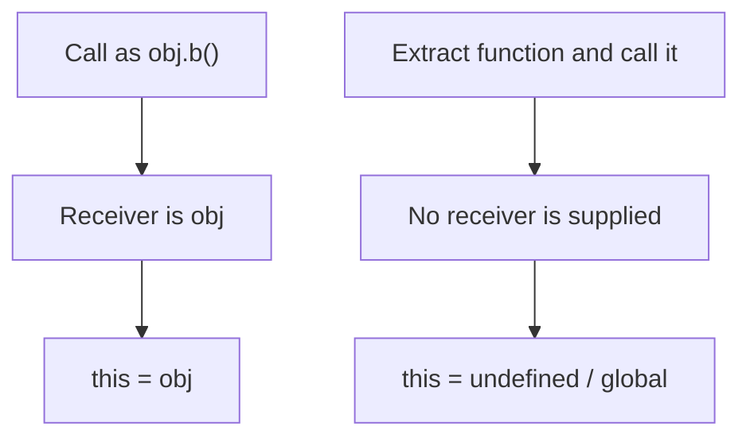

# 📝 [33. `this` II](https://bigfrontend.dev/quiz/this-II)

## 📌 Problem Overview

This quiz examines how `this` behaves when a method is detached from its object and then invoked as a plain function. The core idea is that a method call like `obj.b()` receives `obj` as its receiver, while a later call on the extracted function does not.

```javascript
const obj = {
  a: 1,
  b() {
    return this.a
  }
}
console.log(obj.b())
console.log((true ? obj.b : a)())
console.log((true, obj.b)())
console.log((3, obj['b'])())
console.log((obj.b)())
console.log((obj.c = obj.b)())
```

---

## 🚀 Correct Answer
>
> [!TIP]
> **Output:**
>
> ```text
> 1
> TypeError: Cannot read properties of undefined (reading 'a')
> ```

---

## 🔍 Detailed Explanation & Spec-Accurate Trace

The key concept is that `this` is determined by how a function is called, not by where the function was defined. The first call uses the method-call form, while the second call uses the function value in a plain call position, so the receiver is lost.

### ⚡ Key Spec Rules / Concepts

1. **Rule 1 (Method call binding)**: When a function is called as `obj.method()`, the receiver is `obj` and `this` becomes `obj`.
2. **Rule 2 (Detached function call)**: If the function reference is extracted and then invoked, the call is no longer a method call, so the engine does not supply `obj` as `this`.
3. **Rule 3 (Strict mode fallback)**: In strict mode or ESM, a plain function call leaves `this` as `undefined`, which causes the property access `this.a` to throw.

### Step-by-Step Execution

#### 1. `obj.b()` -> `1`

- **Step A**: The call uses the method-call form `obj.b()`.
- **Step B**: The receiver is `obj`, so `this` inside `b` is `obj`.
- **Output**: `1`

---

#### 2. `(true ? obj.b : a)()` -> throws `TypeError`

- **Step A**: The conditional operator evaluates to the function value `obj.b`.
- **Step B**: The resulting function is then invoked as a plain function call, so no receiver is supplied.
- **Step C**: `this` becomes `undefined` in this environment, and `this.a` fails.
- **Output**: `TypeError: Cannot read properties of undefined (reading 'a')`

---

## 💡 Key Takeaway

- **`this` is about the call site, not the function definition**: extracting a method breaks the implicit binding that made `obj.b()` work.
- **Detached methods are fragile**: if you need a stable receiver, bind the function or use an arrow function.

---

## 🛠️ Recommendations & Best Practices

- **Use `bind` or arrow functions** when you need to preserve the original object context.
- **Avoid calling extracted methods directly** unless you explicitly intend to lose the receiver.

```javascript
const obj = {
  a: 1,
  b: function () {
    return this.a;
  }
};

const safe = obj.b.bind(obj);
console.log(safe());
```

---

## 🧠 Revision Tips & Cheat Sheet

### Visual `this` Flow



---

## 🔗 Helpful Resources

- [ECMA-262 Specification - `this` Binding](https://tc39.es/ecma262/#sec-this-keyword)
- [MDN Web Docs - `this`](https://developer.mozilla.org/en-US/docs/Web/JavaScript/Reference/Operators/this)
- [BFE.dev - Quiz 33](https://bigfrontend.dev/quiz/this-II)

---

## 🏷️ Tags

`#ThisBinding` `#MethodCall` `#JavaScript` `#SpecDeepDive`
