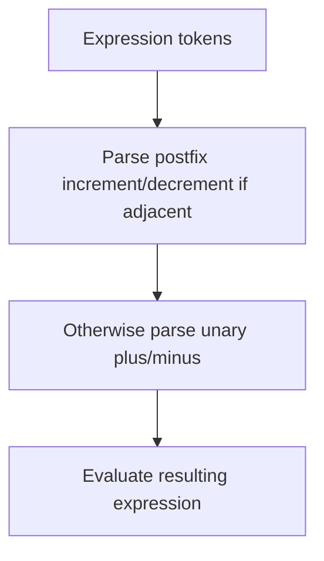

# 📝 [34. precedence](https://bigfrontend.dev/quiz/precedence)

## 📌 Problem Overview

This quiz tests JavaScript operator precedence and parsing ambiguity. The expressions use sequences of `+` and `-` characters, and the way they are tokenized depends on whether they are adjacent or separated by whitespace.

```javascript
let a = 1
console.log(a +++ a)

let b = 1
console.log(b + + + b)

let c = 1
console.log(c --- c)

let d = 1
console.log(d - - - d)
```

---

## 🚀 Correct Answer
>
> [!TIP]
> **Output:**
>
> ```text
> 3
> 2
> 1
> 0
> ```

---

## 🔍 Detailed Explanation & Spec-Accurate Trace

JavaScript parses these expressions according to operator precedence and lexical tokenization. Adjacent `+` and `-` symbols can be interpreted as postfix increment/decrement operators rather than as separate unary operators, while spaced forms are parsed as unary operators.

### ⚡ Key Spec Rules / Concepts

1. **Rule 1 (Postfix increment/decrement)**: `a++` increments `a` and returns the old value; `a--` decrements and returns the old value.
2. **Rule 2 (Unary plus/minus)**: `+a` and `-a` coerce the operand to a number and apply the sign.
3. **Rule 3 (Tokenization and parsing)**: The parser reads adjacent `+`/`-` symbols as part of the same token stream, so `a+++a` is parsed as `a++ + a`, not `a + ++a`.

### Step-by-Step Execution

#### 1. `a +++ a` -> `3`

- **Step A**: The parser reads `a++ + a` because `++` is a postfix increment operator after the first `a`.
- **Step B**: `a++` returns the old value `1` and then increments `a` to `2`.
- **Step C**: The remaining `+ a` adds the current value of `a`, which is now `2`, giving `3`.
- **Output**: `3`

---

#### 2. `b + + + b` -> `2`

- **Step A**: Because of the whitespace, the expression is parsed as `b + +(+(b))`.
- **Step B**: The unary `+` operators convert `b` to a number and leave it positive.
- **Step C**: `1 + 1` evaluates to `2`.
- **Output**: `2`

---

#### 3. `c --- c` -> `1`

- **Step A**: The parser reads this as `c-- - c`.
- **Step B**: `c--` returns the old value `1` and decrements `c` to `0`.
- **Step C**: `1 - 0` evaluates to `1`.
- **Output**: `1`

---

#### 4. `d - - - d` -> `0`

- **Step A**: The expression is parsed as `d - -(-d)`.
- **Step B**: `-d` negates `1` to `-1`.
- **Step C**: The second unary `-` negates again, producing `1`.
- **Step D**: `1 - 1` evaluates to `0`.
- **Output**: `0`

---

## 💡 Key Takeaway

- **Parsing depends on tokenization**: seemingly small spacing differences can completely change how JavaScript parses an expression.
- **Postfix operators and unary operators are distinct**: `a++` and `++a` are not interchangeable, and spacing matters in expressions like `a +++ a`.

---

## 🛠️ Recommendations & Best Practices

- **Avoid ambiguous operator chains**: Write expressions like `a++ + a` or `a + (+a)` explicitly for readability.
- **Use whitespace deliberately**: It can change parsing, especially with `+` and `-` operators.

```javascript
let x = 1;
console.log(x++ + x);
console.log(x + (+x));
```

---

## 🧠 Revision Tips & Cheat Sheet

### Visual Parsing Flow



---

## 🔗 Helpful Resources

- [ECMA-262 Specification - Unary Operators](https://tc39.es/ecma262/#sec-unary-operators)
- [MDN Web Docs - Increment operator](https://developer.mozilla.org/en-US/docs/Web/JavaScript/Reference/Operators/Increment)
- [BFE.dev - Quiz 34](https://bigfrontend.dev/quiz/precedence)

---

## 🏷️ Tags

`#Precedence` `#Parsing` `#JavaScript` `#Operators` `#SpecDeepDive`