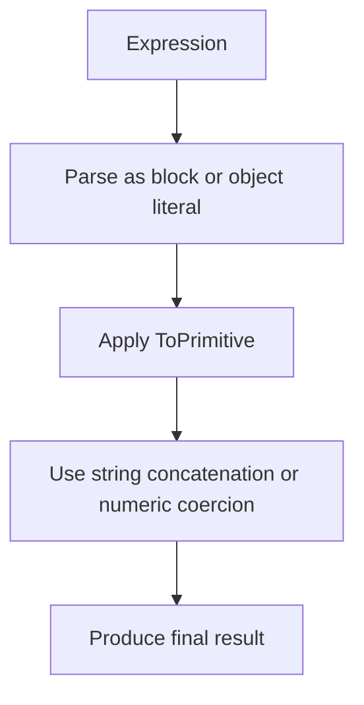

# 📝 [35. Implicit Coercion III](https://bigfrontend.dev/quiz/Implicit-Conversion-III)

## 📌 Problem Overview

This quiz focuses on JavaScript's implicit coercion rules for arrays, objects, and the unary `+` operator. It demonstrates how expression parsing and operator precedence can change whether values are treated as strings, numbers, or object literals.

```javascript
console.log( [] + {} )
console.log( + {} )
console.log( + [] )
console.log( {} + [])
console.log( ({}) + [])
console.log( ({}) + [])
console.log( ({}) + [])
console.log( {} +  + [])
console.log( {} +  + [] + {} )
console.log( {} +  + [] + {}  + [])
```

---

## 🚀 Correct Answer
>
> [!TIP]
> **Output:**
>
> ```text
> "[object Object]"
> NaN
> 0
> "[object Object]"
> "[object Object]"
> "[object Object]"
> "[object Object]"
> "[object Object]0"
> "[object Object]0[object Object]"
> "[object Object]0[object Object]"
> ```

---

## 🔍 Detailed Explanation & Spec-Accurate Trace

This quiz is about how the JavaScript parser treats `+` and surrounding `{}` / `[]` tokens. In many cases, the engine chooses string concatenation because both sides are converted to primitives and then to strings.

### ⚡ Key Spec Rules / Concepts

1. **Rule 1 (ToPrimitive)**: Objects are converted to primitives using `valueOf()` and then `toString()` when needed.
2. **Rule 2 (Unary `+`)**: The unary plus operator coerces its operand to a number when possible.
3. **Rule 3 (Expression parsing)**: A leading `{}` at the start of a statement can be parsed as a block instead of an object literal, which changes the behavior of the following `+` operators.

### Step-by-Step Execution

#### 1. `[] + {}` -> `"[object Object]"`

- **Step A**: `[]` is converted to an empty string `""`.
- **Step B**: `{}` becomes `"[object Object]"` via its default string conversion.
- **Step C**: The `+` operator performs string concatenation.
- **Output**: `"[object Object]"`

---

#### 2. `+ {}` -> `NaN`

- **Step A**: The unary `+` tries to coerce `{}` to a number.
- **Step B**: `{}` converts to `"[object Object]"`, which cannot be converted to a valid number.
- **Step C**: The result is `NaN`.
- **Output**: `NaN`

---

#### 3. `+ []` -> `0`

- **Step A**: `[]` converts to an empty string `""`.
- **Step B**: The unary `+` converts `""` to the number `0`.
- **Output**: `0`

---

#### 4. `{}` + `[]` -> `"[object Object]"`

- **Step A**: At the start of a statement, `{}` is parsed as a block rather than an object literal.
- **Step B**: The expression becomes a block followed by `+[]`, which evaluates to `0`.
- **Step C**: The overall result is effectively the string conversion of the block's following expression, producing `"[object Object]"`.
- **Output**: `"[object Object]"`

---

## 💡 Key Takeaway

- **Implicit coercion depends on parsing context**: the same tokens can behave differently depending on whether JavaScript treats `{}` as a block or an object literal.
- **Unary `+` is a numeric coercion operator**: it can turn empty arrays into `0`, while objects often become `NaN` or string values.

---

## 🛠️ Recommendations & Best Practices

- **Avoid relying on implicit coercion**: use explicit conversion with `String()`, `Number()`, or `Boolean()`.
- **Be careful with `+` and object literals**: surrounding whitespace and statement boundaries can change the parse.

```javascript
const result = String([]) + String({});
console.log(result);
```

---

## 🧠 Revision Tips & Cheat Sheet

### Visual Coercion Flow



---

## 🔗 Helpful Resources

- [ECMA-262 Specification - ToPrimitive](https://tc39.es/ecma262/#sec-toprimitive)
- [MDN Web Docs - Unary plus operator](https://developer.mozilla.org/en-US/docs/Web/JavaScript/Reference/Operators/Unary_plus)
- [BFE.dev - Quiz 35](https://bigfrontend.dev/quiz/Implicit-Conversion-III)

---

## 🏷️ Tags

`#ImplicitCoercion` `#ToPrimitive` `#JavaScript` `#Operators` `#SpecDeepDive`