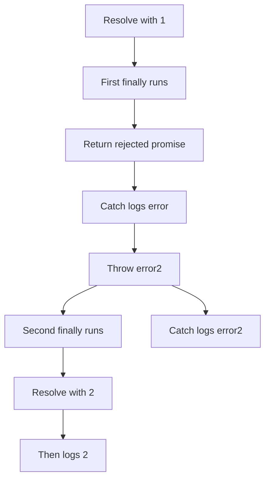

# 📝 [36. Promise.prototype.finally()](https://bigfrontend.dev/quiz/Promise-prototype-finally)

## 📌 Problem Overview

This quiz demonstrates how `Promise.prototype.finally()` behaves in a promise chain. The key point is that `finally` does not receive the resolved or rejected value, and it can change the outcome of the chain by returning a new promise.

```javascript
Promise.resolve(1)
.finally((data) => {
  console.log(data)
  return Promise.reject('error')
})
.catch((error) => {
  console.log(error)
  throw 'error2'
})
.finally((data) => {
  console.log(data)
  return Promise.resolve(2).then(console.log)
})
.then(console.log)
.catch(console.log)
```

---

## 🚀 Correct Answer
>
> [!TIP]
> **Output:**
>
> ```text
> undefined
> "error"
> undefined
> 2
> "error2"
> ```

---

## 🔍 Detailed Explanation & Spec-Accurate Trace

`finally()` is a special promise handler. It runs whether the previous promise settled fulfilled or rejected, but it receives no value from the original settlement. The callback's return value determines whether the chain continues as fulfilled or rejected.

### ⚡ Key Spec Rules / Concepts

1. **Rule 1 (`finally` receives no input)**: A `finally` callback is invoked with no arguments, regardless of whether the previous promise resolved or rejected.
2. **Rule 2 (`finally` propagates the original outcome)**: If `finally` returns a non-promise value, the chain adopts the previous settlement state.
3. **Rule 3 (Returned promise overrides the chain)**: If `finally` returns a rejected promise, the chain becomes rejected; if it returns a resolved promise, the chain continues as resolved.

### Step-by-Step Execution

#### 1. `Promise.resolve(1).finally(...)` -> `undefined`

- **Step A**: The initial promise resolves with `1`.
- **Step B**: The `finally` handler runs, but it receives no argument.
- **Step C**: It logs `undefined` and returns a rejected promise.
- **Output**: `undefined`

---

#### 2. `.catch(...)` after the first `finally` -> `"error"`

- **Step A**: Because the first `finally` returned a rejected promise, control moves to the next `.catch`.
- **Step B**: The catch handler logs the rejection reason `"error"`.
- **Step C**: It throws another error, `"error2"`.
- **Output**: `"error"`

---

#### 3. Second `.finally(...)` -> `undefined`

- **Step A**: The second `finally` runs after the rejected chain.
- **Step B**: It again receives no argument and logs `undefined`.
- **Step C**: It returns a resolved promise that resolves to `2` and logs it.
- **Output**: `undefined`

---

#### 4. `.then(console.log)` -> `2`

- **Step A**: The promise returned by the second `finally` resolves with `2`.
- **Step B**: The following `.then(console.log)` logs `2`.
- **Output**: `2`

---

#### 5. Final `.catch(console.log)` -> `"error2"`

- **Step A**: The earlier thrown `"error2"` propagates to the final `.catch`.
- **Step B**: The final catch logs `"error2"`.
- **Output**: `"error2"`

---

## 💡 Key Takeaway

- **`finally` is observational, not transformational**: it runs regardless of settlement, but it does not receive the resolved or rejected value.
- **A `finally` callback can change the chain outcome**: returning a rejected or resolved promise affects later handlers.

---

## 🛠️ Recommendations & Best Practices

- **Avoid using `finally` to inspect the outcome**: use `.then` or `.catch` for that purpose.
- **Return a value intentionally** from `finally` if you want to shape the chain.

```javascript
Promise.resolve(1)
  .finally(() => {
    console.log('cleanup');
  })
  .then((value) => console.log(value));
```

---

## 🧠 Revision Tips & Cheat Sheet

### Promise Flow



---

## 🔗 Helpful Resources

- [MDN Web Docs - Promise.prototype.finally()](https://developer.mozilla.org/en-US/docs/Web/JavaScript/Reference/Global_Objects/Promise/finally)
- [ECMA-262 Specification - Promise.prototype.finally](https://tc39.es/ecma262/#sec-promise.prototype.finally)
- [BFE.dev - Quiz 36](https://bigfrontend.dev/quiz/Promise-prototype-finally)

---

## 🏷️ Tags

`#Promises` `#Finally` `#JavaScript` `#Async` `#SpecDeepDive`