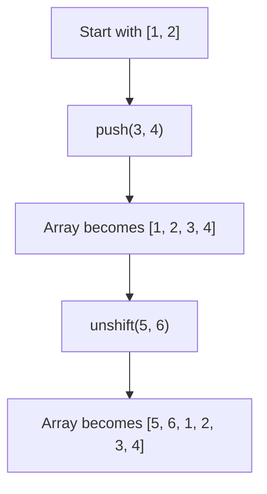

# 📝 [37. push unshift](https://bigfrontend.dev/quiz/push-unshift)

## 📌 Problem Overview

This quiz demonstrates how `Array.prototype.push()` and `Array.prototype.unshift()` mutate an array. The important detail is that `push()` appends elements to the end, while `unshift()` inserts multiple elements at the beginning as a block in the same order they were passed.

```javascript
const arr = [1, 2]
arr.push(3, 4)
arr.unshift(5, 6)
console.log(arr)
```

---

## 🚀 Correct Answer
>
> [!TIP]
> **Output:**
>
> ```text
> [5, 6, 1, 2, 3, 4]
> ```

---

## 🔍 Detailed Explanation & Spec-Accurate Trace

This quiz is about array mutation semantics. `push()` appends arguments to the end of the array, and `unshift()` inserts its arguments at the beginning. When multiple values are passed to `unshift()`, they are inserted as a group in the order supplied, rather than one-by-one in a way that would reverse the order.

### ⚡ Key Spec Rules / Concepts

1. **Rule 1 (`push`)**: `push()` appends new elements to the end of an array and returns the new length.
2. **Rule 2 (`unshift`)**: `unshift()` inserts one or more elements at the beginning of an array and returns the new length.
3. **Rule 3 (Order preservation)**: Multiple values passed to `unshift()` are inserted in the same order they appear in the argument list.

### Step-by-Step Execution

#### 1. `arr.push(3, 4)` -> mutates array to `[1, 2, 3, 4]`

- **Step A**: The existing array is `[1, 2]`.
- **Step B**: `push(3, 4)` appends `3` and `4` to the end.
- **Step C**: The array becomes `[1, 2, 3, 4]`.
- **Output**: `[1, 2, 3, 4]`

---

#### 2. `arr.unshift(5, 6)` -> mutates array to `[5, 6, 1, 2, 3, 4]`

- **Step A**: The current array is `[1, 2, 3, 4]`.
- **Step B**: `unshift(5, 6)` inserts `5` and `6` at the front in the order provided.
- **Step C**: The final array becomes `[5, 6, 1, 2, 3, 4]`.
- **Output**: `[5, 6, 1, 2, 3, 4]`

---

## 💡 Key Takeaway

- **`push()` adds to the end**: it grows the array at the tail.
- **`unshift()` adds to the beginning**: it prepends elements while preserving the order of the arguments.

---

## 🛠️ Recommendations & Best Practices

- **Use `push()` for append operations** and **`unshift()` for prepend operations**.
- **Be explicit about ordering** when inserting multiple values at once.

```javascript
const values = [1, 2];
values.push(3);
values.unshift(0);
console.log(values); // [0, 1, 2, 3]
```

---

## 🧠 Revision Tips & Cheat Sheet

### Array Mutation Flow



---

## 🔗 Helpful Resources

- [MDN Web Docs - Array.prototype.push()](https://developer.mozilla.org/en-US/docs/Web/JavaScript/Reference/Global_Objects/Array/push)
- [MDN Web Docs - Array.prototype.unshift()](https://developer.mozilla.org/en-US/docs/Web/JavaScript/Reference/Global_Objects/Array/unshift)
- [BFE.dev - Quiz 37](https://bigfrontend.dev/quiz/push-unshift)

---

## 🏷️ Tags

`#Arrays` `#Mutation` `#JavaScript` `#Methods` `#SpecDeepDive`