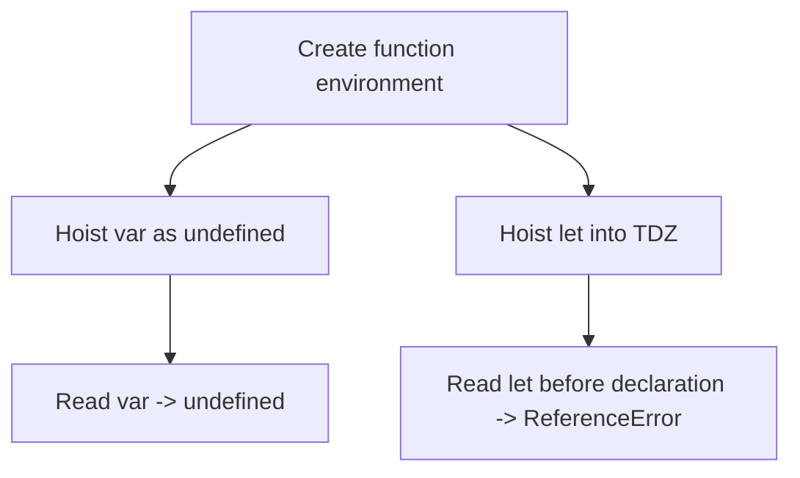

# 📝 [38. Hoisting IV](https://bigfrontend.dev/quiz/Hoisting-IV)

## 📌 Problem Overview

This quiz compares how `var` and `let` behave inside a function scope. The main difference is that `var` is hoisted and initialized to `undefined`, while `let` is hoisted to the block but remains in the Temporal Dead Zone until its declaration is executed.

```javascript
let foo = 10
function func1() {
    console.log(foo)
    var foo = 1
}
func1()

function func2() {
    console.log(foo)
    let foo = 1
}
func2()
```

---

## 🚀 Correct Answer
>
> [!TIP]
> **Output:**
>
> ```text
> undefined
> Error
> ```

---

## 🔍 Detailed Explanation & Spec-Accurate Trace

This quiz highlights a classic hoisting difference. In `func1`, the `var foo` declaration is hoisted within the function scope, so the `console.log(foo)` sees the local binding initialized as `undefined`. In `func2`, the `let foo` declaration is also hoisted to the function block, but it is not initialized and is inaccessible until the declaration line is executed, causing a `ReferenceError`.

### ⚡ Key Spec Rules / Concepts

1. **Rule 1 (Function scope for `var`)**: `var` declarations are created in the function's environment record and initialized to `undefined` during hoisting.
2. **Rule 2 (Block-scoped `let`)**: `let` declarations are also created during hoisting, but they enter the Temporal Dead Zone until execution reaches the declaration.
3. **Rule 3 (Shadowing)**: The inner `foo` shadowing the outer `foo` prevents the outer value from being seen inside the function before the inner declaration runs.

### Step-by-Step Execution

#### 1. `func1()` -> `undefined`

- **Step A**: A new function environment is created for `func1`.
- **Step B**: The `var foo` declaration is hoisted and initialized to `undefined` in that environment.
- **Step C**: `console.log(foo)` reads the local binding, which is still `undefined`.
- **Output**: `undefined`

---

#### 2. `func2()` -> `ReferenceError`

- **Step A**: A new function environment is created for `func2`.
- **Step B**: The `let foo` binding is created in the environment record but remains uninitialized.
- **Step C**: Accessing `foo` before the `let foo = 1` line executes throws a `ReferenceError` due to the Temporal Dead Zone.
- **Output**: `Error`

---

## 💡 Key Takeaway

- **`var` is initialized to `undefined`**: it can be read before assignment, though it will produce `undefined`.
- **`let` is not usable before its declaration**: reading it before initialization throws a `ReferenceError` because it is in the Temporal Dead Zone.

---

## 🛠️ Recommendations & Best Practices

- **Prefer `let` and `const`** over `var` for clearer scoping and fewer hoisting surprises.
- **Declare variables before use** to avoid TDZ-related errors.

```javascript
let foo = 10;
function example() {
  console.log(foo);
  let bar = 1;
}
```

---

## 🧠 Revision Tips & Cheat Sheet

### Hoisting Flow



---

## 🔗 Helpful Resources

- [MDN Web Docs - let](https://developer.mozilla.org/en-US/docs/Web/JavaScript/Reference/Statements/let)
- [MDN Web Docs - var](https://developer.mozilla.org/en-US/docs/Web/JavaScript/Reference/Statements/var)
- [ECMA-262 Specification - Temporal Dead Zone](https://tc39.es/ecma262/#sec-temporal-dead-zone)
- [BFE.dev - Quiz 38](https://bigfrontend.dev/quiz/Hoisting-IV)

---

## 🏷️ Tags

`#Hoisting` `#TDZ` `#Let` `#Var` `#JavaScript` `#SpecDeepDive`