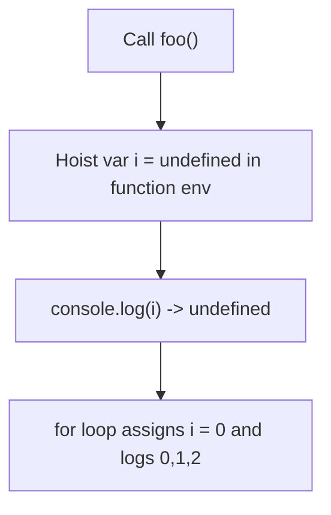

# 📝 [39. var](https://bigfrontend.dev/quiz/var)

## 📌 Problem Overview

This quiz demonstrates `var` hoisting inside a function and how a `for` loop's `var` binding is shared with the function scope.

```javascript
function foo() {
	console.log(i)
	for (var i = 0; i < 3; i++) {
		console.log(i)
	}
}

foo()
```

---

## 🚀 Correct Answer
>
> [!TIP]
> **Output:**
>
> ```text
> undefined
> 0
> 1
> 2
> ```

---

## 🔍 Detailed Explanation & Spec-Accurate Trace

The key point is that `var` declarations are hoisted to the top of the enclosing function and initialized to `undefined` during the creation of the function environment. The `for` loop's `var i` is the same binding as the one accessed before the loop starts.

### ⚡ Key Spec Rules / Concepts

1. **Rule 1 (Var hoisting)**: `var` declarations are created in the function's environment record and initialized to `undefined` before execution.
2. **Rule 2 (Function scope)**: `var` is function-scoped; the `i` declared in the `for` header is the same `i` visible throughout the function.
3. **Rule 3 (Post-declaration assignment)**: Assignments to `i` in the `for` loop body and header update the hoisted binding.

### Step-by-Step Execution

#### 1. `console.log(i)` (first line inside `foo`) -> `undefined`

- **Step A**: When `foo` is called, a new function environment is created and the `var i` binding is added and initialized to `undefined` (hoisting).
- **Step B**: The `console.log(i)` reads the local `i` which is currently `undefined`.
- **Output**: `undefined`

---

#### 2. `for (var i = 0; i < 3; i++) { console.log(i) }` -> `0, 1, 2`

- **Step A**: The loop initializes `i` to `0` (assigns to the hoisted binding).
- **Step B**: Each iteration logs the current numeric value of `i`: `0`, then `1`, then `2`.
- **Output**: `0`, `1`, `2`

---

## 💡 Key Takeaway

- **`var` is hoisted and initialized to `undefined`**: reading it before assignment returns `undefined` rather than throwing.
- **`let`/`const` avoid this class of bug**: prefer them to get block scoping and TDZ protection.

---

## 🛠️ Recommendations & Best Practices

- **Prefer `let` and `const`** over `var` for predictable scoping.
- **Declare loop variables close to usage** to avoid accidental access before initialization.

```javascript
function foo() {
	for (let i = 0; i < 3; i++) {
		console.log(i)
	}
}
```

---

## 🧠 Revision Tips & Cheat Sheet

### Hoisting Flow



---

## 🔗 Helpful Resources

- [ECMA-262 Specification - Variable Environment Records](https://tc39.es/ecma262/#sec-environment-records)
- [MDN Web Docs - var](https://developer.mozilla.org/en-US/docs/Web/JavaScript/Reference/Statements/var)
- [BFE.dev - Quiz 39](https://bigfrontend.dev/quiz/var)

---

## 🏷️ Tags

`#Hoisting` `#Var` `#JavaScript` `#Scope` `#SpecDeepDive`