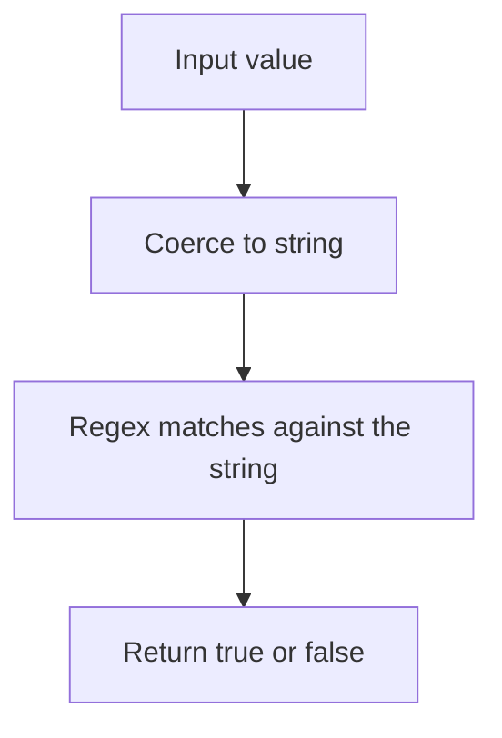

# 📝 [40. RegExp.prototype.test](https://bigfrontend.dev/quiz/RegExp-prototype-test)

## 📌 Problem Overview

This quiz demonstrates how `RegExp.prototype.test()` handles non-string inputs. The method coerces its argument to a string before performing the match, so numbers and arrays can still satisfy a regex pattern if their string form matches.

```javascript
console.log(/^4\d\d$/.test('404'))
console.log(/^4\d\d$/.test(404))
console.log(/^4\d\d$/.test(['404']))
console.log(/^4\d\d$/.test([404]))
```

---

## 🚀 Correct Answer
>
> [!TIP]
> **Output:**
>
> ```text
> true
> true
> true
> true
> ```

---

## 🔍 Detailed Explanation & Spec-Accurate Trace

`RegExp.prototype.test()` uses the ECMAScript `ToString` conversion on its input when the argument is not already a string. This means values like `404`, `['404']`, and `[404]` are first converted to strings before matching against the regular expression.

### ⚡ Key Spec Rules / Concepts

1. **Rule 1 (String coercion)**: Non-string arguments passed to `test()` are converted to strings before the match is attempted.
2. **Rule 2 (Regex matching semantics)**: The pattern `/^4\d\d$/` matches strings that start with `4`, contain exactly two digits, and end immediately afterward.
3. **Rule 3 (Array coercion)**: Arrays are converted to strings by joining their elements with commas, so `['404']` becomes `'404'` and `[404]` becomes `'404'`.

### Step-by-Step Execution

#### 1. `/^4\d\d$/.test('404')` -> `true`

- **Step A**: The input is already a string.
- **Step B**: The regex matches the full string `404`.
- **Output**: `true`

---

#### 2. `/^4\d\d$/.test(404)` -> `true`

- **Step A**: The number `404` is coerced to the string `'404'`.
- **Step B**: The regex matches the full string.
- **Output**: `true`

---

#### 3. `/^4\d\d$/.test(['404'])` -> `true`

- **Step A**: The array is coerced to a string via its elements joined by commas.
- **Step B**: `['404']` becomes `'404'`.
- **Step C**: The regex matches.
- **Output**: `true`

---

#### 4. `/^4\d\d$/.test([404])` -> `true`

- **Step A**: The array is coerced to the string `'404'`.
- **Step B**: The regex matches that string.
- **Output**: `true`

---

## 💡 Key Takeaway

- **`test()` coerces values to strings**: this can make non-string inputs appear to match a regex unexpectedly.
- **Be explicit when matching values**: convert to the intended type before testing if you want predictable behavior.

---

## 🛠️ Recommendations & Best Practices

- **Normalize inputs before matching**: convert values to strings intentionally with `String(value)`.
- **Use strict validation when needed**: if you want to only match actual strings, check the type first.

```javascript
const input = String(value);
console.log(/^4\d\d$/.test(input));
```

---

## 🧠 Revision Tips & Cheat Sheet

### Matching Flow



---

## 🔗 Helpful Resources

- [MDN Web Docs - RegExp.prototype.test()](https://developer.mozilla.org/en-US/docs/Web/JavaScript/Reference/Global_Objects/RegExp/test)
- [ECMA-262 Specification - RegExp.prototype.test](https://tc39.es/ecma262/#sec-regexp.prototype.test)
- [BFE.dev - Quiz 40](https://bigfrontend.dev/quiz/RegExp-prototype-test)

---

## 🏷️ Tags

`#RegExp` `#StringCoercion` `#JavaScript` `#Regex` `#SpecDeepDive`