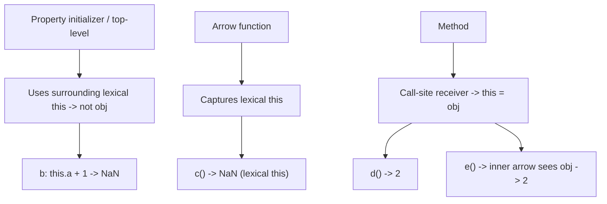

# 📝 [41. `this` III](https://bigfrontend.dev/quiz/this-III)

## 📌 Problem Overview

This quiz demonstrates how `this` behaves in different property initializers and method forms inside an object literal. It shows the difference between using `this` at object creation time, arrow functions (lexical `this`), and regular methods (dynamic `this`).

```javascript
const obj = {
	a: 1,
	b: this.a + 1,
	c: () => this.a + 1,
	d() {
		return this.a + 1
	},
	e() {
		return (() => this.a + 1)()
	}
}
console.log(obj.b)
console.log(obj.c())
console.log(obj.d())
console.log(obj.e())
```

---

## 🚀 Correct Answer
>
> [!TIP]
> **Output:**
>
> ```text
> NaN
> NaN
> 2
> 2
> ```

---

## 🔍 Detailed Explanation & Spec-Accurate Trace

This quiz contrasts three `this` behaviors:
- `this` used at top-level/object-initialization (not bound to the object)
- arrow functions capturing lexical `this`
- methods where `this` is set by the call site (object receiver)

### ⚡ Key Spec Rules / Concepts

1. **Rule 1 (Top-level `this` during object literal evaluation)**: Property initializers are evaluated in the current lexical `this` (e.g., module/strict `this` is `undefined`), so `b: this.a + 1` does not receive `obj` as `this`.
2. **Rule 2 (Arrow functions - lexical `this`)**: Arrow functions capture the surrounding `this` at creation time and do not get a dynamic receiver when called.
3. **Rule 3 (Method `this` binding)**: A concise method (`d() {}`) is invoked with `this` bound to the calling object when called as `obj.d()`.

### Step-by-Step Execution

#### 1. `obj.b` -> `NaN`

- **Step A**: `b` is evaluated during object literal creation using the surrounding `this` (top-level), which has no `a` property; `this.a` is `undefined`.
- **Step B**: `undefined + 1` yields `NaN`.
- **Output**: `NaN`

---

#### 2. `obj.c()` -> `NaN`

- **Step A**: `c` is an arrow function created with the same outer `this` as `b` (lexical `this`), not bound to `obj`.
- **Step B**: Inside the arrow `this.a` is still `undefined`; adding `1` yields `NaN`.
- **Output**: `NaN`

---

#### 3. `obj.d()` -> `2`

- **Step A**: `d` is a regular method; when invoked as `obj.d()` the receiver is `obj` and `this` refers to `obj`.
- **Step B**: `this.a` is `1`, so `this.a + 1` equals `2`.
- **Output**: `2`

---

#### 4. `obj.e()` -> `2`

- **Step A**: `e` is a method; its body immediately invokes an arrow function. The arrow captures `this` from `e`'s lexical environment (the method), which is bound to `obj` because `e` was called as `obj.e()`.
- **Step B**: The inner arrow sees `this.a === 1`, so returns `2`.
- **Output**: `2`

---

## 💡 Key Takeaway

- **Arrow functions capture lexical `this`** (they don't get `obj` as receiver when called as `obj.c()` if created with outer `this` different from `obj`).
- **Methods use call-site binding**: concise methods receive `obj` as `this` when called via `obj.method()`.

---

## 🛠️ Recommendations & Best Practices

- **Prefer methods for behavior that needs `this` pointing to the object**.
- **Use arrow functions for callbacks where you want lexical `this`**, but avoid using them as object methods that need the object as receiver.

```javascript
const obj = {
	a: 1,
	d() { return this.a + 1 }
}
console.log(obj.d()); // 2
```

---

## 🧠 Revision Tips & Cheat Sheet

### `this` Behavior Summary



---

## 🔗 Helpful Resources

- [MDN Web Docs - this](https://developer.mozilla.org/en-US/docs/Web/JavaScript/Reference/Operators/this)
- [ECMA-262 Specification - Arrow Functions](https://tc39.es/ecma262/#sec-arrow-function-definitions)
- [BFE.dev - Quiz 41](https://bigfrontend.dev/quiz/this-III)

---

## 🏷️ Tags

`#ThisBinding` `#ArrowFunctions` `#JavaScript` `#Methods` `#SpecDeepDive`