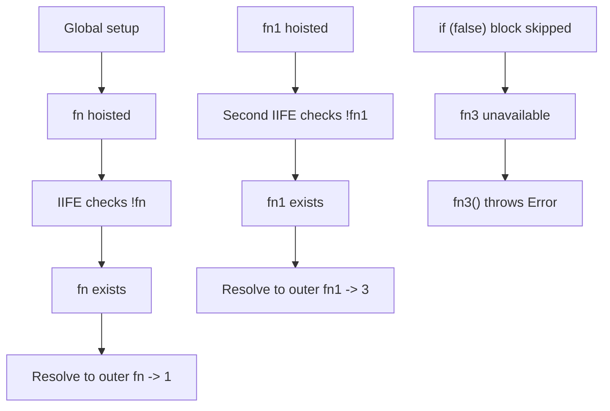

# 📝 [42. Hoisting V](https://bigfrontend.dev/quiz/hoisting-v)

## 📌 Problem Overview

This quiz tests how JavaScript hoists function declarations, resolves names through the scope chain, and handles block-scoped function declarations in a legacy-style pattern.

```javascript
(() => {
  if (!fn) {
    function fn() {
      console.log('2')
    }
  }
  fn()
})()

function fn() {
  console.log('1')
}

// another one
function fn1() {
  console.log('3')
}

(() => {
  if (!fn1) {
    function fn1() {
      console.log('4')
    }
  }
  fn1()
})()


// another one !
(() => {
  if (false) {
    function fn3() {
      console.log('5')
    }
  }
  fn3()
})()
```

---

## 🚀 Correct Answer
>
> [!TIP]
> **Output:**
>
> ```text
> 1
> 3
> Error
> ```

---

## 🔍 Detailed Explanation & Spec-Accurate Trace

This question is about the interaction between function hoisting, lexical scope lookup, and block-level declarations. The engine creates bindings during setup, and then each `fn(...)` call resolves to the closest visible binding in the environment chain.

### ⚡ Key Spec Rules / Concepts

1. **Rule 1 (Function declaration hoisting)**: Function declarations are set up during the initialization phase of the surrounding environment, so they are available before their source position is executed.
2. **Rule 2 (Scope chain resolution)**: A variable or function name is resolved by walking the current lexical environment outward until it finds the binding or reaches the global environment.
3. **Rule 3 (Legacy block function semantics)**: A function declaration inside a block is historically quirky and can behave like a hoisted binding in the surrounding scope in non-strict code, which is exactly why this quiz is tricky.

---

### Step-by-Step Execution

#### 1. `fn()` -> `1`

- **Step A**: During setup, the outer `function fn()` is hoisted and becomes available in the surrounding scope.
- **Step B**: The IIFE evaluates `if (!fn)`. Since `fn` already exists, the condition is `false` and the inner block declaration does not shadow or replace the outer binding.
- **Output**: `1`

#### 2. `fn1()` -> `3`

- **Step A**: The outer `function fn1()` is also hoisted at setup time.
- **Step B**: The second IIFE checks `if (!fn1)`, which is `false` because the global binding already exists.
- **Output**: `3`

#### 3. `fn3()` -> `Error`

- **Step A**: The third IIFE enters `if (false)`, so the block never executes and the inner `fn3` declaration is not established in a reliable way.
- **Step B**: The call `fn3()` then tries to resolve a binding that does not exist as a valid callable function in this scope.
- **Output**: `Error`

---

## 💡 Key Takeaway

* **Hoisting makes function declarations available early**: the outer functions are already defined before execution starts.
* **Nearest scope wins**: when a name is looked up, the current lexical environment is checked first, then outer ones.
* **Block function declarations are not safe to rely on**: they are legacy behavior and can lead to errors or inconsistent results.

---

## 🛠️ Recommendations & Best Practices

* **Avoid function declarations inside conditionals**: They are confusing and browser/engine-specific in old legacy cases.
* **Use function expressions or block-local const functions**: This makes the intended scope explicit.
* **Prefer clear variable declarations**: If you want a local helper, declare it in the enclosing function body instead of inside a block.

```javascript
const fn = () => {
  console.log('safe')
}

if (true) {
  fn()
}
```

---

## 🧠 Revision Tips & Cheat Sheet

### Visual Hoisting / Scope Resolution Flow



---

## 🔗 Helpful Resources

- [ECMA-262 Specification - Function Definitions](https://tc39.es/ecma262/#sec-functiondeclarations)
- [MDN Web Docs - Hoisting](https://developer.mozilla.org/en-US/docs/Glossary/Hoisting)
- [MDN Web Docs - Block Scope](https://developer.mozilla.org/en-US/docs/Web/JavaScript/Reference/Statements/block)
- [BFE.dev - Quiz 42: Hoisting V](https://bigfrontend.dev/quiz/hoisting-v)

---

## 🏷️ Tags

`#Hoisting` `#FunctionScope` `#BlockScope` `#JavaScriptEngine` `#SpecDeepDive`