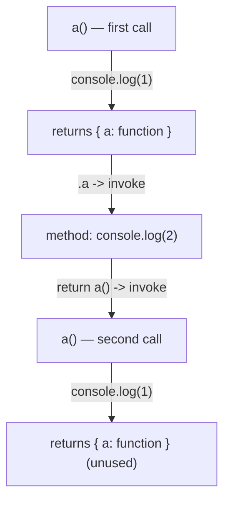

# 📝 [44. Function call](https://bigfrontend.dev/quiz/Function-call)

## 📌 Problem Overview

This quiz demonstrates a function that returns an object with a method which calls the outer function again.

```javascript
function a() {
	console.log(1)
	return {
		a: function() {
			console.log(2)
			return a()
		}
	}
}

a().a()

// 1
// 2
// 1
```

---

## 🚀 Correct Answer
>
> [!TIP]
> **Output:**
>
> ```text
> 1
> 2
> 1
> ```

---

## 🔍 Detailed Explanation & Spec-Accurate Trace

This quiz exercises function calls, method property access, and a recursive invocation via `return a()`. The JS engine evaluates `a().a()` left-to-right: it first calls `a()`, then accesses its `a` property, then invokes that method which itself calls `a()` again.

### ⚡ Key Spec Rules / Concepts

1. **CallExpression evaluation**: evaluation of function calls and the creation of an execution context (ECMA-262 evaluation of CallExpression).
2. **Function declaration / function object**: functions are callable objects and creating/returning object literals follows the ObjectLiteral evaluation semantics.
3. **GetValue / Property Access**: accessing the `a` property of the returned object yields the function value that will be invoked.
4. **OrdinaryCall/Invoke**: calling a function executes its body and produces side-effects (the `console.log` calls) and a return value.

---

### Step-by-Step Execution

#### 1. `a().a()` -> (final value: the object returned by the last `a()` call)

- **Step A**: Evaluate the left part `a()`.
	- Resolve identifier `a` to the function object declared in the surrounding scope.
	- Invoke `a` (ordinary call). This creates a new execution context and executes the function body.

- **Step B**: Inside the first `a()` invocation:
	- `console.log(1)` executes, printing `1` to the console.
	- The function reaches `return { a: function() { ... } }` and constructs a new object with a property `a` whose value is a function object (method).
	- The first `a()` call returns that object value to the caller.

- **Step C**: Property access `.a` on the returned object.
	- The engine performs a GetValue on the returned object, reads property `a`, yielding the function value defined in the object literal.

- **Step D**: Invoke the property function (the method returned previously).
	- Calling that function creates another execution context for the method body.

- **Step E**: Inside the returned object's `a` method:
	- `console.log(2)` executes, printing `2` to the console.
	- The method executes `return a()` which is a direct invocation of the outer function `a` (not a reference). This evaluates another `CallExpression`.

- **Step F**: The `return a()` call (the nested invocation):
	- Resolve `a` to the same function object and invoke it.
	- Inside this new `a()` call, `console.log(1)` runs again, printing `1`.
	- That `a()` invocation returns a newly created object with an `a` method (unused here).

- **Output order**: the three console logs occur in this exact order: `1` (first `a()`), `2` (method), `1` (nested `a()` called by `return a()`).

---

## 💡 Key Takeaway

* **Function calls are evaluated immediately**: `return a()` invokes the function and returns its result, it does not return a reference to the function.
* **Method invocation can re-enter the same function**: storing a function as an object property and then calling it can lead to additional calls of the original function and further side-effects.

---

## 🛠️ Recommendations & Best Practices

* **Return references when intended**: if you mean to return a function for later invocation, return the function itself (e.g. `return a`), not `return a()` which immediately invokes it.
* **Keep side-effects explicit**: avoid implicit recursive calls in returned methods unless the recursion is intentional and well-documented.

```javascript
// If you intend to return the function reference instead of invoking it:
function aRef() {
	console.log(1)
	return {
		a: function() {
			console.log(2)
			return aRef // return the function reference, not call it
		}
	}
}

const obj = aRef();
obj.a(); // prints 1 then 2, but does not immediately call aRef again
```

---

## 🧠 Revision Tips & Cheat Sheet

### Visual Coercion Path / Logical Flow



> [!WARNING]
> When drawing diagrams, wrap node labels containing special characters in double quotes to avoid Mermaid parsing errors.

---

## 🔗 Helpful Resources

- [ECMA-262 Specification - Function Calls](https://262.ecma-international.org/)
- [MDN Web Docs - Functions](https://developer.mozilla.org/en-US/docs/Web/JavaScript/Guide/Functions)
- [BFE.dev - Function call quiz](https://bigfrontend.dev/quiz/Function-call)

---

## 🏷️ Tags

`#functions` `#recursion` `#call-expression` `#javascript` `#SpecDeepDive`
