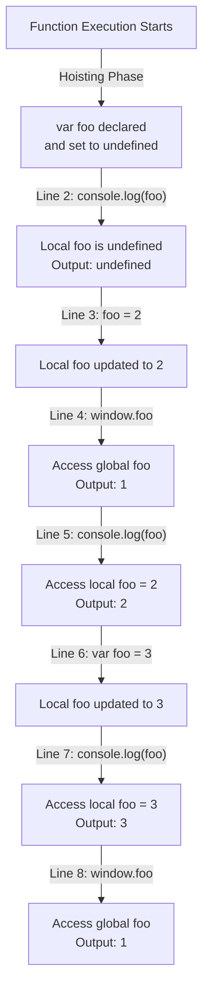

# 📝 [45. Hoisting VI](https://bigfrontend.dev/quiz/Hoisting-VI)

## 📌 Problem Overview

This quiz tests understanding of variable hoisting in JavaScript—specifically how `var` declarations inside functions are hoisted to the function scope, separate from global variables with the same name. The key insight is that while the variable declaration is hoisted, its initialization remains in place, creating a Temporal Dead Zone (TDZ) effect.

```javascript
var foo = 1;
(function () {
  console.log(foo);
  foo = 2;
  console.log(window.foo);
  console.log(foo);
  var foo = 3;
  console.log(foo);
  console.log(window.foo)
})()
```

---

## 🚀 Correct Answer

> [!TIP]
> **Output:**
>
> ```text
> undefined
> 1
> 2
> 3
> 1
> ```

---

## 🔍 Detailed Explanation & Spec-Accurate Trace

This quiz demonstrates the core ECMAScript hoisting behavior and function scope isolation. When a function declares a variable with `var`, the JavaScript engine hoists (moves) the declaration to the top of the function scope during the compilation phase, but the initialization stays at the original location. This creates a scenario where accessing the local variable before its initialization statement returns `undefined` rather than the global variable.

### ⚡ Key Spec Rules / Concepts

1. **Variable Hoisting (Declaration)**: During the creation of a function's Execution Context, all `var` declarations are hoisted to the top of that function scope. The variable is created and initialized to `undefined`.
2. **Function Scope Shadowing**: A local `var` declaration with the same name as a global variable creates a local binding that shadows (completely hides) the global variable throughout the entire function scope, not just after the declaration line.
3. **Temporal Dead Zone (TDZ) Behavior in `var`**: Although `var` doesn't have a formal TDZ like `let`/`const`, accessing a hoisted `var` before its assignment returns `undefined` rather than the global value.
4. **Window Object**: In browsers, global variables declared with `var` are attached as properties to the `window` object; local variables are not.

---

### Step-by-Step Execution

#### 1. `console.log(foo)` → `undefined`

- **Step A**: The function scope is created during hoisting. The `var foo = 3;` declaration at line 8 is hoisted to the top of the function, so `foo` exists as a local variable initialized to `undefined`.
- **Step B**: When `console.log(foo)` executes at line 2, it looks up `foo` in the local scope (not global), finding the hoisted local variable.
- **Step C**: Since the initialization (`foo = 3`) hasn't been reached yet, the local `foo` is still `undefined`.
- **Output**: `undefined`

#### 2. `foo = 2` (Assignment, no console output)

- **Step A**: This assigns `2` to the local `foo` variable (not the global).
- **Step B**: The local `foo` now holds the value `2`.

#### 3. `console.log(window.foo)` → `1`

- **Step A**: Explicitly accesses the global `foo` via the `window` object.
- **Step B**: The global `foo` was set to `1` at line 1 and has never been changed.
- **Output**: `1`

#### 4. `console.log(foo)` → `2`

- **Step A**: Looks up `foo` in the local scope, where it was assigned `2` in step 2.
- **Output**: `2`

#### 5. `var foo = 3;` (Declaration + Initialization, no console output)

- **Step A**: The declaration was already hoisted, so this line only performs the initialization.
- **Step B**: The local `foo` is now assigned the value `3`.

#### 6. `console.log(foo)` → `3`

- **Step A**: Looks up `foo` in the local scope, where it was just assigned `3`.
- **Output**: `3`

#### 7. `console.log(window.foo)` → `1`

- **Step A**: Explicitly accesses the global `foo` via `window`.
- **Step B**: The global `foo` remains `1` (it was never modified inside the function).
- **Output**: `1`

---

## 💡 Key Takeaway

* **Local variables shadow globals**: When you declare a variable with `var` inside a function, even if it has the same name as a global variable, the local declaration shadows the global throughout the entire function scope—not just from the point of declaration onward.
* **Hoisting separates declaration from initialization**: The `var` declaration is hoisted to the top of the function scope and initialized to `undefined`, but the actual assignment (`foo = 3`) stays at its original location. This means you can accidentally reference the local variable before it's initialized, getting `undefined` instead of an error or the global value.
* **`window` object provides global access**: To access the global `foo` from inside the function, you must explicitly use `window.foo`; a plain reference to `foo` will always refer to the local variable.

---

## 🛠️ Recommendations & Best Practices

* **Use `let` or `const` instead of `var`**: Modern JavaScript provides block-scoped `let` and `const`, which avoid the confusing hoisting behavior. They also provide proper TDZ errors if you try to access them before initialization.
* **Avoid variable name shadowing**: Don't create local variables with the same name as globals. This makes code harder to understand and maintain.
* **Be explicit about global access**: If you intentionally need to access a global variable from inside a function, use `window.variableName` to make it clear that you're accessing a global, not a local variable.

```javascript
// ❌ Avoid this (confusing hoisting and shadowing)
var foo = 1;
(function () {
  console.log(foo);  // undefined due to hoisting
  var foo = 3;
})()

// ✅ Use const/let and avoid shadowing
const foo = 1;
(function () {
  console.log(foo);  // 1 (accesses outer scope directly)
  const fooLocal = 3;
})()

// ✅ Or be explicit about accessing globals
var globalFoo = 1;
(function () {
  var localFoo = 3;
  console.log(window.globalFoo);  // 1 (clear intent)
})()
```

---

## 🧠 Revision Tips & Cheat Sheet

### Variable Hoisting Flow



### Hoisting Timeline

| Phase | Local `foo` | Global `foo` | Note |
|-------|------------|--------------|------|
| **Compilation** | `undefined` (hoisted) | `1` | Declaration hoisted, not initialization |
| **Line 2** | `undefined` | `1` | Before any assignment to local |
| **Line 3** | `2` | `1` | Assigned to local var (shadows global) |
| **Line 4** | `2` | `1` | Explicitly access global via `window` |
| **Line 6** | `3` | `1` | Initialization line reached |
| **Line 8** | `3` | `1` | Global never changed inside function |

---

## 🔗 Helpful Resources

- [ECMA-262 Specification - Variable Statements](https://tc39.es/ecma262/#sec-variable-statement)
- [MDN Web Docs - Hoisting](https://developer.mozilla.org/en-US/docs/Glossary/Hoisting)
- [MDN Web Docs - var](https://developer.mozilla.org/en-US/docs/Web/JavaScript/Reference/Statements/var)
- [You Don't Know JS - Scope & Closures](https://github.com/getify/You-Dont-Know-JS/tree/2nd-ed/scope-closures)
- [BFE.dev - Quiz 45](https://bigfrontend.dev/quiz/Hoisting-VI)

---

## 🏷️ Tags

`#Hoisting` `#VarDeclaration` `#FunctionScope` `#Shadowing` `#ExecutionContext` `#SpecDeepDive`