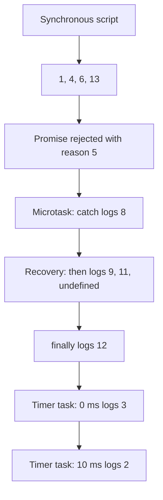

# 📝 [47. Promise Order II](https://bigfrontend.dev/quiz/promise-order-II)

## 📌 Problem Overview

Determine the order in which the synchronous statements, promise reactions, and timers are executed.

```javascript
console.log(1)

setTimeout(() => {
   console.log(2)
}, 10)

setTimeout(() => {
   console.log(3)
}, 0);

new Promise((_, reject) => {
   console.log(4)
   reject(5)
   console.log(6)
}).then(() => console.log(7))
.catch(() => console.log(8))
.then(() => console.log(9))
.catch(() => console.log(10))
.then(() => console.log(11))
.then(console.log)
.finally(() => console.log(12))

console.log(13)
```

---

## 🚀 Correct Answer
>
> [!TIP]
> **Output:**
>
> ```text
> 1
> 4
> 6
> 13
> 8
> 9
> 11
> undefined
> 12
> 3
> 2
> ```

---

## 🔍 Detailed Explanation & Spec-Accurate Trace

The quiz tests synchronous execution, timer task scheduling, promise rejection propagation, promise reaction jobs, and the behavior of `finally()` in a promise chain.

### ⚡ Key Spec Rules / Concepts

1. **Synchronous execution**: JavaScript evaluates the current script on the call stack before the event loop runs queued jobs or timer callbacks.
2. **Promise executor**: The executor passed to `new Promise()` runs synchronously during promise construction. Calling `reject(5)` settles the promise, but execution continues to the next statement in the executor.
3. **Promise reaction jobs**: `then()`, `catch()`, and `finally()` register reactions. Their callbacks are scheduled as microtask jobs after the current synchronous script completes.
4. **Rejection recovery**: A `catch()` callback that completes normally fulfills the promise returned by `catch()`, so the following `then()` callbacks run.
5. **Callback return values**: A callback that returns no value fulfills its next promise with `undefined`. Therefore, `.then(console.log)` logs `undefined` when it receives that value.
6. **`finally()`**: `finally()` runs after the preceding chain settles and passes the prior fulfillment or rejection through unless the `finally()` callback throws or returns a rejected promise.
7. **Tasks versus microtasks**: Promise reaction jobs are drained before the event loop begins timer tasks. The zero-delay timer is eligible before the 10 ms timer, so `3` is logged before `2`.

### Step-by-Step Execution

#### 1. `console.log(1)` -> `1`

- **Step A**: The first statement executes synchronously on the call stack.
- **Output**: `1`

#### 2. `setTimeout(..., 10)` -> timer registered

- **Step A**: The timer callback is registered as a task eligible after approximately 10 ms.
- **Output**: No immediate console output.

#### 3. `setTimeout(..., 0)` -> timer registered

- **Step A**: The callback is registered as a task eligible as soon as the current script and pending microtasks finish.
- **Output**: No immediate console output.

#### 4. `console.log(4)` -> `4`

- **Step A**: The `Promise` constructor invokes its executor synchronously.
- **Step B**: The executor logs before it calls `reject(5)`.
- **Output**: `4`

#### 5. `reject(5)` followed by `console.log(6)` -> `6`

- **Step A**: `reject(5)` changes the promise state to rejected with reason `5` and queues the first rejection reaction for later.
- **Step B**: Settling the promise does not stop the executor, so the next synchronous statement logs `6`.
- **Output**: `6`

#### 6. `console.log(13)` -> `13`

- **Step A**: The rest of the top-level script continues synchronously.
- **Output**: `13`

#### 7. `.catch(() => console.log(8))` -> `8`

- **Step A**: The first `.then()` has no rejection handler, so rejection reason `5` propagates to `.catch()`.
- **Step B**: The catch handler runs in a promise reaction microtask and logs `8`.
- **Step C**: It returns `undefined` implicitly, recovering the chain to fulfillment.
- **Output**: `8`

#### 8. `.then(() => console.log(9))` -> `9`

- **Step A**: Because the catch handler fulfilled its returned promise, the next `then()` handler is scheduled.
- **Step B**: The handler logs `9` and implicitly fulfills with `undefined`.
- **Output**: `9`

#### 9. `.then(() => console.log(11))` -> `11`

- **Step A**: The second catch has no rejection to handle, so it passes the fulfillment through.
- **Step B**: The next `then()` handler logs `11` and returns `undefined`.
- **Output**: `11`

#### 10. `.then(console.log)` -> `undefined`

- **Step A**: The previous handler fulfilled with `undefined`.
- **Step B**: `console.log` is used as the fulfillment handler and logs that value.
- **Output**: `undefined`

#### 11. `.finally(() => console.log(12))` -> `12`

- **Step A**: The chain is fulfilled, so `finally()` invokes its callback before passing the fulfillment onward.
- **Step B**: The callback logs `12` and returns normally.
- **Output**: `12`

#### 12. `setTimeout(..., 0)` -> `3`

- **Step A**: After the current script and all promise microtasks finish, the event loop processes the eligible zero-delay timer.
- **Output**: `3`

#### 13. `setTimeout(..., 10)` -> `2`

- **Step A**: The timer with the longer delay becomes eligible afterward.
- **Output**: `2`

---

## 💡 Key Takeaway

* **Synchronous work comes first**: Promise construction and its executor run immediately, producing `1`, `4`, `6`, and `13`.
* **Rejections can be recovered**: The first `catch()` handles the rejection, allowing all following fulfillment handlers to execute.
* **Microtasks precede timer tasks**: The complete promise chain runs before either `setTimeout()` callback.
* **Implicit `undefined` matters**: A callback without a return value fulfills its next promise with `undefined`.

---

## 🛠️ Recommendations & Best Practices

* **Prefer explicit error handling**: Use a rejection handler that records or transforms the error deliberately instead of relying on accidental chain recovery.
* **Use explicit returns in chains**: Return meaningful values from `then()` callbacks so later handlers do not unexpectedly receive `undefined`.
* **Do not use timers for precise ordering**: Timer delays are minimum eligibility delays, not exact execution times.

```javascript
runTask()
   .then((value) => processValue(value))
   .catch((error) => {
      reportError(error)
      throw error
   })
   .finally(() => closeResources())
```

---

## 🧠 Revision Tips & Cheat Sheet

### Visual Coercion Path / Logical Flow



---

## 🔗 Helpful Resources

- [ECMA-262 Specification - Promise Objects](https://tc39.es/ecma262/multipage/control-abstraction-objects.html#sec-promise-objects)
- [ECMA-262 Specification - Jobs and Host Scheduling](https://tc39.es/ecma262/multipage/executable-code-and-execution-contexts.html#sec-jobs-and-job-queues)
- [MDN Web Docs - Promise](https://developer.mozilla.org/en-US/docs/Web/JavaScript/Reference/Global_Objects/Promise)
- [MDN Web Docs - `Promise.prototype.finally()`](https://developer.mozilla.org/en-US/docs/Web/JavaScript/Reference/Global_Objects/Promise/finally)
- [BFE.dev - Quiz 47](https://bigfrontend.dev/quiz/promise-order-II)

---

## 🏷️ Tags

`#Promises` `#EventLoop` `#Microtasks` `#Macrotasks` `#PromiseChaining` `#SpecDeepDive`