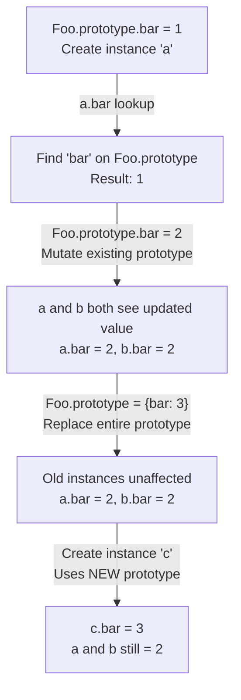

# 📝 [48. Prototype](https://bigfrontend.dev/quiz/prototype)

## 📌 Problem Overview

This quiz tests your understanding of JavaScript's prototype chain mechanism and how prototype mutations affect object instances created before and after the mutation. It explores the critical difference between modifying an existing prototype versus replacing the entire prototype object.

```javascript
function Foo() { }
Foo.prototype.bar = 1
const a = new Foo()
console.log(a.bar)

Foo.prototype.bar = 2
const b = new Foo()
console.log(a.bar)
console.log(b.bar)

Foo.prototype = {bar: 3}
const c = new Foo()
console.log(a.bar)
console.log(b.bar)
console.log(c.bar)
```

---

## 🚀 Correct Answer

> [!TIP]
> **Output:**
>
> ```text
> 1
> 2
> 2
> 2
> 2
> 3
> ```

---

## 🔍 Detailed Explanation & Spec-Accurate Trace

The JavaScript prototype chain is fundamental to object inheritance. When accessing a property on an object, the JavaScript engine searches the object's own properties first, then walks up the prototype chain until it finds the property or reaches the end of the chain. This quiz demonstrates two critical behaviors: modifying prototype properties (which affects all instances) and replacing the entire prototype object (which only affects future instances).

### ⚡ Key Spec Rules / Concepts

1. **Prototype Chain Lookup (ECMA-262 §10.1.3)**: When accessing a property on an object, the engine first checks the object's own properties (`[[OwnProperties]]`). If not found, it checks the prototype (`[[Prototype]]`), and continues up the chain until found or the chain ends (null).

2. **Mutating vs Replacing Prototypes (ECMA-262 §19.1)**: Modifying properties on an existing prototype object affects all instances that share that prototype. However, replacing the entire `Foo.prototype` reference creates a new prototype object, severing the connection for instances created before the replacement.

3. **Constructor Property Chain**: When an instance is created with `new Foo()`, the instance's internal `[[Prototype]]` slot is set to `Foo.prototype`. This reference is established at construction time and does not change if `Foo.prototype` is later reassigned.

---

### Step-by-Step Execution

#### 1. `Foo.prototype.bar = 1` → Modifies shared prototype

- **Step A**: `Foo.prototype` initially exists as an empty object with `constructor` property pointing back to `Foo`.
- **Step B**: The property `bar` is added to `Foo.prototype`. All future and past instances will inherit this property.
- **Output**: `Foo.prototype` now has `{constructor: Foo, bar: 1}`

#### 2. `const a = new Foo()` → Creates first instance with `bar = 1`

- **Step A**: A new object is created with `[[Prototype]]` set to `Foo.prototype`.
- **Step B**: The `Foo` constructor executes (no assignments in this case).
- **Step C**: When `console.log(a.bar)` accesses `bar`, the prototype chain lookup finds `bar` on `Foo.prototype`.
- **Output**: `1` (from `Foo.prototype.bar`)

#### 3. `Foo.prototype.bar = 2` → Modifies shared prototype again

- **Step A**: The existing property `bar` on `Foo.prototype` is updated to `2`.
- **Step B**: Since `a` still references `Foo.prototype`, accessing `a.bar` now returns `2`.
- **Step C**: The reassignment affects both previously created instances (`a`) and future instances.
- **Output**: `Foo.prototype.bar` is now `2`

#### 4. `const b = new Foo()` and `console.log(a.bar)` → Both see updated prototype

- **Step A**: `b` is created with `[[Prototype]]` pointing to the same `Foo.prototype` (which has `bar = 2`).
- **Step B**: `a.bar` now resolves to `2` because the prototype has been mutated.
- **Step C**: `b.bar` resolves to `2` from `Foo.prototype`.
- **Output**: Both `a.bar` and `b.bar` return `2`

#### 5. `Foo.prototype = {bar: 3}` → Replaces entire prototype

- **Step A**: A brand new object `{bar: 3}` is created and assigned to `Foo.prototype`.
- **Step B**: Existing instances `a` and `b` still hold references to the *old* prototype object (with `bar = 2`). They are unaffected by this reassignment.
- **Step C**: Only newly created instances will use the new prototype.
- **Output**: `Foo.prototype` reference now points to a different object

#### 6. `const c = new Foo()` and final console.logs

- **Step A**: `c` is created with `[[Prototype]]` pointing to the *new* `Foo.prototype` (which has `bar = 3`).
- **Step B**: `a.bar` still resolves to `2` (old prototype).
- **Step C**: `b.bar` still resolves to `2` (old prototype).
- **Step D**: `c.bar` resolves to `3` (new prototype).
- **Output**: `2`, `2`, `3`

---

## 💡 Key Takeaway

* **Mutating Prototypes Affects All Instances**: Modifying properties on `Foo.prototype` (e.g., `Foo.prototype.bar = 2`) affects both instances created before and after the mutation, because they all reference the same prototype object.

* **Replacing Prototypes Only Affects Future Instances**: Reassigning `Foo.prototype = {...}` breaks the connection for existing instances. They continue to use the old prototype, while new instances use the new one.

* **Prototype Chain is Established at Construction**: The `[[Prototype]]` reference is set when an instance is created with `new`, not dynamically resolved. Subsequent changes to `Foo.prototype` won't change existing instances' prototype chain unless you're mutating the shared prototype object itself.

---

## 🛠️ Recommendations & Best Practices

* **Avoid Replacing Prototypes After Construction**: If you need to add methods or properties, always mutate the existing prototype rather than replacing it entirely. Replacement breaks inheritance for already-constructed instances.

* **Use Object.create() for Explicit Prototype Control**: When you need fine-grained control over prototypes, use `Object.create()` instead of relying on constructor functions and prototype reassignment.

* **Prefer ES6 Classes**: Modern JavaScript provides the `class` syntax, which handles prototype management more clearly and prevents accidental prototype chain breakage.

* **Freeze or Seal Prototypes in Production**: Consider using `Object.freeze()` or `Object.seal()` on prototypes to prevent accidental mutations that could affect all instances.

```javascript
// ❌ Avoid: Replacing prototypes breaks existing instances
function OldWay() { }
const obj1 = new OldWay()
OldWay.prototype = { method: () => 'new' }  // obj1 won't have access
const obj2 = new OldWay()  // obj2 has access

// ✅ Good: Mutate the shared prototype
function BetterWay() { }
const obj3 = new BetterWay()
BetterWay.prototype.method = () => 'updated'  // All instances see this
const obj4 = new BetterWay()  // obj3 and obj4 both have access

// ✅ Best: Use ES6 classes
class ModernWay {
  method() { return 'updated' }
}
const obj5 = new ModernWay()  // Clear and unambiguous
const obj6 = new ModernWay()
```

---

## 🧠 Revision Tips & Cheat Sheet

### Visual Prototype Chain Behavior



### Memory Layout Diagram

```
Before Replacement:
┌──────────┐     ┌──────────────────────────┐
│ instance │     │ Foo.prototype (OLD)       │
│    a     │────→│ {bar: 2, constructor}     │←────┐
└──────────┘     └──────────────────────────┘     │
                                                   │
┌──────────┐                                       │
│ instance │                                       │
│    b     │───────────────────────────────────────┘
└──────────┘

After Replacement:
┌──────────┐     ┌──────────────────────────┐
│ instance │     │ Foo.prototype (OLD)       │
│    a     │────→│ {bar: 2, constructor}     │
└──────────┘     └──────────────────────────┘

┌──────────┐     ┌──────────────────────────┐
│ instance │     │ Foo.prototype (NEW)       │
│    c     │────→│ {bar: 3}                  │
└──────────┘     └──────────────────────────┘
```

---

## 🔗 Helpful Resources

- [ECMA-262 Specification - OrdinaryGet](https://tc39.es/ecma262/#sec-ordinaryget)
- [MDN Web Docs - Prototype](https://developer.mozilla.org/en-US/docs/Learn/JavaScript/Objects/Object_prototypes)
- [MDN Web Docs - Inheritance and the Prototype Chain](https://developer.mozilla.org/en-US/docs/Web/JavaScript/Inheritance_and_the_prototype_chain)
- [BFE.dev - Quiz 48](https://bigfrontend.dev/quiz/prototype)

---

## 🏷️ Tags

`#Prototype` `#PrototypeChain` `#Inheritance` `#ObjectModel` `#ES5` `#SpecDeepDive` `#ConstructorFunctions`

