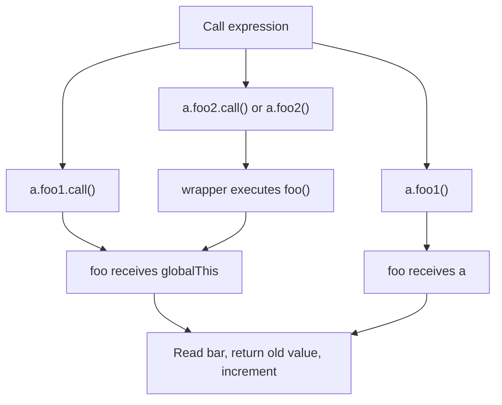

# 📝 [49. `this` IV](https://bigfrontend.dev/quiz/this-4)

## 📌 Problem Overview

This quiz tests how a regular function determines its `this` value when it is called as a method, through `call()` without an explicit receiver, and as a plain function inside another method.

```javascript
var bar = 1

function foo() {
	return this.bar++
}

const a = {
	bar: 10,
	foo1: foo,
	foo2: function() {
		return foo()
	},
}

console.log(a.foo1.call())
console.log(a.foo1())
console.log(a.foo2.call())
console.log(a.foo2())
```

---

## 🚀 Correct Answer
>
> [!TIP]
> **Output:**
>
> ```text
> 1
> 10
> 2
> 3
> ```

---

## 🔍 Detailed Explanation & Spec-Accurate Trace

`foo` is a non-arrow function, so its `this` value is determined at call time. The result of `this.bar++` is the current property value, while the increment updates that property afterward.

### ⚡ Key Spec Rules / Concepts

1. **`this` is determined by the call form**: A regular function called as `a.foo1()` receives `a` as its `this` value. The same function called as `foo()` does not receive `a` implicitly.
2. **`Function.prototype.call` supplies the receiver**: `a.foo1.call()` invokes `foo` with an undefined `thisArg`. In a non-strict script, the function call's `this` is converted to the global object.
3. **Global `var` bindings are global-object properties**: In a browser-style global script, `var bar = 1` creates `globalThis.bar`, so the global-object calls observe and mutate that value.
4. **Post-increment returns before updating**: `this.bar++` reads the property, converts it to a number, returns the old value, and then stores the incremented value.
5. **Method context is not inherited by nested plain calls**: Inside `foo2`, the expression `foo()` is a separate plain function call, so it does not retain the `this` value from `a.foo2()`.

### Step-by-Step Execution

#### 1. `a.foo1.call()` -> `1`

- **Step A**: `a.foo1` resolves to the function `foo`, and `.call()` invokes it with an undefined `thisArg`.
- **Step B**: Because this is a non-strict script, the regular function call uses the global object as `this`.
- **Step C**: `this.bar` resolves to the global `bar`, initially `1`. Post-increment returns `1` and updates the global property to `2`.
- **Output**: `1`

#### 2. `a.foo1()` -> `10`

- **Step A**: `a.foo1` resolves to `foo` and the member-call form supplies `a` as `this`.
- **Step B**: `this.bar` is therefore `a.bar`, initially `10`. Post-increment returns `10` and updates `a.bar` to `11`.
- **Output**: `10`

#### 3. `a.foo2.call()` -> `2`

- **Step A**: `a.foo2` resolves to the wrapper function, and `.call()` invokes it with an undefined `thisArg`, which becomes the global object in this non-strict script.
- **Step B**: The wrapper executes `foo()` as a plain call. It does not pass the wrapper's `this` value to `foo`.
- **Step C**: `foo()` consequently uses the global object as `this`. Its `bar` value is now `2`; post-increment returns `2` and updates it to `3`.
- **Output**: `2`

#### 4. `a.foo2()` -> `3`

- **Step A**: The member-call form supplies `a` as `this` for `foo2`.
- **Step B**: The wrapper executes `foo()` as an independent plain call, so `foo` again uses the global object rather than `a`.
- **Step C**: The global `bar` value is now `3`; post-increment returns `3` and updates it to `4`.
- **Output**: `3`

---

## 💡 Key Takeaway

* **Call syntax controls `this`**: `a.foo1()` binds `this` to `a`, while `foo()` and `call()` without a receiver use the global object in this non-strict script.
* **Wrapper functions do not forward context automatically**: Calling `foo()` inside `foo2` loses the outer method receiver; use `foo.call(this)` or `foo.call(a)` when forwarding is intentional.

---

## 🛠️ Recommendations & Best Practices

* **Prefer strict mode or modules**: Strict mode makes an omitted `thisArg` remain `undefined`, avoiding accidental writes to the global object.
* **Forward context explicitly**: When a wrapper should preserve its receiver, use `Reflect.apply` or `Function.prototype.call` deliberately.

```javascript
'use strict'

function foo() {
	return this.bar++
}

const a = {
	bar: 10,
	foo2() {
		return Reflect.apply(foo, this, [])
	},
}
```

---

## 🧠 Revision Tips & Cheat Sheet

### Visual Coercion Path / Logical Flow



> [!WARNING]
> The `globalThis` result for an omitted `thisArg` depends on non-strict regular-function semantics. In ES modules or strict mode, `this` is `undefined` instead.

---

## 🔗 Helpful Resources

- [ECMA-262 Specification - OrdinaryCallBindThis](https://tc39.es/ecma262/multipage/ecmascript-language-functions.html#sec-ordinarycallbindthis)
- [ECMA-262 Specification - Function.prototype.call](https://tc39.es/ecma262/multipage/fundamental-objects.html#sec-function.prototype.call)
- [MDN Web Docs - `this`](https://developer.mozilla.org/en-US/docs/Web/JavaScript/Reference/Operators/this)
- [BFE.dev - Quiz 49](https://bigfrontend.dev/quiz/this-4)

---

## 🏷️ Tags

`#this` `#FunctionCall` `#call` `#StrictMode` `#SpecDeepDive`