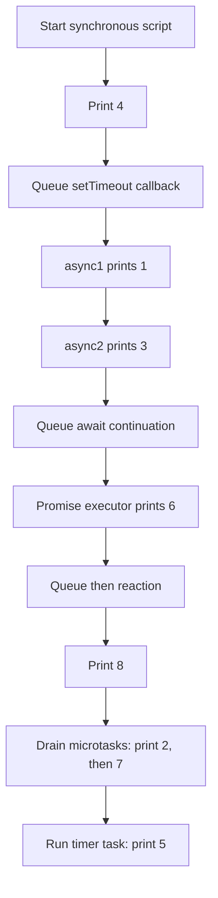

# 📝 [50. async await](https://bigfrontend.dev/quiz/async-await)

## 📌 Problem Overview

Determine the order in which the following values are printed. The quiz tests synchronous execution, `async`/`await`, promise reactions, and timers.

```javascript
async function async1(){
	console.log(1)
	await async2()
	console.log(2)
}

async function async2(){
	console.log(3)
}

console.log(4)

setTimeout(function(){
	console.log(5)
}, 0)

async1()

new Promise(function(resolve){
	console.log(6)
	resolve()
}).then(function(){
	console.log(7)
})

console.log(8)
```

---

## 🚀 Correct Answer
>
> [!TIP]
> **Output:**
>
> ```text
> 4
> 1
> 3
> 6
> 8
> 2
> 7
> 5
> ```

---

## 🔍 Detailed Explanation & Spec-Accurate Trace

The initial script runs synchronously on the current execution context. Promise reactions and the continuation after `await` run as microtasks, while the `setTimeout` callback runs later as a timer task. After the current call stack is empty, queued microtasks are processed before the timer task.

### ⚡ Key Spec Rules / Concepts

1. **`async` function calls**: Calling an `async` function starts its body synchronously until the first `await`. The function immediately returns a promise representing its eventual completion.
2. **`await` continuation**: `await async2()` evaluates `async2()` immediately. Once its result is handled, the remaining statements in `async1` are resumed through a promise reaction scheduled as a microtask.
3. **Promise executor**: The executor passed to `new Promise` runs synchronously during promise construction, so `console.log(6)` happens before the current script finishes.
4. **Promise reactions**: `.then(...)` registers a reaction. Because the promise is already fulfilled by the time `.then` is called, its callback is queued as a microtask rather than run synchronously.
5. **Microtask checkpoint**: Once the current synchronous job completes, microtasks are drained in FIFO order before the event loop proceeds to timer tasks.
6. **Timer task**: `setTimeout(..., 0)` requests a timer callback; zero delay does not make it synchronous or place it ahead of already-queued microtasks.

### Step-by-Step Execution

#### 1. `console.log(4)` -> `4`

- **Step A**: The top-level script is executing synchronously.
- **Step B**: The `console.log` call immediately writes `4`.
- **Output**: `4`

#### 2. `setTimeout(function(){ console.log(5) }, 0)` -> `timer task queued`

- **Step A**: The timer is registered with a delay of `0` milliseconds.
- **Step B**: Its callback cannot run until the current script and pending microtasks have completed.
- **Output**: No output yet.

#### 3. `async1()` -> `1`, then `3`

- **Step A**: `async1` starts synchronously and prints `1`.
- **Step B**: Evaluating `await async2()` calls `async2` immediately, so `async2` prints `3` and fulfills its promise.
- **Step C**: The remainder of `async1`, including `console.log(2)`, is scheduled as a microtask continuation.
- **Output**: `1`, then `3`

#### 4. `new Promise(function(resolve){ ... })` -> `6`

- **Step A**: The promise constructor invokes its executor synchronously.
- **Step B**: The executor prints `6` and calls `resolve()`, fulfilling the promise.
- **Output**: `6`

#### 5. `.then(function(){ console.log(7) })` -> `promise reaction queued`

- **Step A**: The promise is already fulfilled, so `.then` creates a promise reaction job.
- **Step B**: The callback is queued in the microtask queue; it does not execute during the current synchronous script.
- **Output**: No output yet.

#### 6. `console.log(8)` -> `8`

- **Step A**: The remaining top-level code is still synchronous.
- **Step B**: The `console.log` call writes `8` before either microtask runs.
- **Output**: `8`

#### 7. `async1` continuation -> `2`

- **Step A**: The current script has finished, so the microtask checkpoint begins.
- **Step B**: The continuation created by `await` was queued first and resumes `async1`.
- **Step C**: The resumed function prints `2` and fulfills the promise returned by `async1`.
- **Output**: `2`

#### 8. Promise reaction -> `7`

- **Step A**: The `.then` reaction is the next microtask in FIFO order.
- **Step B**: Its callback executes and prints `7`.
- **Output**: `7`

#### 9. Timer callback -> `5`

- **Step A**: The microtask queue is empty, so the host can process the timer task.
- **Step B**: The timer callback executes and prints `5`.
- **Output**: `5`

---

## 💡 Key Takeaway

* **Synchronous code runs first**: Regular statements, `async` function code before `await`, and promise executors run during the current script job.
* **`await` pauses only the async function**: It does not block the entire JavaScript thread; the continuation is resumed through a microtask.
* **Microtasks precede timer tasks**: Promise reactions and `await` continuations are drained before a `setTimeout` callback is processed.

---

## 🛠️ Recommendations & Best Practices

* **Make scheduling explicit**: Use `await` for dependent asynchronous work and avoid relying on timer delays to order promise callbacks.
* **Handle asynchronous failures**: Pair `await` with `try...catch` or handle the promise returned by the async function.
* **Keep synchronous promise executors small**: The executor runs immediately; start asynchronous work there only when that behavior is intentional.

```javascript
async function run() {
	try {
		await async1()
		console.log('async1 completed')
	} catch (error) {
		console.error('async1 failed', error)
	}
}
```

---

## 🧠 Revision Tips & Cheat Sheet

### Visual Coercion Path / Logical Flow



> [!WARNING]
> A zero-millisecond timer is a scheduling request, not an immediate callback. Exact host scheduling details can differ, but promise microtasks are processed before the event loop advances to the timer task.

---

## 🔗 Helpful Resources

- [ECMA-262 Specification - Jobs and Host Operations](https://tc39.es/ecma262/#sec-jobs)
- [ECMA-262 Specification - Await](https://tc39.es/ecma262/#await)
- [MDN Web Docs - async function](https://developer.mozilla.org/en-US/docs/Web/JavaScript/Reference/Statements/async_function)
- [MDN Web Docs - Microtask guide](https://developer.mozilla.org/en-US/docs/Web/API/HTML_DOM_API/Microtask_guide)
- [BFE.dev - Quiz 50](https://bigfrontend.dev/quiz/async-await)

---

## 🏷️ Tags

`#AsyncAwait` `#Promises` `#EventLoop` `#Microtasks` `#Macrotasks` `#SpecDeepDive`