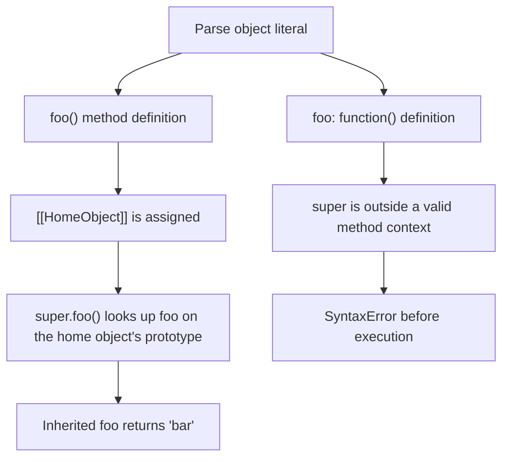

# 📝 [51. method](https://bigfrontend.dev/quiz/method)

## 📌 Problem Overview

This quiz tests the difference between an object method defined with method shorthand and a function expression assigned to an object property. Both functions appear callable, but only the method shorthand creates the internal `[[HomeObject]]` needed for `super` property access.

```javascript
// This is a JavaScript Quiz from BFE.dev


// This is a trick question

// case 1
const obj1 = {
	foo() {
		console.log(super.foo())
	}
}

Object.setPrototypeOf(obj1, {
	foo() {
		return 'bar'
	}
})

obj1.foo()

// case 2

const obj2 = {
	foo: function() {
		console.log(super.foo())
	}
}

Object.setPrototypeOf(obj2, {
	foo() {
		return 'bar'
	}
})

obj2.foo()

// Error
```

---

## 🚀 Correct Answer
>
> [!TIP]
> **Output:**
>
> ```text
> SyntaxError: 'super' keyword unexpected here
> ```

The error occurs while parsing the source, so the script produces no `bar` output. If case 1 is run by itself, it logs `bar`; however, case 2 is an early syntax error for the complete script.

---

## 🔍 Detailed Explanation & Spec-Accurate Trace

The key distinction is not whether `foo` is callable. It is how the function is defined. A method definition such as `foo() {}` is parsed as a method and receives a `[[HomeObject]]`. A function expression assigned through `foo: function() {}` is an ordinary function and has no `[[HomeObject]]`.

### ⚡ Key Spec Rules / Concepts

1. **Method Definitions and `[[HomeObject]]`**: An object method definition records the object containing the method as its `[[HomeObject]]`. This lets `super` determine where to begin prototype lookup.
2. **`super` Property Access**: `super.foo()` is evaluated by looking up `foo` on the prototype of the current function's `[[HomeObject]]`, then calling the resulting function with the current `this` value.
3. **Function Expressions Are Not Methods**: A function expression stored in an object property does not receive `[[HomeObject]]` merely because it is assigned to a property named `foo`.
4. **Early Errors Happen Before Execution**: `super` is only syntactically valid in permitted method, class, or derived-constructor contexts. The invalid function expression makes the entire script fail before any statement executes.
5. **Prototype Mutation**: `Object.setPrototypeOf(obj1, prototype)` changes `obj1`'s `[[Prototype]]`; it does not add a `prototype` property to the instance. The method's `super` lookup uses this new prototype.

### Step-by-Step Execution

#### 1. `const obj1 = { foo() { ... } }` -> valid method definition

- **Step A**: The object literal creates a method named `foo`.
- **Step B**: The method receives `[[HomeObject]]` set to the object literal.
- **Output**: No output yet.

#### 2. `Object.setPrototypeOf(obj1, { foo() { return 'bar' } })` -> prototype updated

- **Step A**: The new object becomes `obj1`'s `[[Prototype]]`.
- **Step B**: This gives the method's `super` lookup a prototype containing `foo`.
- **Output**: No output.

#### 3. `obj1.foo()` -> `bar` when case 1 is isolated

- **Step A**: Property lookup finds the method on `obj1`, and the call sets `this` to `obj1`.
- **Step B**: `super.foo` starts at `Object.getPrototypeOf([[HomeObject]])`, which is the object assigned as `obj1`'s prototype.
- **Step C**: The inherited `foo` method returns the string `'bar'`; `console.log` prints it.
- **Output**: `bar` when case 1 is parsed and executed without case 2.

#### 4. `const obj2 = { foo: function() { console.log(super.foo()) } }` -> `SyntaxError`

- **Step A**: The parser sees `super` inside an ordinary function expression.
- **Step B**: That function has no method definition context and no `[[HomeObject]]`; the source therefore violates the `super` early-error rules.
- **Output**: `SyntaxError: 'super' keyword unexpected here`.

#### 5. `obj2.foo()` -> not evaluated

- **Step A**: Parsing fails before the declaration of `obj2` can be evaluated.
- **Step B**: Consequently, `Object.setPrototypeOf(obj2, ...)` and `obj2.foo()` are never reached.
- **Output**: No `bar` output from the complete file.

---

## 💡 Key Takeaway

* **Method syntax matters**: `foo() {}` creates a method with the internal metadata required by `super`, while `foo: function() {}` creates an ordinary function.
* **Parsing precedes execution**: One invalid `super` usage prevents every statement in the script from running, including valid code that appears earlier.
* **`super` follows the home object's prototype**: It is not equivalent to `this.__proto__`; its base is derived from the method's `[[HomeObject]]`.

---

## 🛠️ Recommendations & Best Practices

* **Use method shorthand when inheritance is intended**: Define object methods with `foo() {}` when they need `super`.
* **Prefer explicit delegation for standalone functions**: Pass the parent behavior in explicitly or call a named helper when the function is not a method.
* **Avoid mutating prototypes after creation when possible**: Define the intended prototype during object construction with `Object.create` for clearer ownership.

```javascript
const parent = {
	foo() {
		return 'bar'
	}
}

const child = {
	foo() {
		return super.foo()
	}
}

Object.setPrototypeOf(child, parent)
console.log(child.foo()) // bar
```

---

## 🧠 Revision Tips & Cheat Sheet

### Visual Coercion Path / Logical Flow



> [!WARNING]
> `super` is not enabled by assigning a function to an object property. The function must be created in a syntactically valid method context.

---

## 🔗 Helpful Resources

- [ECMA-262 Specification - Method Definitions](https://tc39.es/ecma262/#sec-method-definitions)
- [ECMA-262 Specification - MakeMethod](https://tc39.es/ecma262/#sec-makemethod)
- [ECMA-262 Specification - Super Property Access](https://tc39.es/ecma262/#sec-super-keyword)
- [MDN Web Docs - super](https://developer.mozilla.org/en-US/docs/Web/JavaScript/Reference/Operators/super)
- [MDN Web Docs - Object.setPrototypeOf()](https://developer.mozilla.org/en-US/docs/Web/JavaScript/Reference/Global_Objects/Object/setPrototypeOf)
- [BFE.dev - Quiz 51](https://bigfrontend.dev/quiz/method)

---

## 🏷️ Tags

`#Methods` `#Super` `#PrototypeChain` `#SyntaxError` `#SpecDeepDive`