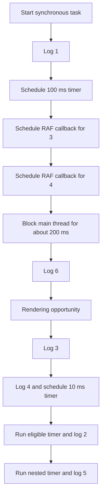

# 📝 [52. requestAnimationFrame](https://bigfrontend.dev/quiz/requestanimationframe)

## 📌 Problem Overview

This quiz tests how synchronous JavaScript, `requestAnimationFrame()`, and `setTimeout()` callbacks are scheduled by a browser event loop. The busy loop blocks the main thread for approximately 200 ms before the final synchronous log runs.

```javascript
console.log(1)

setTimeout(() => {
	console.log(2)
}, 100)

requestAnimationFrame(() => {
	console.log(3)
})

requestAnimationFrame(() => {
	console.log(4)
	setTimeout(() => {
		console.log(5)
	}, 10)
})

const end = Date.now() + 200;
while (Date.now() < end) {
}

console.log(6)
```

---

## 🚀 Correct Answer
>
> [!TIP]
> **Output:**
>
> ```text
> 1
> 6
> 3
> 4
> 2
> 5
> ```

---

## 🔍 Detailed Explanation & Spec-Accurate Trace

The JavaScript execution context runs the top-level statements synchronously. Browser APIs such as timers and `requestAnimationFrame()` schedule callbacks outside that synchronous run, and the browser later chooses when to dispatch them according to its event-loop and rendering algorithms.

### ⚡ Key Spec Rules / Concepts

1. **Synchronous run-to-completion**: JavaScript executes the current task until its call stack is empty. A callback cannot interrupt the busy loop, even when its timer has become eligible.
2. **`setTimeout()` timer task**: `setTimeout()` requests a timer task after its delay. The delay is a minimum threshold, not a guarantee that the callback runs at that exact time.
3. **`requestAnimationFrame()` rendering callback**: `requestAnimationFrame()` requests a callback before a future rendering update, typically before the next repaint when the document is eligible for rendering. It is not a standard ECMAScript job queue.
4. **Rendering and timer scheduling**: After the blocking task completes, the browser may perform a rendering opportunity and invoke queued animation-frame callbacks before later timer tasks. Exact ordering can vary with browser state, refresh rate, throttling, and timing.
5. **Nested timer scheduling**: The callback that logs `5` is not scheduled until the callback that logs `4` runs. Its 10 ms delay therefore starts after `4` has been logged.

### Step-by-Step Execution

#### 1. `console.log(1)` -> `1`

- **Step A**: The top-level script starts as a synchronous task.
- **Step B**: `console.log(1)` writes to the console immediately.
- **Output**: `1`

#### 2. `setTimeout(() => console.log(2), 100)` -> timer scheduled

- **Step A**: The browser registers a timer with a 100 ms minimum delay.
- **Step B**: Its callback is eligible for a future timer task; it does not run during the current synchronous task.
- **Output**: No immediate console output.

#### 3. `requestAnimationFrame(() => console.log(3))` -> animation callback scheduled

- **Step A**: The browser registers a callback for a future rendering opportunity.
- **Step B**: The callback waits until the current JavaScript task finishes and the browser reaches an eligible animation frame.
- **Output**: No immediate console output.

#### 4. `requestAnimationFrame(() => { console.log(4); ... })` -> animation callback scheduled

- **Step A**: A second animation-frame callback is registered.
- **Step B**: It is queued after the callback that logs `3`, so both callbacks are candidates for the same future rendering opportunity.
- **Output**: No immediate console output.

#### 5. `while (Date.now() < end) {}` -> approximately 200 ms of blocking

- **Step A**: `end` is calculated from the current time.
- **Step B**: The loop keeps the JavaScript thread busy until the deadline passes. No timer or animation callback can execute while this task is running.
- **Output**: No immediate console output.

#### 6. `console.log(6)` -> `6`

- **Step A**: The loop finishes and execution continues within the same synchronous task.
- **Step B**: `console.log(6)` runs before the browser can dispatch the pending callbacks.
- **Output**: `6`

#### 7. First animation callback -> `3`

- **Step A**: The current task has completed, so the browser can process a rendering opportunity.
- **Step B**: The first registered animation-frame callback logs `3`.
- **Output**: `3`

#### 8. Second animation callback -> `4`

- **Step A**: The second animation-frame callback runs in registration order for that rendering opportunity.
- **Step B**: It logs `4`, then registers a new timer with a 10 ms minimum delay.
- **Output**: `4`

#### 9. Original timer callback -> `2`

- **Step A**: The original 100 ms timer was already eligible while the main thread was blocked, but it could not run during the synchronous task.
- **Step B**: The browser dispatches its timer task after the rendering callbacks in this quiz's expected scheduling scenario.
- **Output**: `2`

#### 10. Nested timer callback -> `5`

- **Step A**: The 10 ms timer was created only after `4` ran.
- **Step B**: Once its minimum delay has elapsed, the browser dispatches its timer task and logs `5`.
- **Output**: `5`

---

## 💡 Key Takeaway

* **Synchronous code has priority while it is running**: A long-running task delays every callback, including timers whose delays have already elapsed.
* **`requestAnimationFrame()` is tied to rendering**: Its callbacks are intended to run before a repaint, whereas `setTimeout()` callbacks are timer tasks.
* **Timer delays are lower bounds**: `100` and `10` milliseconds describe when callbacks become eligible, not exact execution times.

---

## 🛠️ Recommendations & Best Practices

* **Keep the main thread non-blocking**: Avoid busy loops so input, rendering, timers, and animation callbacks remain responsive.
* **Use the API that matches the work**: Use `requestAnimationFrame()` for visual updates and timers for delayed non-rendering work.
* **Treat callback order as scheduling-dependent**: Do not rely on a timer and an animation callback having a fixed relative order across all browsers and runtime conditions.

```javascript
function animate(timestamp) {
	updateVisualState(timestamp)
	requestAnimationFrame(animate)
}

requestAnimationFrame(animate)

setTimeout(() => {
	runDelayedTask()
}, 100)
```

---

## 🧠 Revision Tips & Cheat Sheet

### Visual Coercion Path / Logical Flow



> [!WARNING]
> The output shown is the quiz's expected browser scheduling scenario. Rendering opportunities, throttling, refresh rate, and timer implementation details can affect the exact relative order in a real browser.

---

## 🔗 Helpful Resources

- [HTML Standard - Event Loops](https://html.spec.whatwg.org/multipage/webappapis.html#event-loops)
- [HTML Standard - Animation Frames](https://html.spec.whatwg.org/multipage/imagebitmap-and-animations.html#animation-frames)
- [MDN - `requestAnimationFrame()`](https://developer.mozilla.org/en-US/docs/Web/API/Window/requestAnimationFrame)
- [MDN - `setTimeout()`](https://developer.mozilla.org/en-US/docs/Web/API/Window/setTimeout)
- [BFE.dev - Quiz 52](https://bigfrontend.dev/quiz/requestanimationframe)
- [Jake Archibald - In The Loop](https://www.youtube.com/watch?v=cCOL7MC4Pl0)

---

## 🏷️ Tags

`#EventLoop` `#RequestAnimationFrame` `#SetTimeout` `#BrowserScheduling` `#JavaScriptRuntime`