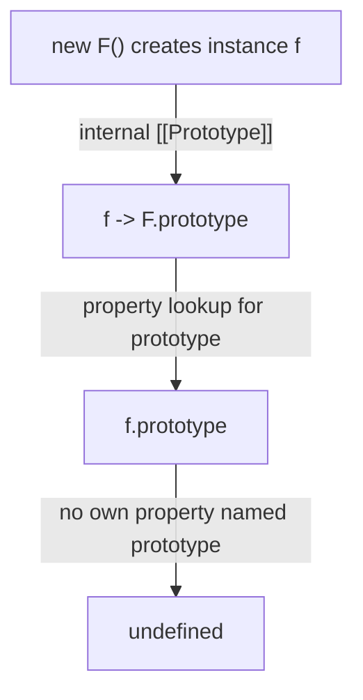

# 📝 [53. Prototype 2](https://bigfrontend.dev/quiz/prototype2)

## 📌 Problem Overview

This quiz tests a very common JavaScript misconception: whether an instance created with `new` has a `.prototype` property like its constructor function does.

```javascript
function F() {
  this.foo = 'bar'
}

const f = new F()
console.log(f.prototype)
```

---

## 🚀 Correct Answer
>
> [!TIP]
> **Output:**
>
> ```text
> undefined
> ```

---

## 🔍 Detailed Explanation & Spec-Accurate Trace

The key idea is that `prototype` is a property of constructor functions, not of ordinary object instances created by those constructors. In JavaScript, an instance like `f` has an internal `[[Prototype]]` link to `F.prototype`, but it does not expose a direct `.prototype` property.

### ⚡ Key Spec Rules / Concepts

1. **Rule 1 (Constructor function prototype property)**: Functions created by function declarations, class declarations, and constructors have a `prototype` property as part of their object model. This property is used when the function is called with `new`.
2. **Rule 2 (Instance prototype lookup)**: An object instance created via `new F()` gets an internal `[[Prototype]]` reference to `F.prototype`. The instance itself does not receive its own `.prototype` property unless one is explicitly assigned.

---

### Step-by-Step Execution

#### 1. `f.prototype` -> `undefined`

- **Step A**: The engine evaluates the property access `f.prototype` as a normal property lookup on the object `f`.
- **Step B**: `f` is an ordinary object instance created by `new F()`. It has an own property `foo`, but no own property named `prototype`.
- **Step C**: The engine checks the prototype chain, but the chain does not magically include a `prototype` property on the instance; instead, the instance points to `F.prototype` via its internal `[[Prototype]]` slot.
- **Output**: `undefined`

---

## 💡 Key Takeaway

* **Constructor functions have a `prototype` property**: `F.prototype` exists and is used by the `new` operator to set up the instance’s prototype chain.
* **Instances do not automatically have a `prototype` property**: `f.prototype` resolves to `undefined` because the instance object itself is not the constructor function.

---

## 🛠️ Recommendations & Best Practices

* **Use `F.prototype` when working with the constructor’s prototype**: If you want to inspect or define methods shared across instances, access the constructor function’s prototype.
* **Avoid assuming instances expose `.prototype`**: Use `Object.getPrototypeOf(f)` or `f.__proto__` only when you intentionally need the instance’s prototype reference.

```javascript
function F() {
  this.foo = 'bar'
}

const f = new F()

console.log(F.prototype)           // { constructor: F, ... }
console.log(Object.getPrototypeOf(f) === F.prototype) // true
console.log(f.prototype)           // undefined
```

---

## 🧠 Revision Tips & Cheat Sheet

### Visual Coercion Path / Logical Flow



---

## 🔗 Helpful Resources

- [ECMA-262 Specification - Function Objects](https://tc39.es/ecma262/#sec-function-instances)
- [MDN Web Docs - Prototype](https://developer.mozilla.org/en-US/docs/Learn/JavaScript/Objects/Object_prototypes)
- [BFE.dev - Quiz 53](https://bigfrontend.dev/quiz/prototype2)

---

## 🏷️ Tags

`#JavaScript` `#Prototype` `#Constructor` `#newOperator` `#SpecDeepDive`