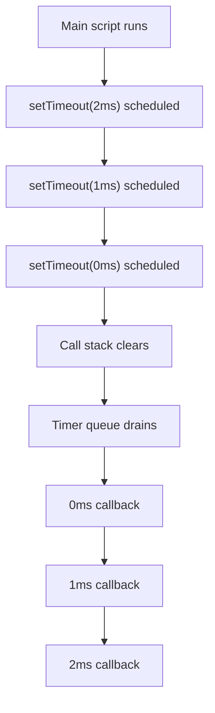

# 📝 [54. setTimeout(0ms)](https://bigfrontend.dev/quiz/setTimeout-0ms)

## 📌 Problem Overview

This quiz tests how JavaScript schedules timer callbacks in the event loop. Even when the delays are `2`, `1`, and `0` milliseconds, their order of execution is not simply the same as the delay values because the timers are added to the task queue based on when they become eligible and when the main thread is free.

```javascript
setTimeout(() => {
    console.log(2)
}, 2)

setTimeout(() => {
    console.log(1)
}, 1)

setTimeout(() => {
    console.log(0)
}, 0)
```

---

## 🚀 Correct Answer
>
> [!TIP]
> **Output:**
>
> ```text
> 0
> 1
> 2
> ```

---

## 🔍 Detailed Explanation & Spec-Accurate Trace

The core behavior here is the JavaScript event loop and timer task scheduling. A `setTimeout` callback is not executed immediately when you call it; instead, the browser or runtime schedules it to run at a later time, after the specified delay has elapsed and the main call stack is empty.

### ⚡ Key Spec Rules / Concepts

1. **Rule 1 (Timer scheduling)**: `setTimeout(fn, delay)` queues a task to be executed after at least the provided delay has elapsed. The actual callback may run later due to event-loop scheduling and host environment constraints.
2. **Rule 2 (Event loop ordering)**: Once multiple timers are ready, they are processed from the task queue in the order they became eligible to run, and each callback executes only when the JS call stack is empty.

---

### Step-by-Step Execution

#### 1. `setTimeout(() => console.log(2), 2)` -> schedules timer

- **Step A**: The first timer is registered with a delay of `2` ms.
- **Step B**: The runtime starts a timer and will enqueue the callback when the delay expires.
- **Output**: No immediate console output yet.

#### 2. `setTimeout(() => console.log(1), 1)` -> schedules timer

- **Step A**: The second timer is registered with a delay of `1` ms.
- **Step B**: This timer becomes eligible sooner than the `2` ms timer, but it still must wait for the event loop to pick it up.
- **Output**: No immediate console output yet.

#### 3. `setTimeout(() => console.log(0), 0)` -> schedules timer

- **Step A**: The third timer is registered with a delay of `0` ms.
- **Step B**: The callback is still queued asynchronously; the environment does not run it synchronously on the current stack.
- **Output**: No immediate console output yet.

#### 4. Timer callbacks execute -> `0`, then `1`, then `2`

- **Step A**: The main script finishes synchronously and the call stack becomes empty.
- **Step B**: The event loop looks at the task queue and picks the earliest ready callbacks, which in practice results in the `0` ms timeout firing before the `1` ms timeout, and the `1` ms before the `2` ms timeout.
- **Output**: `0`, then `1`, then `2`

---

## 💡 Key Takeaway

* **Delay is a minimum, not a strict ordering guarantee**: `setTimeout` with `0` ms does not run “immediately” during the current synchronous execution.
* **The event loop decides execution order**: Browsers and runtimes schedule timer tasks asynchronously; the final order depends on when each timer becomes eligible and when the event loop drains the queue.

---

## 🛠️ Recommendations & Best Practices

* **Do not assume delay values map directly to execution order**: If ordering matters, chain callbacks, use `await`/`Promise`, or schedule explicit steps in sequence.
* **Use timers for asynchronous work only**: Keep the main thread free and avoid blocking operations inside timer callbacks.

```javascript
function runInOrder() {
  setTimeout(() => console.log(0), 0)
  setTimeout(() => console.log(1), 0)
  setTimeout(() => console.log(2), 0)
}

// Execution order is still determined by the event loop and runtime scheduling
```

---

## 🧠 Revision Tips & Cheat Sheet

### Visual Coercion Path / Logical Flow



---

## 🔗 Helpful Resources

- [ECMA-262 Specification - Timers and Scheduling](https://tc39.es/ecma262/#sec-timer-initialization)
- [MDN Web Docs - setTimeout](https://developer.mozilla.org/en-US/docs/Web/API/setTimeout)
- [BFE.dev - Quiz 54](https://bigfrontend.dev/quiz/setTimeout-0ms)

---

## 🏷️ Tags

`#JavaScript` `#EventLoop` `#setTimeout` `#AsyncProgramming` `#SpecDeepDive`