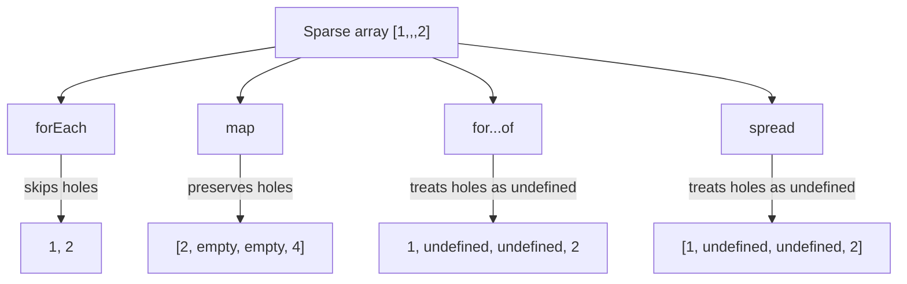

# 📝 [55. sparse array](https://bigfrontend.dev/quiz/sparse-array)

## 📌 Problem Overview

This quiz explores how sparse arrays behave across different iteration and transformation APIs. A sparse array contains holes, which are indices that exist in the array’s length but do not have a value assigned.

```javascript
const arr = [1,,,2]

// forEach
arr.forEach(i => console.log(i))

// map
console.log(arr.map(i => i * 2))

// for ... of
for (const i of arr) {
  console.log(i)
}

// spread
console.log([...arr])
```

---

## 🚀 Correct Answer
>
> [!TIP]
> **Output:**
>
> ```text
> 1
> 2
> [2, empty, empty, 4]
> 1
> undefined
> undefined
> 2
> [1, undefined, undefined, 2]
> ```

---

## 🔍 Detailed Explanation & Spec-Accurate Trace

A sparse array is not the same as an array filled with `undefined`. The holes are missing elements, and built-in APIs differ in how they treat them.

### ⚡ Key Spec Rules / Concepts

1. **Rule 1 (Sparse array iteration)**: `forEach` skips missing elements, so holes are not visited at all. This is because the callback is invoked only for actual indexed elements that exist.
2. **Rule 2 (Map preserves holes)**: `map` invokes its callback only for present indexes, but the resulting array keeps the same length and preserves holes as empty slots rather than filling them with `undefined`.
3. **Rule 3 (for...of and spread normalize holes)**: `for...of` and array spread treat holes as `undefined` when iterating values, which is why the missing positions show up as `undefined`.

---

### Step-by-Step Execution

#### 1. `arr.forEach(i => console.log(i))` -> logs `1`, then `2`

- **Step A**: `forEach` visits only the present indexed entries in the sparse array.
- **Step B**: The holes between `1` and `2` are not iterated.
- **Output**: `1`, then `2`

#### 2. `arr.map(i => i * 2)` -> `[2, empty, empty, 4]`

- **Step A**: `map` calls the callback only for existing indexes, which are `0` and `3`.
- **Step B**: The result array keeps the same length and leaves holes in the skipped positions.
- **Output**: `[2, empty, empty, 4]`

#### 3. `for (const i of arr) { console.log(i) }` -> logs `1`, `undefined`, `undefined`, `2`

- **Step A**: The iterator for arrays visits each indexed value in order.
- **Step B**: Missing entries are treated as `undefined` during iteration.
- **Output**: `1`, `undefined`, `undefined`, `2`

#### 4. `[...arr]` -> `[1, undefined, undefined, 2]`

- **Step A**: The spread operator copies the array into a new array using iteration semantics.
- **Step B**: Missing entries are converted to `undefined` in the resulting array.
- **Output**: `[1, undefined, undefined, 2]`

---

## 💡 Key Takeaway

* **Sparse arrays are holes, not undefined values**: APIs like `forEach` and `map` treat holes differently from actual `undefined` entries.
* **Iteration semantics matter**: `for...of` and spread convert holes into `undefined`, while `map` preserves structure with empty slots and `forEach` skips them.

---

## 🛠️ Recommendations & Best Practices

* **Normalize sparse arrays before processing**: Use `filter(Boolean)` or explicit mapping if you want to ignore holes consistently.
* **Be careful with array methods that preserve holes vs. iterate values**: Choose the API that matches the behavior you need.

```javascript
const arr = [1,,,2]

const normalized = Array.from(arr, x => x ?? 'missing')
console.log(normalized) // [1, 'missing', 'missing', 2]
```

---

## 🧠 Revision Tips & Cheat Sheet

### Visual Coercion Path / Logical Flow



---

## 🔗 Helpful Resources

- [ECMA-262 Specification - Array Iterator Operations](https://tc39.es/ecma262/#sec-array-iterator-objects)
- [MDN Web Docs - Array.prototype.forEach](https://developer.mozilla.org/en-US/docs/Web/JavaScript/Reference/Global_Objects/Array/forEach)
- [MDN Web Docs - Array.prototype.map](https://developer.mozilla.org/en-US/docs/Web/JavaScript/Reference/Global_Objects/Array/map)
- [BFE.dev - Quiz 55](https://bigfrontend.dev/quiz/sparse-array)

---

## 🏷️ Tags

`#JavaScript` `#SparseArray` `#ArrayIteration` `#forEach` `#SpecDeepDive`

