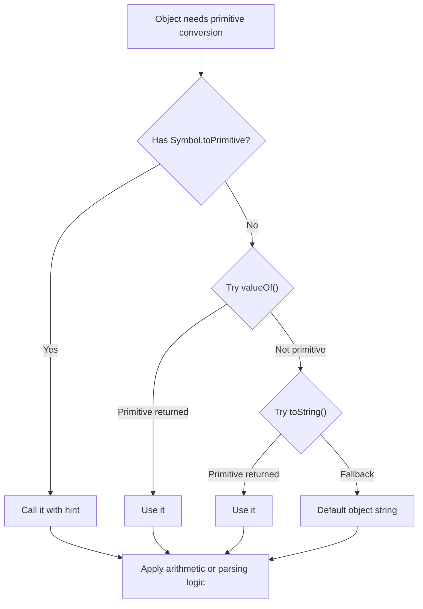

# 📝 [56. to primitive](https://bigfrontend.dev/quiz/primitive)

## 📌 Problem Overview

This quiz tests JavaScript's object-to-primitive conversion rules. The engine uses a strict priority order when coercing objects in arithmetic and parsing operations: `Symbol.toPrimitive` first, then `valueOf()`, then `toString()`, depending on the conversion hint.

```javascript
// case 1
const obj1 = {
  valueOf() {
    return 1
  },
  toString() {
    return '100'
  }
}

console.log(obj1 + 1)
console.log(parseInt(obj1))

// case 2
const obj2 = {
  [Symbol.toPrimitive]() {
    return 200
  },

  valueOf() {
    return 1
  },
  toString() {
    return '100'
  }
}

console.log(obj2 + 1)
console.log(parseInt(obj2))

// case 3
const obj3 = {
  toString() {
    return '100'
  }
}

console.log(+obj3)
console.log(obj3 + 1)
console.log(parseInt(obj3))

// case 4
const obj4 = {
  valueOf() {
    return 1
  }
}

console.log(obj4 + 1)
console.log(parseInt(obj4))

// case 5
const obj5 = {
  [Symbol.toPrimitive](hint) {
    return hint === 'string' ? '100' : 1
  },
}

console.log(obj5 + 1)
console.log(parseInt(obj5))
```

---

## 🚀 Correct Answer
>
> [!TIP]
> **Output:**
>
> ```text
> 2
> 100
> 201
> 200
> 100
> "1001"
> 100
> 2
> NaN
> 2
> 100
> ```

---

## 🔍 Detailed Explanation & Spec-Accurate Trace

JavaScript follows the ToPrimitive abstract operation when a value needs to be converted to a primitive. The algorithm checks whether an object defines `Symbol.toPrimitive`; if not, it tries `valueOf()` and then `toString()` depending on the hint: number or string.

### ⚡ Key Spec Rules / Concepts

1. **Rule 1 (ToPrimitive precedence)**: `Symbol.toPrimitive` has the highest precedence and is called before `valueOf()` and `toString()`.
2. **Rule 2 (Hint-dependent conversion)**: For arithmetic operations like `+`, the hint is usually `default` or `number`; for `parseInt`, the engine effectively uses a string conversion path.
3. **Rule 3 (Fallback behavior)**: If `valueOf()` returns a non-primitive, JavaScript keeps checking the next conversion method until it reaches a primitive value.

---

### Step-by-Step Execution

#### 1. `obj1 + 1` -> `2`

- **Step A**: `obj1` is coerced to a primitive because of the `+` operator.
- **Step B**: `obj1` has no `Symbol.toPrimitive`, so it tries `valueOf()`, which returns `1`.
- **Step C**: `1 + 1` evaluates to `2`.
- **Output**: `2`

#### 2. `parseInt(obj1)` -> `100`

- **Step A**: `parseInt` first converts its argument to a string.
- **Step B**: `obj1.toString()` returns `'100'`.
- **Step C**: `parseInt('100')` becomes `100`.
- **Output**: `100`

#### 3. `obj2 + 1` -> `201`

- **Step A**: `obj2` defines `Symbol.toPrimitive`, which takes priority.
- **Step B**: The method returns `200`.
- **Step C**: `200 + 1` becomes `201`.
- **Output**: `201`

#### 4. `parseInt(obj2)` -> `200`

- **Step A**: `parseInt` uses the string conversion path.
- **Step B**: `Symbol.toPrimitive` is still used first, returning `200`.
- **Step C**: `parseInt(200)` is effectively `200`.
- **Output**: `200`

#### 5. `+obj3` -> `100`

- **Step A**: Unary `+` requires a number conversion.
- **Step B**: `obj3` has no `Symbol.toPrimitive` and no `valueOf` override.
- **Step C**: It falls back to `toString()`, returning `'100'`.
- **Step D**: `Number('100')` is `100`.
- **Output**: `100`

#### 6. `obj3 + 1` -> `"1001"`

- **Step A**: Addition uses string concatenation because one operand is a string-like primitive.
- **Step B**: `obj3` is converted to `'100'` through `toString()`.
- **Step C**: `'100' + 1` yields `'1001'`.
- **Output**: `"1001"`

#### 7. `parseInt(obj3)` -> `100`

- **Step A**: `parseInt` converts the object to a string.
- **Step B**: `toString()` gives `'100'`.
- **Step C**: Parsing yields `100`.
- **Output**: `100`

#### 8. `obj4 + 1` -> `2`

- **Step A**: No `Symbol.toPrimitive` exists.
- **Step B**: `valueOf()` returns `1`.
- **Step C**: `1 + 1` gives `2`.
- **Output**: `2`

#### 9. `parseInt(obj4)` -> `NaN`

- **Step A**: `parseInt` attempts string conversion.
- **Step B**: `obj4` has no `toString()` method, so JavaScript falls back to the default object string `"[object Object]"`.
- **Step C**: `parseInt('[object Object]')` is `NaN`.
- **Output**: `NaN`

#### 10. `obj5 + 1` -> `2`

- **Step A**: `Symbol.toPrimitive` is called with the hint `'default'` (or `'number'` for arithmetic).
- **Step B**: The method returns `1`.
- **Step C**: `1 + 1` gives `2`.
- **Output**: `2`

#### 11. `parseInt(obj5)` -> `100`

- **Step A**: `parseInt` needs a string-ish value.
- **Step B**: `Symbol.toPrimitive` is called with the hint `'string'`.
- **Step C**: The method returns `'100'`.
- **Step D**: `parseInt('100')` is `100`.
- **Output**: `100`

---

## 💡 Key Takeaway

* **`Symbol.toPrimitive` wins first**: It gives the object complete control over conversion behavior.
* **`valueOf()` and `toString()` are fallback paths**: Their order depends on the coercion context and the hint the engine provides.
* **Primitive conversion is context-sensitive**: The same object can behave differently under `+`, unary `+`, and `parseInt`.

---

## 🛠️ Recommendations & Best Practices

* **Prefer `Symbol.toPrimitive` for custom coercion**: It is the clearest and most explicit conversion hook.
* **Avoid relying on implicit coercion**: Use `Number(...)`, `String(...)`, or explicit equality checks to make intent obvious.

```javascript
const money = {
  amount: 10,
  [Symbol.toPrimitive](hint) {
    return hint === 'string' ? `$${this.amount}` : this.amount
  }
}

console.log(money + 5) // 15
console.log(String(money)) // "$10"
```

---

## 🧠 Revision Tips & Cheat Sheet

### Visual Coercion Path / Logical Flow



---

## 🔗 Helpful Resources

- [ECMA-262 Specification - ToPrimitive](https://tc39.es/ecma262/#sec-toprimitive)
- [MDN Web Docs - Symbol.toPrimitive](https://developer.mozilla.org/en-US/docs/Web/JavaScript/Reference/Global_Objects/Symbol/toPrimitive)
- [MDN Web Docs - Object.prototype.valueOf](https://developer.mozilla.org/en-US/docs/Web/JavaScript/Reference/Global_Objects/Object/valueOf)
- [BFE.dev - Quiz 56](https://bigfrontend.dev/quiz/primitive)

---

## 🏷️ Tags

`#JavaScript` `#ToPrimitive` `#Coercion` `#Symbol` `#SpecDeepDive`