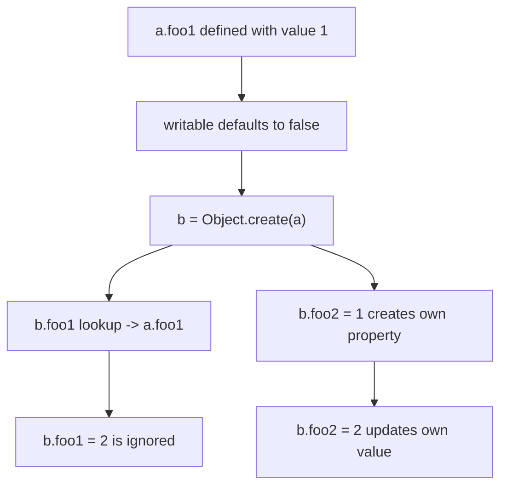

# 📝 [57. non-writable](https://bigfrontend.dev/quiz/inherit-writable-flag)

## 📌 Problem Overview

This quiz tests how property descriptors behave when a property is defined on a prototype and then inherited by a child object. In particular, it examines the effect of the `writable` attribute and how assignment behaves on inherited properties.

```javascript
const a = {}
Object.defineProperty(a, 'foo1', {
 value: 1
})
const b = Object.create(a)
b.foo2 = 1

console.log(b.foo1)
console.log(b.foo2)

b.foo1 = 2
b.foo2 = 2

console.log(b.foo1)
console.log(b.foo2)
```

---

## 🚀 Correct Answer
>
> [!TIP]
> **Output:**
>
> ```text
> 1
> 1
> 1
> 2
> ```

---

## 🔍 Detailed Explanation & Spec-Accurate Trace

`Object.defineProperty` creates a property with an explicit descriptor. When `writable` is omitted, it defaults to `false`. That means `foo1` on `a` is non-writable, so later assignment through `b.foo1 = 2` does not change the inherited value.

### ⚡ Key Spec Rules / Concepts

1. **Rule 1 (Descriptor defaults)**: If `writable` is not specified in `Object.defineProperty`, it defaults to `false`.
2. **Rule 2 (Prototype property lookup and assignment semantics)**: When an assignment targets an inherited property, the engine checks whether the property is writable on the prototype. If it is not writable, the assignment is ignored in non-strict mode and throws in strict mode.
3. **Rule 3 (Own properties vs inherited properties)**: `b.foo2 = 1` creates an own property on `b`, so later writes to `b.foo2` work normally.

---

### Step-by-Step Execution

#### 1. `Object.defineProperty(a, 'foo1', { value: 1 })` -> defines non-writable inherited property

- **Step A**: `a.foo1` is created as a data property with value `1`.
- **Step B**: Because `writable` is omitted, it defaults to `false`.
- **Step C**: `a.foo1` can be read but cannot be reassigned directly.
- **Output**: `a.foo1` remains `1`

#### 2. `const b = Object.create(a)` -> creates prototype chain

- **Step A**: `b` inherits from `a`.
- **Step B**: Property lookup for `b.foo1` resolves to `a.foo1`.
- **Output**: `b.foo1` reads as `1`

#### 3. `b.foo2 = 1` -> creates own property on `b`

- **Step A**: `b` does not have an own `foo2` yet.
- **Step B**: Assignment creates `b.foo2 = 1` as a new own property.
- **Output**: `b.foo2` becomes `1`

#### 4. `console.log(b.foo1)` -> `1`

- **Step A**: The engine checks `b` for an own `foo1`.
- **Step B**: None exists, so it looks up the prototype chain and finds `a.foo1`.
- **Step C**: The inherited value is `1`.
- **Output**: `1`

#### 5. `console.log(b.foo2)` -> `1`

- **Step A**: `b` has its own `foo2` property.
- **Step B**: The lookup resolves immediately to that own property.
- **Output**: `1`

#### 6. `b.foo1 = 2` -> failed assignment due to non-writable inherited property

- **Step A**: The engine sees that `b` does not own `foo1`.
- **Step B**: It checks the prototype chain and finds `a.foo1`.
- **Step C**: `a.foo1` is non-writable, so the assignment is ignored in non-strict mode.
- **Output**: `a.foo1` remains `1`

#### 7. `b.foo2 = 2` -> successful assignment to own property

- **Step A**: `b.foo2` is an own writable property.
- **Step B**: Assignment updates the value to `2`.
- **Output**: `b.foo2` becomes `2`

#### 8. Final outputs -> `1`, `2`

- **Step A**: `b.foo1` still resolves to inherited `a.foo1` value `1`.
- **Step B**: `b.foo2` resolves to own value `2`.
- **Output**: `1`, then `2`

---

## 💡 Key Takeaway

* **Non-writable inherited properties cannot be reassigned through the prototype chain**: `b.foo1 = 2` does not overwrite `a.foo1`.
* **Own properties behave independently**: `b.foo2` is created on `b`, so assigning to it updates the instance value without affecting the prototype.

---

## 🛠️ Recommendations & Best Practices

* **Use explicit property descriptors for protected prototype state**: This is useful for immutable defaults and configuration objects.
* **Be aware of prototype mutation behavior**: Inherited non-writable properties prevent accidental mutation through child instances.

```javascript
const config = {}
Object.defineProperty(config, 'mode', {
 value: 'prod',
 writable: false
})

const child = Object.create(config)
child.mode = 'dev' // ignored in non-strict mode
console.log(child.mode) // 'prod'
```

---

## 🧠 Revision Tips & Cheat Sheet

### Visual Coercion Path / Logical Flow



---

## 🔗 Helpful Resources

- [ECMA-262 Specification - Property Descriptors](https://tc39.es/ecma262/#sec-property-descriptor-specification-type)
- [MDN Web Docs - Object.defineProperty](https://developer.mozilla.org/en-US/docs/Web/JavaScript/Reference/Global_Objects/Object/defineProperty)
- [MDN Web Docs - Object.create](https://developer.mozilla.org/en-US/docs/Web/JavaScript/Reference/Global_Objects/Object/create)
- [BFE.dev - Quiz 57](https://bigfrontend.dev/quiz/inherit-writable-flag)

---

## 🏷️ Tags

`#JavaScript` `#PropertyDescriptors` `#Prototype` `#writable` `#SpecDeepDive`
