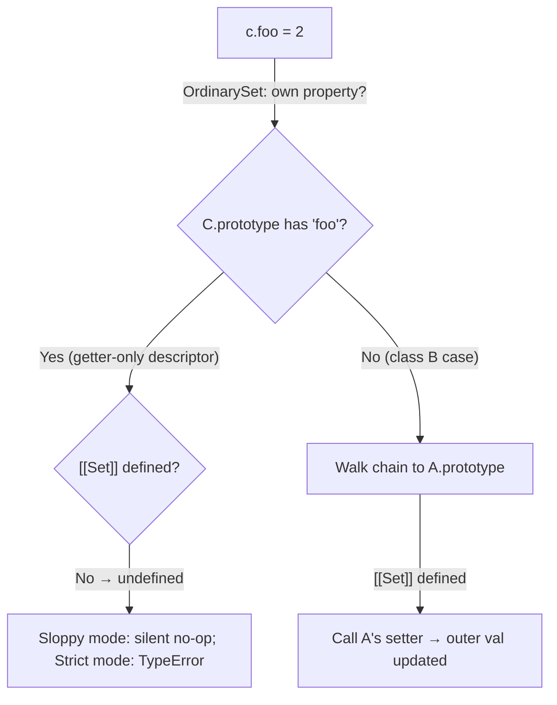

# 📝 [58. inherit getter setter](https://bigfrontend.dev/quiz/inherit-getter-setter)

## 📌 Problem Overview

This quiz tests how accessor properties (getters/setters) behave across an inheritance chain — specifically what happens when a subclass overrides **only the getter** of an accessor property that is defined as a getter/setter pair on the superclass.

```javascript
let val = 0

class A {
  set foo(_val) {
    val = _val
  }
  get foo() {
    return val
  }
}

class B extends A { }

class C extends A {
  get foo() {
    return val
  }
}

const b = new B()
console.log(b.foo)
b.foo = 1
console.log(b.foo)

const c = new C()
console.log(c.foo)
c.foo = 2
console.log(c.foo)
console.log(b.foo)
```

---

## 🚀 Correct Answer
>
> [!TIP]
> **Output:**
>
> ```text
> 0
> 1
> 1
> 1
> 1
> ```

---

## 🔍 Detailed Explanation & Spec-Accurate Trace

The core concept here is how the ECMAScript spec handles **accessor property inheritance and overriding in class semantics**. When a subclass redefines only the `get` half of an accessor, it completely shadows the **entire accessor property** from the parent — the parent's `set` half is *not* merged in. Also note the setter/getter body assigns to the outer-scope variable `val` (not `this.val`), so all instances share one global value.

### ⚡ Key Spec Rules / Concepts

1. **Rule 1 (Accessor Property as a Unit)**: Per ECMA-262, an accessor property is a *single* property whose descriptor holds both `[[Get]]` and `[[Set]]`. When `class C` declares `get foo()`, a **new** property descriptor is created on `C.prototype` with `[[Get]]` = the new function and `[[Set]]` = **undefined**. It fully replaces — not merges with — `A.prototype`'s descriptor during prototype chain lookup.
2. **Rule 2 (OrdinarySetWithOwnDescriptor — assignment to a setter-less accessor is a no-op)**: When evaluating `c.foo = 2`, the spec walks the prototype chain via `OrdinarySet`. It finds the accessor on `C.prototype`, sees `[[Set]]` is `undefined`, and the assignment silently does nothing (in sloppy mode; it would throw a `TypeError` in strict mode).
3. **Rule 3 (Prototype Chain Lookup for [[Get]])**: Property reads walk the chain: `instance → B.prototype → A.prototype → Object.prototype`. `B` defines nothing, so `b.foo` uses `A`'s getter/setter pair intact.
4. **Rule 4 (Closure over outer `val`)**: All accessors close over the module-scope `let val`, so every read/write via `A`-derived accessors mutates/reads the *same* shared variable — instances hold no own state.

---

### Step-by-Step Execution

#### 1. `const b = new B(); console.log(b.foo)` -> `0`

- **Step A**: `B.prototype` has no own `foo` property, so `[[Get]]` lookup walks up to `A.prototype` and finds the accessor with both getter and setter.
- **Step B**: `A`'s getter executes with `this = b`, returning the outer `val`, which is currently `0`.
- **Output**: `0`

#### 2. `b.foo = 1` -> (assignment)

- **Step A**: `OrdinarySet` on `b` finds no own property, walks to `A.prototype`, finds the accessor descriptor whose `[[Set]]` **is defined**.
- **Step B**: `A`'s setter runs with `this = b`, executing `val = 1`. This assigns to the outer-scope `val` (because the setter body references `val`, not `this.foo`), mutating the shared closure variable.
- **Output**: `val` is now `1`

#### 3. `console.log(b.foo)` -> `1`

- **Step A**: Same lookup path as step 1 — `A.prototype`'s getter.
- **Step B**: Reads outer `val`, now `1`.
- **Output**: `1`

#### 4. `const c = new C(); console.log(c.foo)` -> `1`

- **Step A**: `C.prototype` **does** have its own `foo` accessor (getter only), which shadows `A`'s descriptor entirely.
- **Step B**: `C`'s getter runs, returning the outer `val` — still `1` from step 2.
- **Output**: `1`

#### 5. `c.foo = 2` -> (assignment — silently ignored)

- **Step A**: `OrdinarySet` finds the accessor on `C.prototype` first (shorter chain than `A.prototype`), so lookup stops there.
- **Step B**: That descriptor's `[[Set]]` is `undefined` — because declaring only `get foo()` creates a descriptor with **no setter**. The spec therefore *fails the assignment silently* (sloppy mode). `A`'s setter is never reached — the descriptor is shadowed, not merged.
- **Output**: `val` remains `1`

#### 6. `console.log(c.foo)` -> `1`

- **Step A**: `C`'s getter reads outer `val`, which step 5 never changed.
- **Output**: `1`

#### 7. `console.log(b.foo)` -> `1`

- **Step A**: `b` uses `A`'s untouched getter.
- **Step B**: Outer `val` is still `1`.
- **Output**: `1`

---

## 💡 Key Takeaway

* **Getters and setters are one property, not two**: Overriding only `get foo()` in a subclass creates a brand-new descriptor that *erases* the parent's setter — JavaScript never merges accessor halves across a prototype chain.
* **Setter-less accessor assignment fails silently in sloppy mode**: `c.foo = 2` neither throws nor assigns; in `'use strict'` mode it throws `TypeError: Cannot set property foo of #<C> which has only a getter`.

---

## 🛠️ Recommendations & Best Practices

* **Always override accessors as a pair**: If a subclass overrides a getter but needs mutation, explicitly re-declare (or delegate to) the setter too.
* **Prefer strict mode** (`'use strict'` or ES modules, which are strict by default): Silent no-op assignments like `c.foo = 2` become loud `TypeError`s, surfacing the bug immediately.
* **Use explicit descriptors when composing accessors**: `Object.getOwnPropertyDescriptor` lets you safely reuse the parent's setter while swapping the getter.

```javascript
class C extends A {
  get foo() {
    return val
  }
  // explicitly re-declare the setter — or delegate to the parent's:
  set foo(v) {
    super.foo = v       // invokes A's setter
  }
}

// Or, fully descriptor-driven approach:
Object.defineProperty(C.prototype, 'foo', {
  get() { return val },
  set: Object.getOwnPropertyDescriptor(A.prototype, 'foo').set
})

const c = new C()
c.foo = 2   // ✅ now works, val becomes 2
```

---

## 🧠 Revision Tips & Cheat Sheet

### Visual Coercion Path / Logical Flow

Property lookup & assignment decision flow for `c.foo = 2`:



> [!WARNING]
> Remember: prototype lookup **stops at the first match**. `C.prototype.foo` (getter-only) prevents `A.prototype.foo`'s setter from ever being seen.

---

## 🔗 Helpful Resources

- [ECMA-262 Specification — OrdinarySet / OrdinarySetWithOwnDescriptor](https://tc39.es/ecma262/#sec-ordinarysetwithownproperty)
- [MDN Web Docs — getter](https://developer.mozilla.org/en-US/docs/Web/JavaScript/Reference/Functions/get)
- [MDN Web Docs — setter](https://developer.mozilla.org/en-US/docs/Web/JavaScript/Reference/Functions/set)
- [BFE.dev - Quiz 58](https://bigfrontend.dev/quiz/inherit-getter-setter)

---

## 🏷️ Tags

`#AccessorProperties` `#PrototypeChain` `#ClassInheritance` `#GetterSetter` `#SpecDeepDive`
