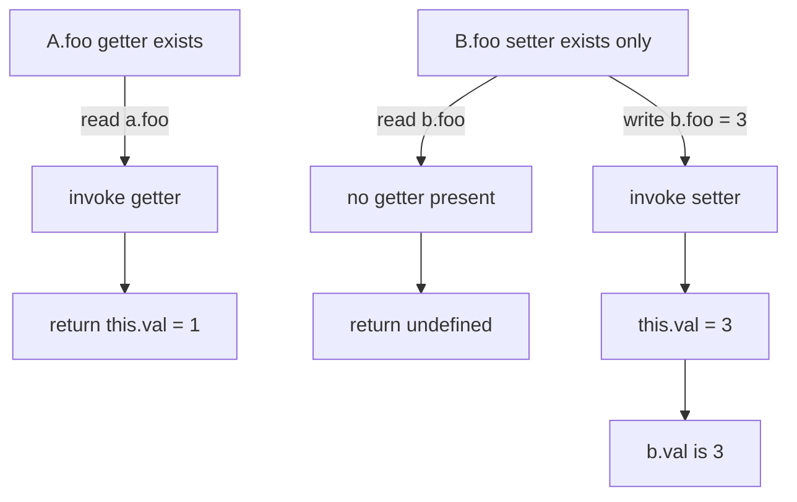

# 📝 [59. override setter](https://bigfrontend.dev/quiz/override-setter)

## 📌 Problem Overview

In JavaScript, accessor properties are defined as a pair of getter and setter operations. When only one side is present, the missing side behaves differently during reads and writes. This quiz tests whether you understand how class field access interacts with property descriptors.

```javascript
class A {
  val = 1
  get foo() {
    return this.val
  }
}

class B {
  val = 2
  set foo(val) {
    this.val = val
  }
}
const a = new A()
const b = new B()
console.log(a.foo)
console.log(b.foo)
b.foo = 3
console.log(b.val)
console.log(b.foo)
```

---

## 🚀 Correct Answer
>
> [!TIP]
> **Output:**
>
> ```text
> 1
> undefined
> 3
> undefined
> ```

---

## 🔍 Detailed Explanation & Spec-Accurate Trace

This quiz is about how JavaScript treats accessor properties when only a getter or only a setter is defined. The essential rule is that a property can be read through a getter, written through a setter, or both, and if only one accessor exists, the other side is effectively absent from the property descriptor.

### ⚡ Key Spec Rules / Concepts

1. **Rule 1 (Accessor property definition)**: A `get` definition creates an accessor property with a getter function, and a `set` definition creates an accessor property with a setter function. If only one accessor is present, the property is still an accessor descriptor, but the missing side does not produce a value during the opposite operation.
2. **Rule 2 (Property read/write semantics)**: During `obj.prop`, the engine attempts to get the value from the getter if one exists. If no getter is defined, the result is `undefined` for an accessor property. During `obj.prop = value`, the setter runs if present; otherwise, the assignment is silently ignored in non-strict mode and throws in strict mode.
3. **Rule 3 (Prototype/class instance behavior)**: Class instance accessors are created on the prototype and are looked up using the normal property lookup chain. `a.foo` resolves through `A.prototype.foo`, while `b.foo` resolves through `B.prototype.foo`.

---

### Step-by-Step Execution

#### 1. `a.foo` -> `1`

- **Step A**: `a` is an instance of `A`, and `A` defines a getter named `foo` on its prototype.
- **Step B**: When `a.foo` is evaluated, JavaScript performs property lookup and finds the accessor getter on `A.prototype`.
- **Step C**: The getter executes `return this.val`, and because `a.val` was initialized to `1`, the getter returns `1`.
- **Output**: `1`

#### 2. `b.foo` -> `undefined`

- **Step A**: `b` is an instance of `B`, and `B` defines only a setter named `foo`.
- **Step B**: There is no getter for `foo`, so the read operation does not invoke any function.
- **Step C**: For an accessor property with no getter, a property read returns `undefined`.
- **Output**: `undefined`

#### 3. `b.foo = 3` -> writes `3` to `b.val`

- **Step A**: The assignment triggers the setter declared on `B.prototype`.
- **Step B**: The setter runs with `val === 3` and executes `this.val = val`.
- **Step C**: `b.val` is updated from `2` to `3`.
- **Output**: `b.val` becomes `3`

#### 4. `b.val` -> `3`

- **Step A**: `b.val` is a standard instance field defined in the class body.
- **Step B**: The engine reads the normal own property on the instance, which currently holds `3`.
- **Step C**: The value is `3`.
- **Output**: `3`

#### 5. `b.foo` -> `undefined`

- **Step A**: The property lookup still finds `B.prototype.foo`, but it is only a setter.
- **Step B**: No getter is present, so the read side is absent.
- **Step C**: Accessing `b.foo` returns `undefined` even though the setter previously updated `b.val`.
- **Output**: `undefined`

---

## 💡 Key Takeaway

* **Accessor pairs are asymmetric when half is missing**: A getter without a setter can read data but not write it; a setter without a getter can write data but reading the property yields `undefined`.
* **Class fields and accessor properties are different mechanisms**: `b.val` is a regular property holding the actual value, while `b.foo` is an accessor property whose getter/setter behavior is determined by the property descriptor.

---

## 🛠️ Recommendations & Best Practices

* **Define both sides together when you want a computed property**: If a property should be readable and writable, define both a getter and a setter.
* **Use explicit state fields for storage**: Keep the actual values in a regular instance field such as `this.val`, and expose accessors only when you need custom logic.

```javascript
class Counter {
  #value = 0

  get value() {
    return this.#value
  }

  set value(next) {
    if (typeof next !== 'number' || Number.isNaN(next)) {
      throw new TypeError('value must be a number')
    }
    this.#value = next
  }
}
```

---

## 🧠 Revision Tips & Cheat Sheet

### Visual Coercion Path / Logical Flow



---

## 🔗 Helpful Resources

- [ECMA-262 Specification - Property Definitions](https://tc39.es/ecma262/#sec-property-definitions)
- [MDN Web Docs - get](https://developer.mozilla.org/en-US/docs/Web/JavaScript/Reference/Functions/get)
- [MDN Web Docs - set](https://developer.mozilla.org/en-US/docs/Web/JavaScript/Reference/Functions/set)
- [BFE.dev - Quiz 59](https://bigfrontend.dev/quiz/override-setter)

---

## 🏷️ Tags

`#AccessorProperties` `#GettersAndSetters` `#PrototypeLookup` `#ClassFields` `#SpecDeepDive`