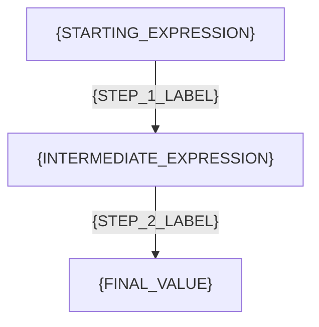

# 🗺️ BFE.dev JS Quiz Explanation Blueprint & Prompt

This blueprint defines the standard structure, style guidelines, and LLM prompt template for formatting JavaScript Quiz `readme.md` explanation files in this repository.

---

## 📖 The Markdown Template Structure

Use the exact layout below for all generated `readme.md` files:

```markdown
# 📝 [{QUIZ_NUMBER}. {QUIZ_TITLE}]({BFE_DEV_URL})

## 📌 Problem Overview

{BRIEF_DESCRIPTION_OF_THE_QUIZ}

```javascript
{QUIZ_CODE_SNIPPET}
```

---

## 🚀 Correct Answer
>
> [!TIP]
> **Output:**
>
> ```text
> {EXPECTED_CONSOLE_OUTPUT}
> ```

---

## 🔍 Detailed Explanation & Spec-Accurate Trace

{BRIEF_OVERVIEW_OF_THE_CORE_ECMASCRIPT_OR_JS_ENGINE_CONCEPTS_TESTED}

### ⚡ Key Spec Rules / Concepts

1. **Rule 1 ({RULE_NAME})**: {SPEC_EXPLANATION_WITH_TC39_SPEC_OR_STANDARD_ENGINE_BEHAVIOR}
2. **Rule 2 ({RULE_NAME})**: {SPEC_EXPLANATION_WITH_TC39_SPEC_OR_STANDARD_ENGINE_BEHAVIOR}

---

### Step-by-Step Execution

For each expression/statement executed in the quiz, trace the evaluation step-by-step:

#### {INDEX}. `{CODE_EXPRESSION}` -> `{EVALUATED_RESULT}`

- **Step A**: {EXPLAIN_FIRST_COERCION_OR_LOOKUP_STEP} (e.g. Coercing type, checking prototype, etc.)
- **Step B**: {EXPLAIN_SUBSEQUENT_STEP}
- **Output**: `{FINAL_EXPRESSION_VALUE}`

---

## 💡 Key Takeaway

* **{CORE_TAKEAWAY_1}**: {DETAILED_ONE_SENTENCE_EXPLANATION}
* **{CORE_TAKEAWAY_2}**: {DETAILED_ONE_SENTENCE_EXPLANATION}

---

## 🛠️ Recommendations & Best Practices

* **{BEST_PRACTICE_1}**: {EXPLANATION}
* **{BEST_PRACTICE_2}**: {EXPLANATION}

```javascript
// Good practice code snippet illustrating the recommendation
```

---

## 🧠 Revision Tips & Cheat Sheet

### Visual Coercion Path / Logical Flow

Provide a Mermaid diagram to visualize the key decision path or type coercion flow.

> [!WARNING]
> Always wrap node labels containing brackets, parentheses, or spaces in double quotes to avoid Mermaid parsing errors (e.g. use `A["[] == false"]` instead of `A[[] == false]`).



---

## 🔗 Helpful Resources

- [ECMA-262 Specification - {RELEVANT_SECTION}]({SPEC_URL})
- [MDN Web Docs - {RELEVANT_TOPIC}]({MDN_URL})
- [BFE.dev - Quiz {QUIZ_NUMBER}]({BFE_DEV_URL})

---

## 🏷️ Tags

`#{TAG_1}` `#{TAG_2}` `#{TAG_3}` `#SpecDeepDive`
```

---

## 🤖 Prompt for LLM Generation

Copy and paste the system prompt below into any LLM model along with the raw `solutions.js` and `readme.md` files to generate the fully expanded explanation.

### LLM System Prompt

```text
You are an expert JavaScript Engine and ECMAScript Specification Analyst. 

Your task is to take a raw JavaScript Quiz file and its corresponding `solutions.js` solution file, and generate a beautifully formatted, spec-accurate `readme.md` explaining the quiz in deep technical detail.

You MUST follow the structured format defined below strictly. 

### Instructions & Rules:
1. **Title & Links**: Determine the BFE.dev quiz URL, number, and title. Create a markdown heading 1.
2. **Problem Overview**: Render the exact JavaScript code block from the quiz.
3. **Correct Answer**: Place the final output in a `> [!TIP]` GitHub markdown alert block.
4. **Detailed Explanation & Spec-Accurate Trace**:
   - Provide a precise, step-by-step breakdown of how the JS Engine evaluates the code.
   - Reference the exact ECMAScript Specification mechanisms (e.g., ToNumber, ToPrimitive, Abstract Equality, Prototype Chain lookup, etc.).
   - Explicitly list the key spec rules involved before doing step-by-step execution.
   - Walk through every single `console.log` expression sequentially under "Step-by-Step Execution" headers.
5. **Key Takeaway**: Summarize the ultimate conceptual takeaways.
6. **Recommendations**: Provide actionable best practices and a clean code snippet demonstrating how a developer should handle this in production (e.g., strict equality, explicit coercion, checking nullishness).
7. **Mermaid Diagram**: Create a clear Mermaid flowchart (`graph TD` or similar) mapping out the logical or type coercion path. 
   - CRITICAL: To prevent Mermaid syntax errors, you MUST wrap all node labels that contain special characters, brackets, or spaces in double quotes. E.g. `A["[] == false"]` instead of `A[[] == false]`.
8. **Helpful Resources**: Include links to relevant sections of MDN, TC39 Spec, and BFE.dev.
9. **Tags**: Add relevant hash-tags representing the concepts tested.

Follow the exact markdown structure and casing shown in the template. Do not omit any sections.
```
