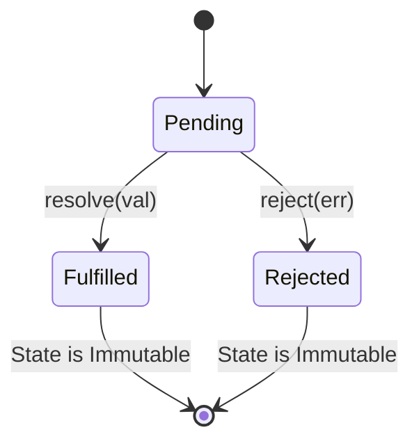

# 🚀 JavaScript Big Frontend Dev Revision Dashboard

This dashboard serves as a high-density, spec-accurate revision sheet for JavaScript concepts tested in the BFE.dev quizzes. Use this to prepare for frontend technical interviews (Google, Meta, Amazon, etc.).

---

## 📅 1. Event Loop & Asynchronous Flow

The event loop coordinates execution between the **Call Stack**, the **Microtask Queue**, and the **Macrotask (Task) Queue**.

### 🔄 The Event Loop Execution Cycle:
1. **Call Stack**: Executes synchronous code.
2. **Microtasks Check**: When the Call Stack is empty, the engine drains the **entire Microtask Queue** before moving on. If executing a microtask schedules more microtasks, they are added to the end of the current queue and also executed in the same tick (which can starve the Macrotask Queue if infinite!).
3. **Render Phase**: Browser may render updates here if needed.
4. **Macrotask Check**: The engine executes **one single macrotask** from the Macrotask Queue, then immediately returns to Step 2 (checking microtasks).

### 🛠️ Execution Classification:
* **Synchronous (Executed Immediately)**:
  - Normal statements (`console.log`, loops).
  - The **Executor Function** of a Promise: `new Promise((resolve) => { /* runs immediately! */ })`.
* **Microtasks (High Priority, Executes Next Tick)**:
  - Promise Reactions: `.then()`, `.catch()`, `.finally()` callbacks.
  - `queueMicrotask()` callbacks.
  - MutationObserver callbacks.
  - `process.nextTick()` (in Node.js, runs *before* standard microtasks).
* **Macrotasks / Tasks (Lower Priority, Wait Turn)**:
  - Timers: `setTimeout()`, `setInterval()`.
  - DOM/I/O events.
  - `setImmediate()` (Node.js).
  - `MessageChannel` callbacks.

---

## 🔒 2. Promise Mechanics & State Transitions

A Promise is an object representing the eventual completion or failure of an asynchronous operation.



### 🔑 Critical Rules:
1. **Immutability of Settle State**: Once a Promise transitions out of `pending` to `fulfilled` or `rejected`, its state is frozen permanently. Any subsequent `resolve()` or `reject()` calls are completely ignored.
2. **Promise Fallthrough**: `Promise.prototype.then()` expects functions. If you pass a non-function (e.g. `Promise.resolve(4)` or `3`), it is internally replaced by an identity function `(x) => x`. The resolved value simply "falls through" to the next handler in the chain.
3. **Promise Nesting**: If a callback in a `.then()` returns a nested Promise, the outer chain waits for the inner Promise to settle, passing its settlement value down the outer chain.
4. **Finally Transparency**: `.finally(callback)` receives **no arguments** and returns a promise that resolves to the *previous* settled value (it is transparent). It ignores the returned value of `callback` unless `callback` throws an error or returns a rejected promise.
5. **Catch Recovery**: A `.catch()` block catches the error and recovers the chain to a resolved state returning `undefined` (unless it throws a new error).

---

## 🧩 3. Scopes, Closures, and `this` Context

Scoping determines the accessibility of variables, while `this` determines the context of execution.

### 📝 Variable Scopes:
* **`var` (Function-scoped)**:
  - Hoisted and initialized to `undefined`.
  - Not block-scoped (shares a single binding across loop iterations).
* **`let` / `const` (Block-scoped)**:
  - Hoisted but placed in a **Temporal Dead Zone (TDZ)** (accessing before declaration throws `ReferenceError`).
  - Scoped to `{}` curly braces. In a `for (let i = ...)`, a completely separate, immutable `i` binding is created for every loop iteration.

### 🎯 The `this` Keyword Binding Rules:
* **Dynamic Binding (Normal Functions)**:
  - Determined by *how* the function is invoked.
  - Method invocation (`obj.method()`): `this` is `obj`.
  - Standalone invocation (`func()`): `this` is `window`/`global` (or `undefined` in strict mode).
  - Explicit binding (`call`, `apply`, `bind`): manually points to the specified object.
* **Lexical Binding (Arrow Functions)**:
  - Do **not** have their own `this` binding. They resolve `this` by looking up the lexical environment parent scopes.
  - Their `this` is bound permanently at creation and cannot be changed by `.call()`, `.apply()`, or `.bind()`.
  - Do **not** have their own `arguments` object, `prototype`, and are **non-constructible** (cannot be called with `new`).

---

## ⚙️ 4. Operators, Precedence, and Evaluation Order

Understanding operators prevents common syntax and logical bugs under stress.

### ➕ Increment Operators (`++`):
* **Prefix (`++i`)**: Increments the variable first, then evaluates to the **new** value.
* **Postfix (`i++`)**: Evaluates to the **current** value first, then increments the variable in memory as a side effect.

### 🔀 Comma Operator (`,`):
* Evaluates each of its operands from left to right and returns the value of the **last** operand.
  ```javascript
  const x = (1, 2, 3); // x is 3
  ```

---

## 🧮 5. Implicit Coercion & Equality

JavaScript coerces values to Primitive, Number, or Boolean using internal abstract spec operations.

### ☯️ Abstract Equality (`==`) Comparison Algorithm:
When comparing `x == y`:
1. **If Types Match**: Use Strict Equality (`===`).
2. **Null & Undefined**: `null == undefined` is `true`. They are equal to nothing else.
3. **Boolean vs Other**: If one is a Boolean, convert it to a Number first (`true -> 1`, `false -> 0`) and repeat the loose equality algorithm.
4. **String vs Number**: Convert String to Number and repeat.
5. **Object vs Primitive**: Convert Object to Primitive via `ToPrimitive(object)` and repeat.

### 🔄 The `ToPrimitive(object)` Coercion Algorithm:
For default objects and arrays:
1. Call `.valueOf()`. If it returns a primitive, use it.
2. If `valueOf()` returns an object (which it does for arrays `[]`), call `.toString()`.
3. If `.toString()` returns a primitive (e.g. `[] -> ""` or `[1,2] -> "1,2"`), use it. Otherwise, throw `TypeError`.

### 🚨 Falsy Values Reference Table:
The only values in JavaScript that coerce to `false` under `Boolean()` are:
- `false`
- `0`, `-0`, `0n` (BigInt zero)
- `""` (empty string)
- `null`
- `undefined`
- `NaN`
- *Note:* Any object, including empty array `[]` and empty object `{}`, is **inherently truthy**!