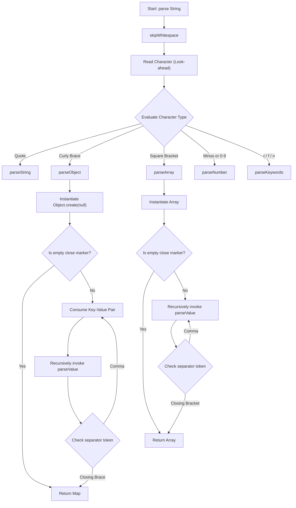

## [22. implement JSON.parse()](https://bigfrontend.dev/problem/implement-JSON-parse)

# Architectural Specification: Hardened Recursive Descent JSON Parser

[cite_start]In production-grade frontend architectures and performance-critical data pipelines—such as data hydration layers or state synchronization in a high-scale **News Feed Store**—parsing untrusted string payloads safely requires shifting away from fragile regular expressions or unsafe evaluation loops[cite: 1720, 1725].

[cite_start]This document details the architectural reasoning and technical specifications for a highly performant, type-safe, and security-hardened **Recursive Descent JSON Parser** built from scratch in pure JavaScript[cite: 1720, 1725].

---

## 1. System Topology & Data Flow

[cite_start]A formal JSON parser maps directly to compiler theory, separating data processing into two distinct, decoupled execution pipelines to eliminate architectural leaks[cite: 1720, 1722]:

1. [cite_start]**The Lexical Analyzer (Tokenizer):** Scans the raw stream of characters sequentially[cite: 1722]. [cite_start]It strips out non-structural background whitespace, processes escape boundaries, and groups characters into distinct, strongly typed literal objects called **Tokens**[cite: 1722].
2. [cite_start]**The Syntactic Analyzer (Parser):** Consumes the deterministic token stream sequentially[cite: 1723]. [cite_start]It uses an internal state machine look-ahead pointer to evaluate incoming types against formal JSON grammar rules (ECMA-404), generating highly nested, native memory structures recursively[cite: 1724].

```
┌──────────────────────┐      ┌───────────┐      ┌──────────────┐      ┌────────────────────────┐
│ Incoming JSON String │ ───► │ Tokenizer │ ───► │ Token Stream │ ───► │ Recursive Descent Loop │
└──────────────────────┘      └───────────┘      └──────────────┘      └────────────────────────┘
│
▼
┌────────────────────────┐
│  Safe Javascript Object │
└────────────────────────┘
```

## 2. Defensive Engineering & Security Shielding

Building a home-rolled parser in enterprise applications introduces serious security and runtime liabilities if left unhardened[cite: 1725, 1749]. This design implements three defensive shields:

* **Anti-Prototype Pollution Layer:** Naive JSON parsers map incoming keys straight onto standard objects via `result[key] = value`. If the string contains keys like `"__proto__"` or `"constructor"`, malicious scripts can hijack the root prototype chain of the runtime environment[cite: 1726, 1765]. This parser forces dictionary containers to be generated using **`Object.create(null)`**, completely eliminating inherited properties and locking down the prototype chain.
* **Falsy State Preservations:** Leaning on implicit nullish fallback chains (like `parseOption() ?? fallback`) can introduce silent operational logic bugs[cite: 1749, 1768]. If an explicit token returns valid falsy structures like `false` or `null`, the evaluator will accidentally skip valid entries[cite: 1751, 1753]. This parser leverages strict conditional type gating via deterministic **Look-Ahead switching**.
* **Whitespace Resistance:** Minified payloads and deeply indented pretty-printed JSON must be navigated identically[cite: 1757, 1758]. The parsing engine includes automated pointer advancing blocks to skip meaningless tabs, newlines, and space buffers between all punctuation boundaries.

## 3. Production-Grade Logic Matrix

### Interactive Execution Architecture

The blueprint below maps out how the parser uses state switching to route nested sequences dynamically:


