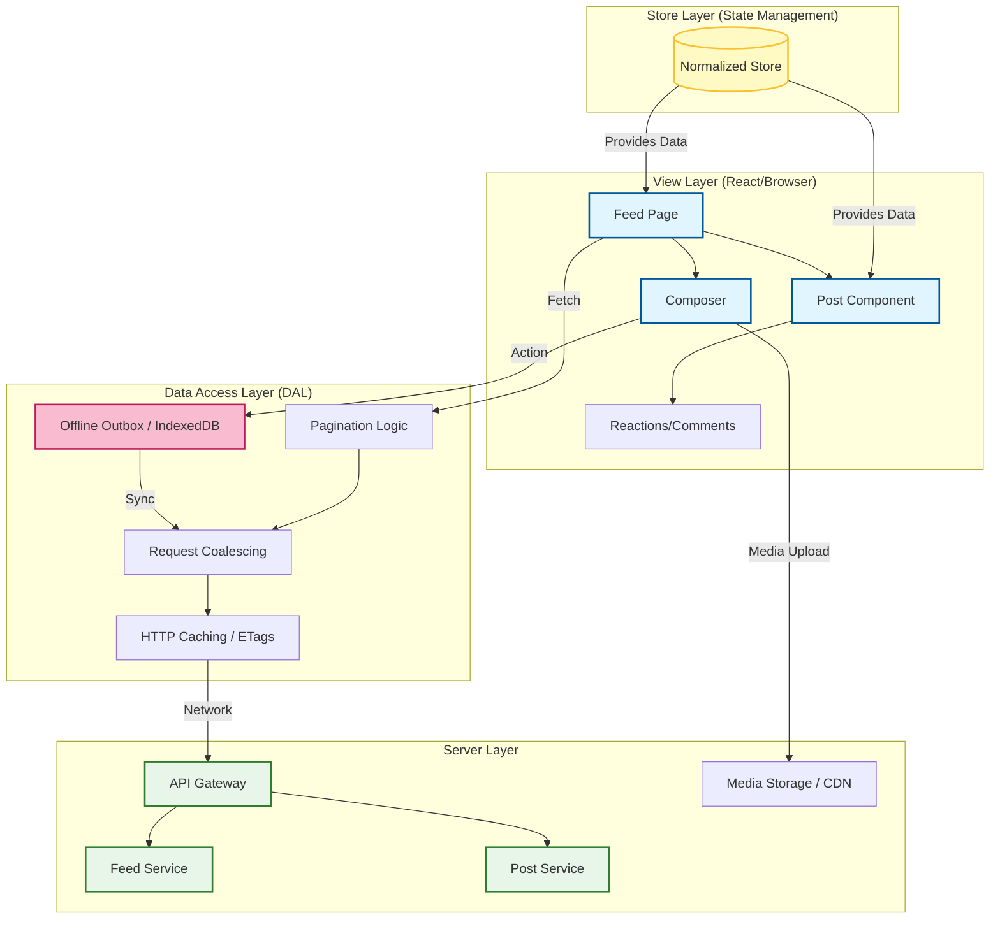
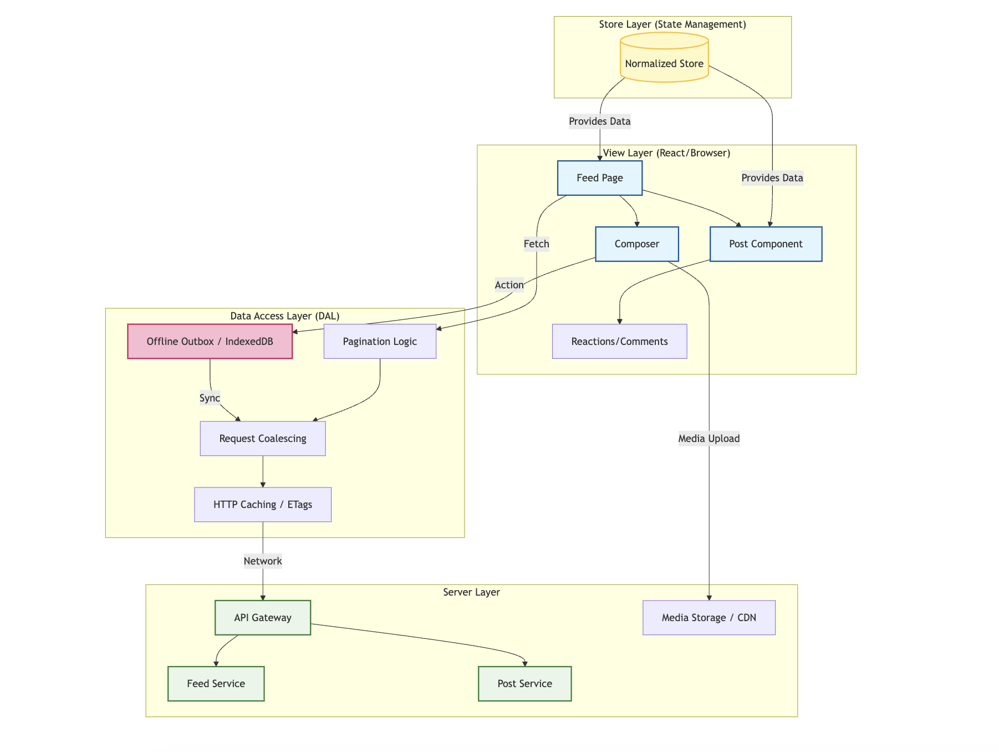
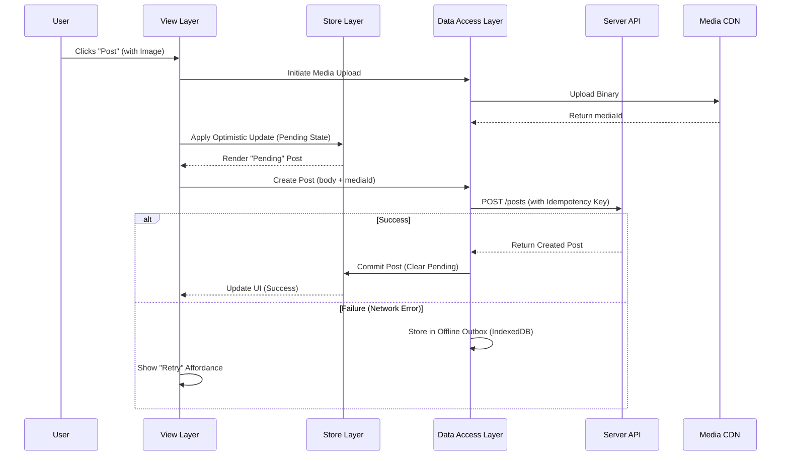
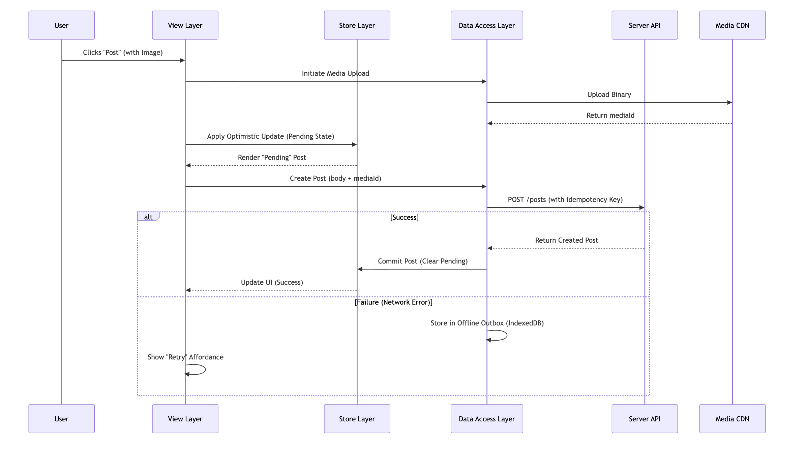
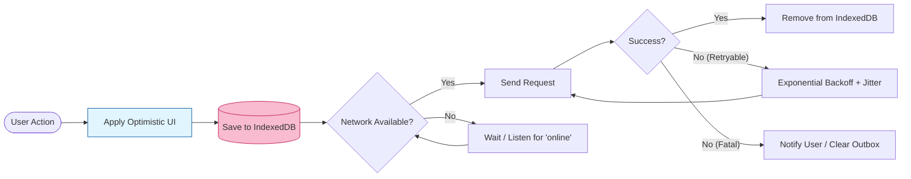
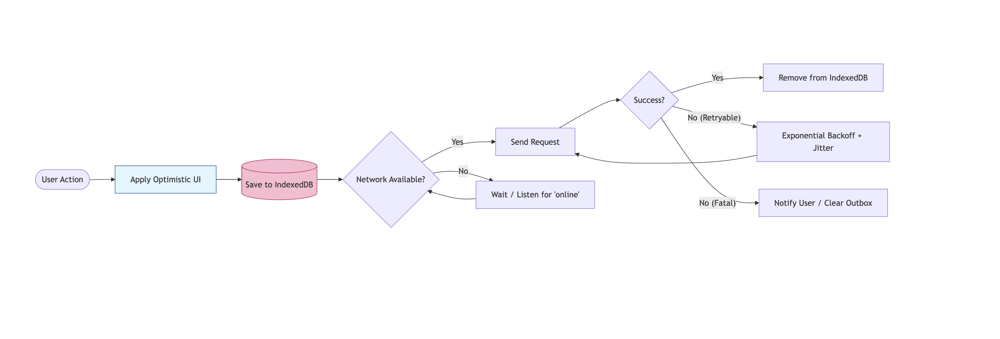
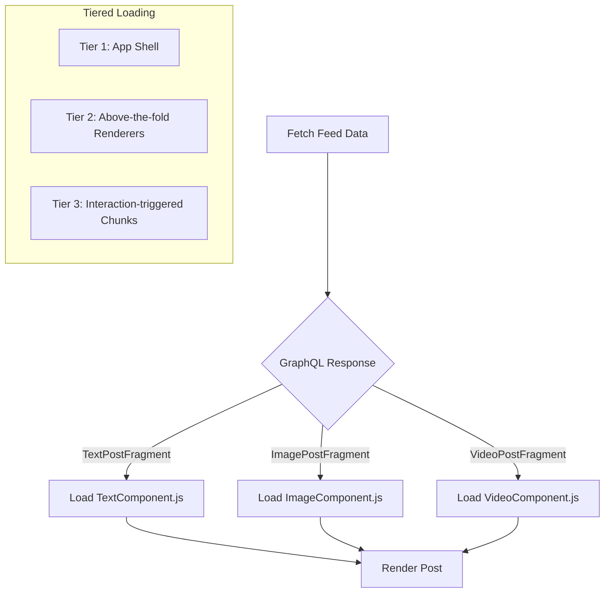
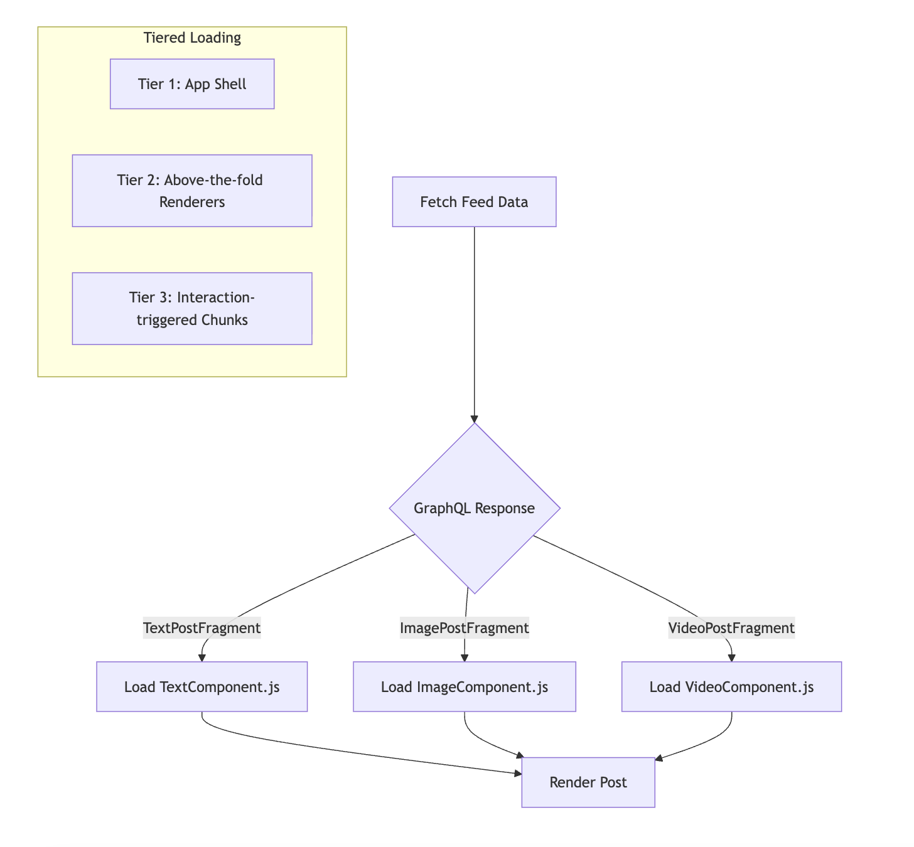
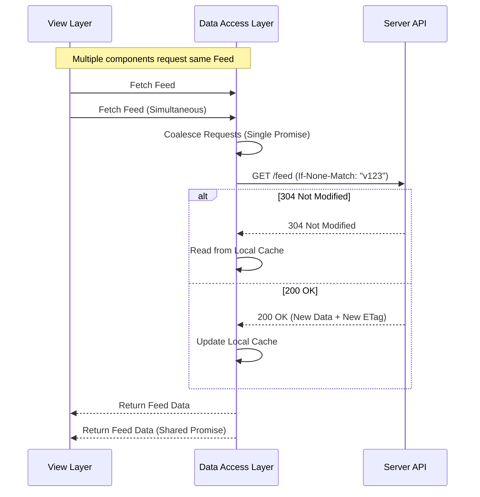
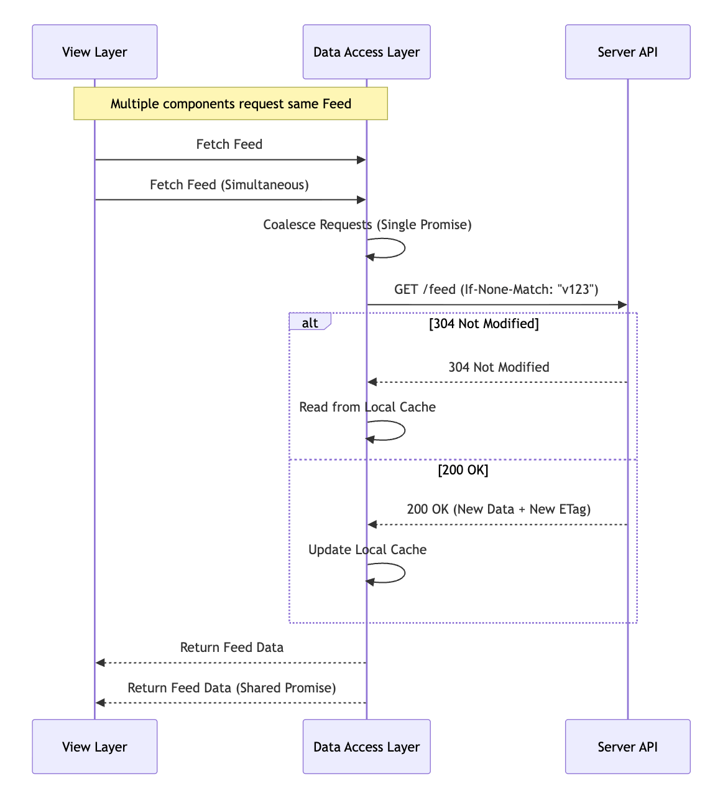

# News Feed Architecture Diagrams

This document contains visual representations of the News Feed architecture described in the [README.md](./readme.md).

## 1. High-Level System Architecture

The system is divided into four distinct layers to ensure separation of concerns and scalability.

---

## 2. Post Creation Flow (with Media & Optimistic UI)

This sequence shows how the system handles media uploads and provides immediate feedback to the user.

---

## 3. Offline Outbox Pattern (Resilient Writes)

Ensures user actions (likes, comments, posts) are never lost during poor connectivity.

---

## 4. Data-Driven Dependency Loading

How the application avoids shipping 50+ post renderers by lazy-loading based on GraphQL metadata.

---

## 5. Optimized Feed Fetching (ETags & Deduplication)

