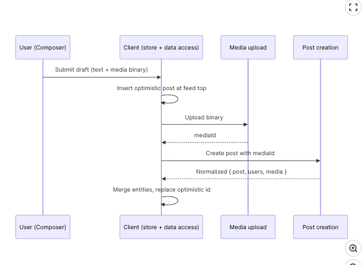

## [News Feed](https://www.greatfrontend.com/interviews/study/gfe75/questions/system-design/news-feed-facebook)

### Requirements

#### What are the core features to be supported?

1. Creating and publishing new posts
2. Browse feeds of user and their friends
3. Liking and Reacting to posts

#### What kind of posts are supported?

Primarily text and image-based posts.

#### What pagination UX should be used for the feed?

Infinite scrolling, meaning more posts will be added when the user reaches the end of their feed. For long-lived sessions, it is also worth discussing how newer posts are surfaced at the top without silently disrupting what the user is reading.

#### Will the application be used on mobile devices?

Not a priority, but a good mobile experience would be nice. The architecture discussion can stay web-first unless the interviewer explicitly wants to focus on mobile-specific interaction patterns.

### Architecture / high-level design

A well-structured front-end architecture separates concerns across distinct layers, each responsible for a specific set of tasks

#### Rendering approach

1. CSR
2. SSR
3. Hybrid

For a personalized signed-in feed, the main benefit of rendering on the server is performance, not SEO. The content is already personalized, so search indexing is much less important than keeping the session interactive and responsive.

That makes CSR the best default answer for the home feed. The feed is highly interactive, heavily personalized, and benefits from keeping state alive in the browser over a long-lived session. This is a long-session state-management tradeoff, not a claim that CSR has the fastest cold start.

#### Navigation approach

1. Single-page application (SPA): The app loads once, then uses JavaScript to update the URL, fetch data, and update the DOM without a full page reload.
2. Multi-page application (MPA): Each route is a separate HTML page, and navigation triggers a full page reload.
3. For a feed product, SPA is the stronger default. The biggest reason is shared client state. Most users open a post from the feed itself. In an SPA, the main post details such as text, media, and author data may already be in the store, so navigation to the post detail page can feel nearly instant, and only replies or comments need to be fetched after navigation.

In an MPA, navigation tears down the current page state and rebuilds it from scratch.

#### Architecture layers


**View Layer**: The direct interface for user interaction (e.g., feed pages, post details, and composers). This layer is responsible for rendering data provided by the Store and triggering user actions like reactions or post creation.

**Store Layer**: Functions as the "Single Source of Truth" for the client-side state. It manages normalized data including posts, users, and feed ordering, while also handling optimistic updates and freshness states to keep the UI responsive.

**Data Access Layer**: An abstraction layer that manages all backend communication. Its responsibilities include handling network requests, parsing responses, implementing pagination (like cursor-based logic), managing retries, and transforming raw API data into structures optimized for the store.

**Server Layer**: The external boundary that exposes HTTP endpoints for core functionality. This includes fetching feed data, creating new posts, uploading media, and recording user engagement actions like shares or reactions.

This separation allows you to "harden" each part of the system independently—for example, updating your Data Access caching policy without disrupting your View components.

### Data Entities

You can find in attached [file](./types.ts).

### Feed pagination

1. Offset-based pagination : relies on numerical offsets to determine which results to fetch next. For example, a request might specify ?offset=20&limit=10 to get the next ten posts after the first twenty This is why offset-based pagination is a better fit for relatively static lists such as search results, where jumping to a specific page matters more than handling real-time inserts cleanly.
2. Cursor-based pagination uses a unique identifier such as a post ID or timestamp as a cursor that marks the boundary between pages. Instead of asking for "the next 10 results after offset 20", the client requests "the next 10 results after post ID X." Cursor-based pagination is more stable and efficient because it does not depend on the dataset's size or ordering at query time. It works well in environments where data is frequently updated, such as a news feed where new posts appear constantly and older posts can be deleted, re-ranked, or refreshed.

### Dynamic loading count

Whichever pagination style is used, the feed API typically exposes a configurable count or limit parameter alongside the cursor. We can use that flexibility to adapt how many posts to load based on the browser viewport height.

If the first feed request is initiated on the client in a CSR flow, the app can read window.innerHeight before requesting data and size the initial page more accurately. If the initial feed response is rendered on the server, the server does not know the viewport height ahead of time, so it usually overfetches slightly. Subsequent fetches can then adapt based on the measured viewport height.

### HTTP caching, deduplication, and idempotency

1. HTTP Caching (ETags & 304 Not Modified)
    1. Instead of downloading the same feed data repeatedly, the Data Access Layer uses ETags (entity tags) as a digital fingerprint for your data.How it works: When you fetch your feed, the server sends the data along with an ETag: "v123". The next time you fetch, the client sends **If-None-Match**: "v123".
    2. The Result: If no new posts have arrived, the server simply returns a 304 Not Modified status.
    3. Benefit: You save bandwidth and battery by not re-downloading data you already have.
    4. Hash --> Instead of hashing the complete data, a hardened server generates a "Lightweight Fingerprint" using Metadata.
        1. Version-Based Hashing: The server combines the id of the last post in the feed with its updatedAt timestamp and the current viewerReaction state.
        2. The Algorithm: These small metadata strings are concatenated and passed through a fast hashing algorithm like MurmurHash or SHA-1.
        3. The Result: A short, 8–32 character string (e.g., "34jrfp2") that represents the state of the entire feed.
2. Request Coalescing (Deduplication)
    1. This prevents "Self-inflicted DDoS" where multiple parts of your UI accidentally fire identical requests.
    2. Example: Imagine your News Feed has a "Post Detail" sidebar and a "Main Feed." Both components need data for Post_ABC at the same time.
    3.
      ```
      function createCoalescedFetch() {
        // Persistent Cache to track active, in-flight promises [cite: 813]
        const inFlightRequests = new Map();

        return async function (url, options = {}) {
          // 1. The Check: Does this specific request already exist in the map? [cite: 814]
          if (inFlightRequests.has(url)) {
            console.log(`Coalescing: Returning existing promise for ${url}`);
            // 2. The Coalesce: Return the stored promise so callers share the same trigger [cite: 806, 815]
            return inFlightRequests.get(url);
          }

          // 3. The New Request: Create the promise and store it in the map [cite: 813]
          const fetchPromise = fetch(url, options)
            .then((res) => res.json())
            .finally(() => {
              // 4. The Cleanup: Remove from map once settled to allow fresh data later [cite: 816]
              inFlightRequests.delete(url);
            });

          inFlightRequests.set(url, fetchPromise);
          return fetchPromise;
        };
      }

      // Usage Example
      const coalescedFetch = createCoalescedFetch();

      // Firing three identical requests simultaneously [cite: 700, 713, 811]
      coalescedFetch('/api/news-feed');
      coalescedFetch('/api/news-feed');
      coalescedFetch('/api/news-feed');
      // Result: Only ONE network request is actually triggered.
      ```


3. **AbortController**: When a user navigates away or triggers rapid-fire actions (like repeated clicks on a reaction button), the layer uses AbortController to cancel superseded or obsolete requests.
4. **Idempotency for Robust Writes** : Idempotency ensures that retrying a write operation (like liking a post or submitting a comment) doesn't result in duplicate data on the server. 
   1. The client generates a unique key (such as a UUID) at the moment of user submission. This key is attached to the request via a header or the request body.
   2. Stable Retries: If a network error occurs, the client (or a service worker) can retry the request using the same key. The server recognizes the duplicate key and returns the original successful result instead of creating a second "like" or post.

### API endpoints

| Endpoint                        | Purpose                                        |
| ------------------------------- | ---------------------------------------------- |
| GET /posts/{postId}             | Fetch a single post surface or permalink page. |
| PUT /posts/{postId}/reaction    | Set or change the viewer's reaction.           |
| DELETE /posts/{postId}/reaction | Remove the viewer's reaction.                  |


This HTTP method is for users to create a new post, which will be shown in their own feed as well as the feeds of others they are friends with.

| Field       | Value                            |
| ----------- | -------------------------------- |
| HTTP Method | POST                             |
| Path        | /posts                           |
| Description | Creates a new post.              |
| Parameters  | { body: '...', mediaIds: [...] } |


**Upload media binaries first**, then create the post by mediaId
For posts with attachments, upload the binary first, get a mediaId back, then include that ID when creating the post. In production, the upload step often involves getting a presigned URL so the client uploads directly to blob storage, keeping large uploads off the application server and letting post creation stay a small JSON request.

The response format can be just the single post and the client can write it straight into the normalized store:

```
{
  "post": {
    "id": "124",
    "authorId": "456",
    "body": { "text": "Hello world", "entities": [] },
    "mediaIds": ["m_1"],
    "engagementSummary": {
      "reactions": { "like": 20, "haha": 15 },
      "totalReactions": 35,
      "commentCount": 0,
      "shareCount": 0
    },
    "viewerReaction": null,
    "viewerHasShared": false,
    "createdAt": 1620639583
  },
  "users": [{ "id": "456", "name": "John Doe" }],
  "media": [
    {
      "id": "m_1",
      "src": "https://www.example.com/feed-images.jpg",
      "alt": "An image alt",
      "width": 1200,
      "height": 800
    }
  ]
}

```



Post creation flow with media upload and optimistic UI
